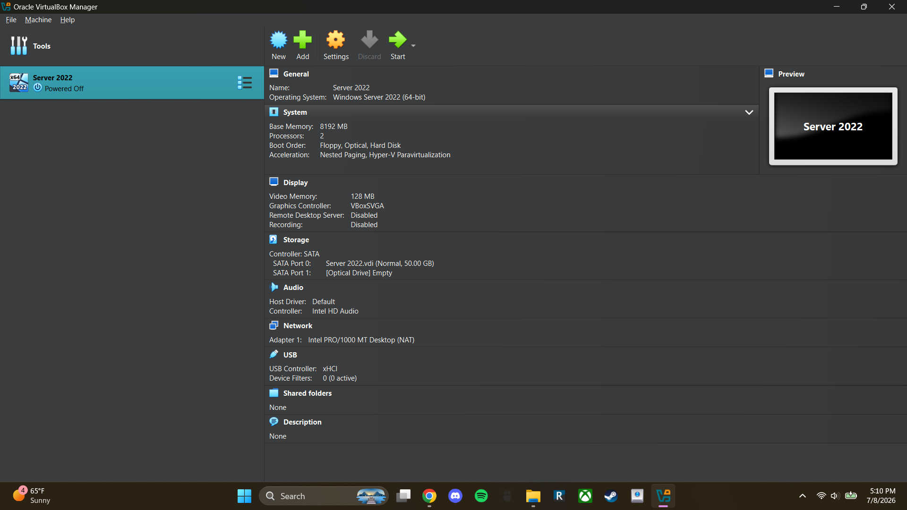
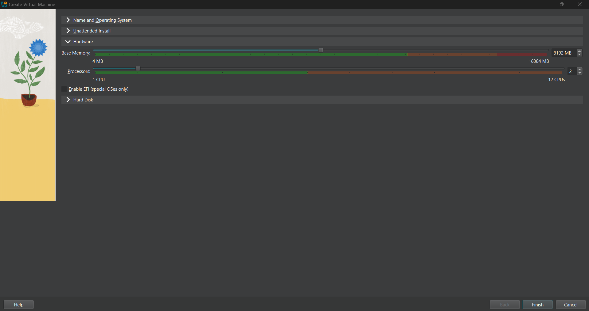

# *Lab 01 - Building an Active Directory Environment*

## *Objective*
The goal of this lab is to build a basic Active Directory environment using Virtual Box, and Windows Server 2022

## *Environment*
The following software was used:
- Oracle VirtualBox
- Windows Server 2022 Evaluation ISO

## *Skills Demonstrated*
- Windows Server 2022 Administration
- Virtualization (VirtualBox)
- Active Directory Domain Services
- Domain Controller Deployment
- Server Configuration

## *Steps*

### *Step 1 - Create the Windows Server Virtual Machine*

I created a new virtual machine in VirtualBox that will act as the domain controller for this lab

### *Step 2 - Configure Hardware*

