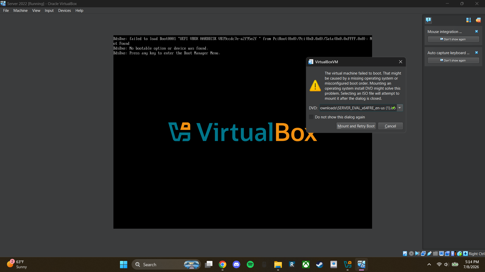
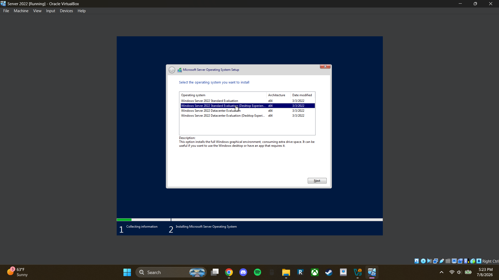
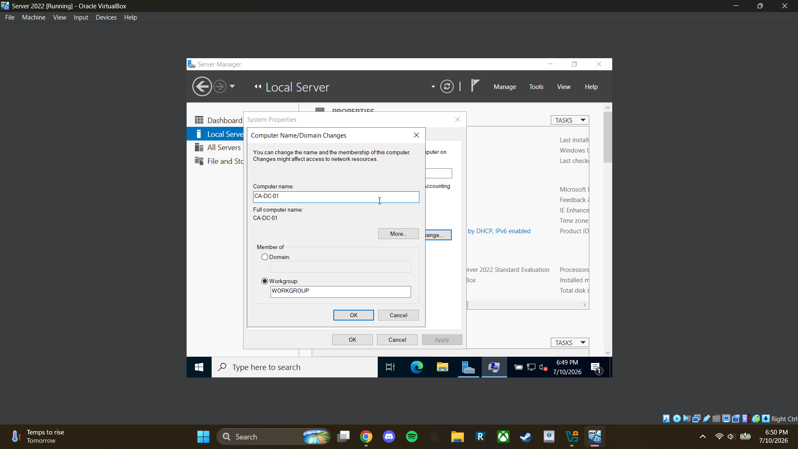
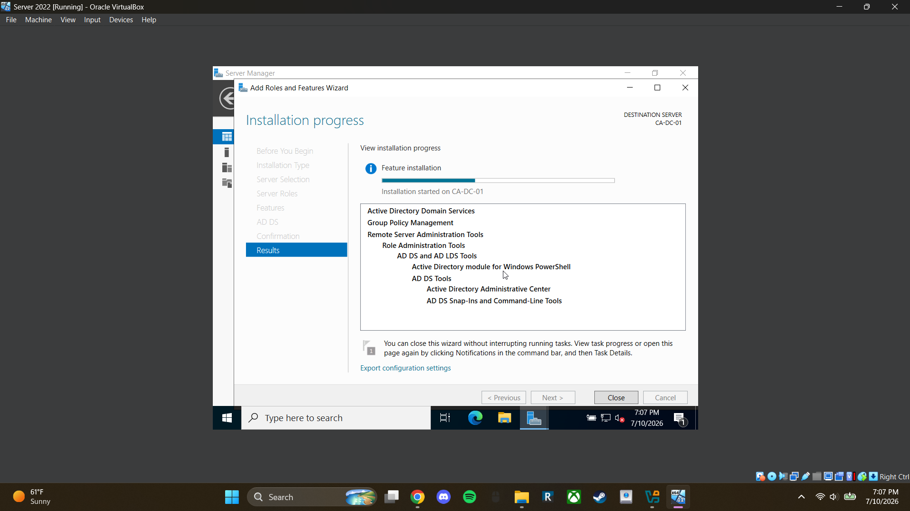

# *Lab 01 - Building an Active Directory Environment*

## *Objective*
The goal of this lab is to build a basic Active Directory environment using Virtual Box, and Windows Server 2022

## *Environment*
The following software was used:
- Oracle VirtualBox
- Windows Server 2022 Evaluation ISO

## *Skills Demonstrated*
- Windows Server 2022 Administration
- Virtualization (VirtualBox)
- Active Directory Domain Services
- Domain Controller Deployment
- Server Configuration

## *Steps*

### *Step 1 - Create the Windows Server Virtual Machine*

I created a new virtual machine in VirtualBox that will act as the domain controller for this lab

### *Step 2 - Configure Hardware*

I allocated 8 GB of RAM and 2 virtual CPUs to the server. Active Directory itself is not particularly resource intensive, but providing additional memory leaves room for future services and expansion within the lab environment

### *Step 3 - Attach the Windows Server ISO*

I attached the Windows Server 2022 Evaluation ISO file that was downloaded before this lab began and selected “Mount and Retry Boot” to start the boot process.

The ISO file acts as the installation media for Windows Server 2022 and allows the virtual machine to boot into the operating system installer.

### *Step 4 - Install Windows Server*

I selected Windows Server 2022 Desktop Experience because it includes a graphical user interface (GUI). The non Desktop Experience version installs Server Core, which is command-line only.

Since this is a new virtual machine, I selected Custom Installation because there was no existing operating system to upgrade.

For this home lab I installed Windows directly to the default virtual disk instead of creating multiple partitions. This keeps the lab simple while still allowing me to practice Active Directory administration.

### *Step 5 - Rename the Server*

I first click on the Local Server Tab on the Server Manager app. I click on the computer name and then I click Change in order to change the Name to “CA-DC-01”. 

Renaming computers makes it easier for troubleshooting and administration is much more efficient than using default computer names.

### *Step 6 - Install Active Directory*

Using Server Manager, I installed the Active Directory Domain Services (AD DS) role.

AD DS allows the server to function as a Domain Controller capable of managing users, computers, authentication, and security policies within a Windows domain environment.

### *Step 7 - Promote Server to Domain Controller*

In Server Manager, I click the notification flag to begin promoting the server to a domain controller. Since this is a new environment, I choose "Add a new forest" and create the domain lab.local. 

I then continue through the setup wizard, set a Directory Services Restore Mode (DSRM) password, and complete the installation. 

After the server restarts, I open Server Manager and navigate to Local Server, where I can see the domain name lab.local, confirming that the domain controller was successfully configured.

Promoting the server to a Domain Controller creates the foundation of the Active Directory environment. Creating a new forest establishes the first domain within the lab environment.

## *Challenges*
While documentating the lab, VirtualBox initially captured keyboard inputs which prevented screenshots from being taken. This issue was resolved by disabling the keyboard capture settings, allowing screenshots to be taken normally.

## *What I Learned*
- Learned how to create and configure a Windows Server virtual machine.
- Learned the difference between Server Core and Desktop Experience installations.
- Learned how to install Active Directory Domain Services (AD DS).
- Learned how a server is promoted to a Domain Controller.
- Learned the purpose of a new forest and domain structure within Active Directory.
- Learned the role of Directory Services Restore Mode (DSRM) during Domain Controller deployment.

## *Next Steps*
In the next lab I will:
- Install Guest Addition (We will see)
- Install Windows 11 VM
- Join Windows 11 VM to Domain

## *References*
- KEVTECH IT Support Youtube Series
- Microsoft Learn Documentation
- Oracle VirtualBox Documentation
