# *Lab 02 - Domain Client Deployment*

## *Objective*
The goal of this lab is to configure a Windows 11 client workstation and connect it to the Active Directory domain created in Lab 01. This includes installing VirtualBox Guest Additions for improved usability, creating Active Directory user accounts, configuring networking, joining the workstation to the domain, and verifiying domain authentication by logging in with a domain user.

## *Environment*
The following software was used:
- Oracle VirtualBox
- Windows Server 2022
- VirtualBox Guest Additions
- Windows 11
- Active Directory Domain Services (AD DS)

## *Skills Demonstrated*
- Installing and configuring VirtualBox Guest Additions
- Creating and testing shared folders between a host computer and a virtual machine
- Creating and managing Active Directory user accounts
- Configuring static IPv4 addresses
- Configuring DNS settings for a domain environment
- Testing network connectivity with the `ping` command
- Creating and configuring a Windows 11 virtual machine
- Renaming a workstation for easier identification
- Joining a Windows 11 workstation to an Active Directory domain
- Authenticating with an Active Directory domain account
- Verifying computer membership through Active Directory Users and Computers
- Troubleshooting Windows 11 virtual machine system requirements

## *Steps*

### *Step 1 - Install Guest Addition for VirtualBox*

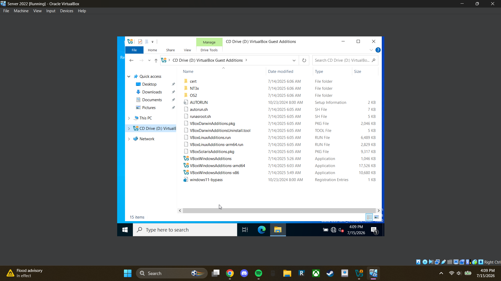

After opening the Windows Server 2022 virtual machine, I install **VirtualBox Guest Additions** by selecting **Devices > Insert Guest Additions CD Image** from the VirtualBox menu. I then open File Explorer inside the Windows Server 2022 virtual machine, locate the mounted CD drive, and run **VBoxWindowsAdditions-amd64**. After completing the installation wizard, I restart the virtual machine to apply the changes.

Installing Guest Additions enables features such as file sharing, improved display support, and better integration between the host computer and the virtual machine. Since my Windows Server VM will use a static IP address and won't have internet access later in the lab, shared folders allow me to easily transfer software and other files from my host computer to the server whenever needed.

### *Step 2 - Add a New Shared Folder*

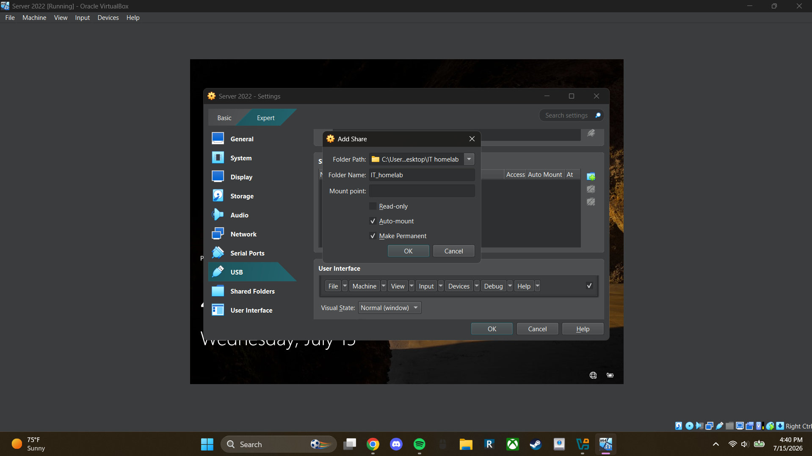

To configure a shared folder, I open the **Devices** menu in VirtualBox and navigate to **Shared Folders > Shared Folder Settings**. I then click the **Add Shared Folder** icon, select the folder on my host computer that I want to share with the virtual machine, and name it **IT_homelab**.

Finally, I enable **Auto-mount** and **Make Permanent** so the shared folder is automatically available each time the virtual machine starts.

### *Step 3 - Test Shared Folder*

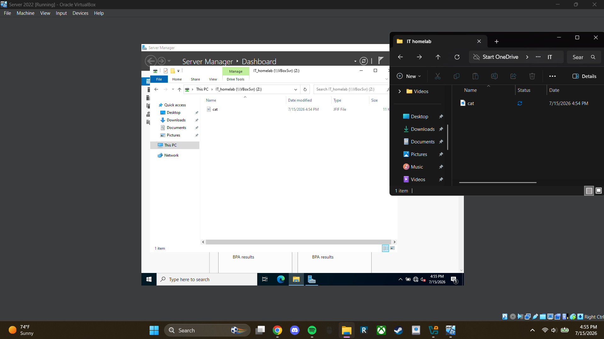

To test the shared folder, I added an image to the folder on my host computer. The image also appeared in the shared folder on the Windows Server virtual machine, confirming that the shared folder was working correctly.

### *Step 4 - Creating Users in Active Directory*

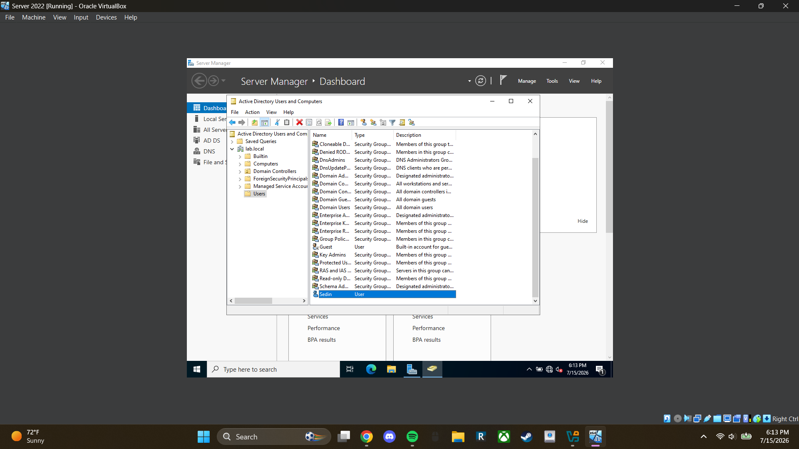

To create a domain user, I open **Active Directory Users and Computers** and navigate to the **lab.local** domain. I then right-click the **Users** folder and select **New > User**. For this lab, I fill in the user's first name, logon name, and password. Since this is a test account, I uncheck **"User must change password at next logon"** before completing the user creation wizard.

Active Directory provides a centralized way to manage user accounts and their settings. From here, administrators can reset passwords, configure logon hours, manage group memberships, update user information, and perform many other administrative tasks. Most user account management within a Windows domain is performed through **Active Directory Users and Computers**.

You can also use the **`net user <username> /domain`** command to view additional information about a domain user, such as password expiration, account status, and the last logon time. For example, running **`net user sedin /domain`** displays information for the user account named **sedin**.

### *Step 5 - Creating Windows 11 VM*

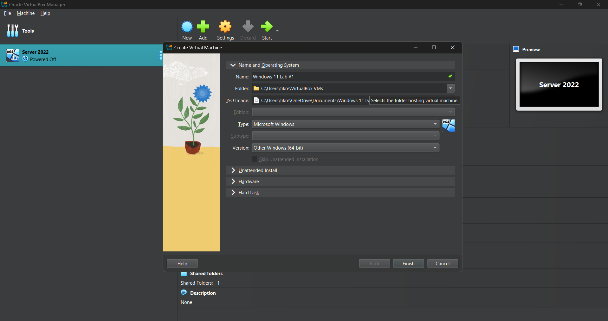

I create a user profile for the Windows 11 virtual machine using the same process outlined in **Lab 01** for the Windows Server 2022 virtual machine. Since the setup is identical, I won't repeat each step here.

### *Step 6 - Installing Windows 11*

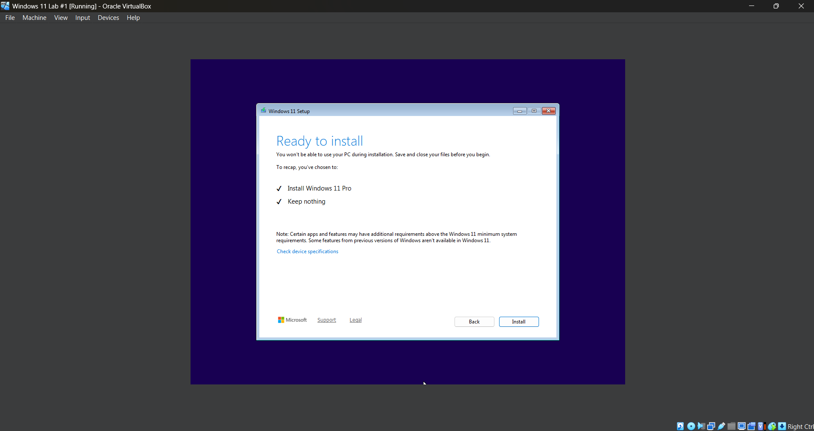

I start up the VM and go through the Setup Wizard, I don't have a product key for it which is fine. Important thing to do is to ensure you click to install Windows 11 Pro instead of just Windows 11. Windows 11 Pro is needed as that has the feature of being able to join domains.

### *Step 7 - Setting up Windows 11*

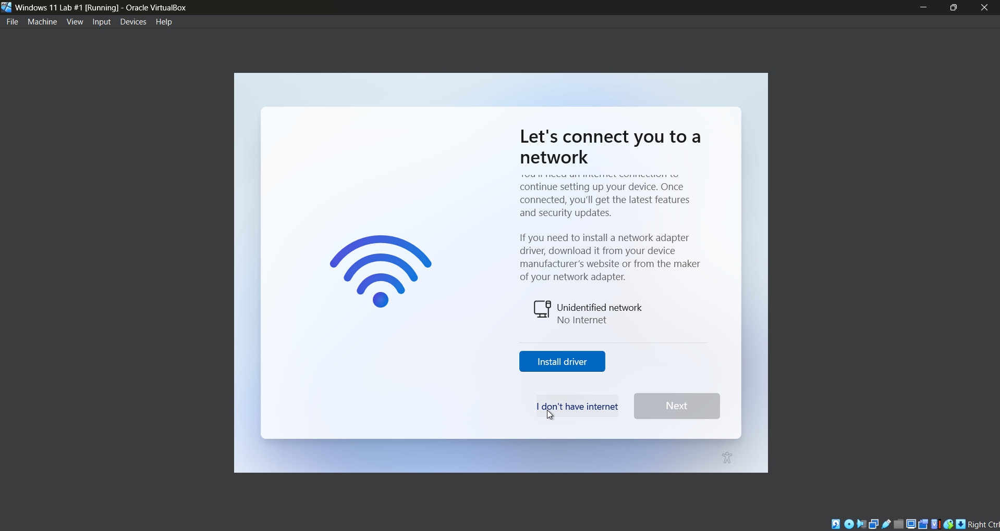

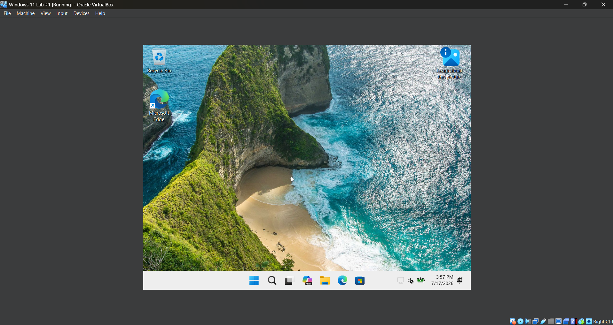

Once installed, I go into the VM settings and navigate to **Devices** > **Network** > **Network Settings**. I then change the adapter from **NAT** to **Host-Only Adapter**, as this is needed to bypass the Microsoft account step so I can continue to the Windows desktop.

I restart the VM and continue through the Windows setup wizard. Once I reach the screen asking for an internet connection, I press **Shift + F10** to open Command Prompt and run the following command `OOBE\BYPASSNRO`. 

After running the command, the virtual machine restarts. I go through the setup wizard again, and when I reach the internet connection screen, a new **"I don't have internet"** option is available. I select this option and continue through the rest of the setup until I can log in and reach the Windows desktop.

### *Step 8 - Rename PC*

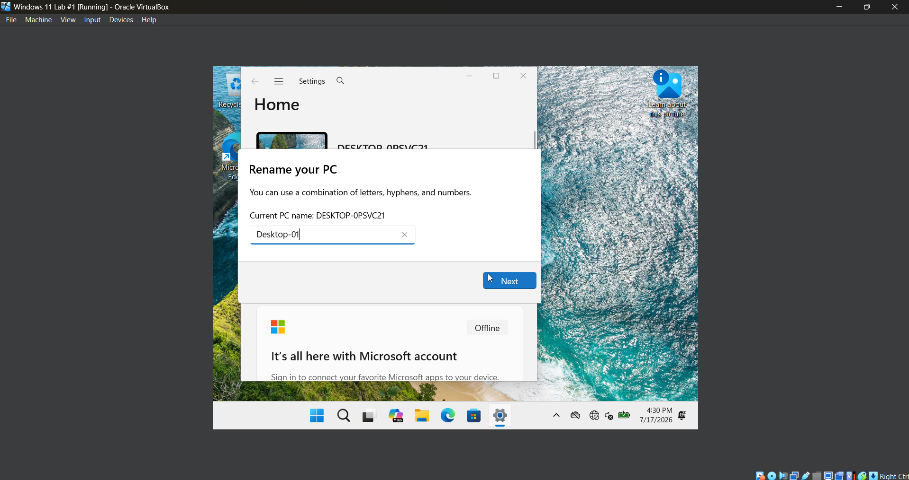

I press the **Windows** key, open **Settings**, and select **Rename**. Renaming the computer makes it easier to identify, locate, and manage within **Active Directory**.

### *Step 9 - Setup Stactic IP For Server 2022 VM*

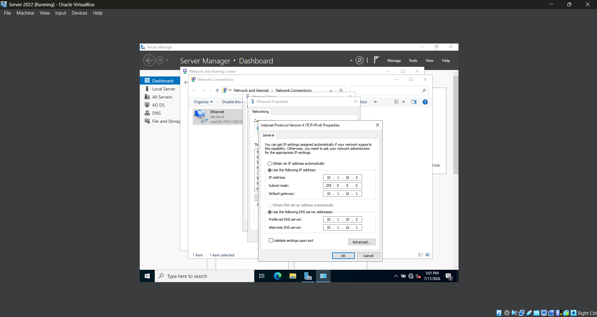

I boot up the **Windows Server 2022** VM and change the VM's network adapter to **Host-Only Adapter**, just as I did with the Windows 11 VM. I then log in and open **Control Panel**. Under **Network and Internet**, I click **View network status and tasks** > **Change adapter settings** > **Ethernet**. 

Next, I click **Properties**, select **Internet Protocol Version 4 (TCP/IPv4)**, and click **Properties**. I then select **Use the following IP address**, enter the IP settings shown in the image above, and click **OK**.

### *Step 10 - Setup Stactic IP For Windows 11 VM*

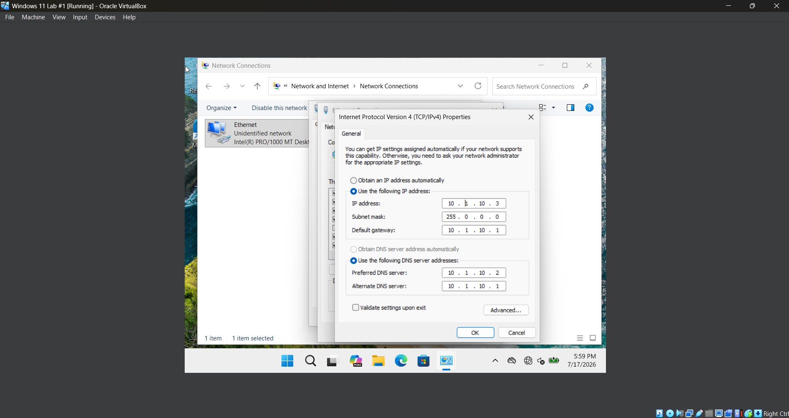

Follow the same steps outlined above to access **Internet Protocol Version 4 (TCP/IPv4)**. Enter the IP settings shown in the image above, then click **OK**.

### *Step 11 - Testing Connectivity*

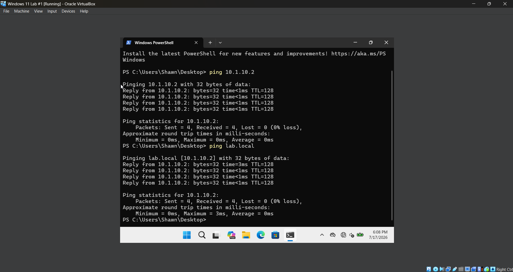

On the Windows 11 VM, I open **Terminal** by right-clicking on the desktop and selecting **Open in Terminal**. I then type `ping 10.1.0.2`, or you can type `ping lab.local`, to verify that the VM is on the same virtual network as the **Windows Server 2022** VM.

### *Step 12 - Joining Windows 11 to the Domain*

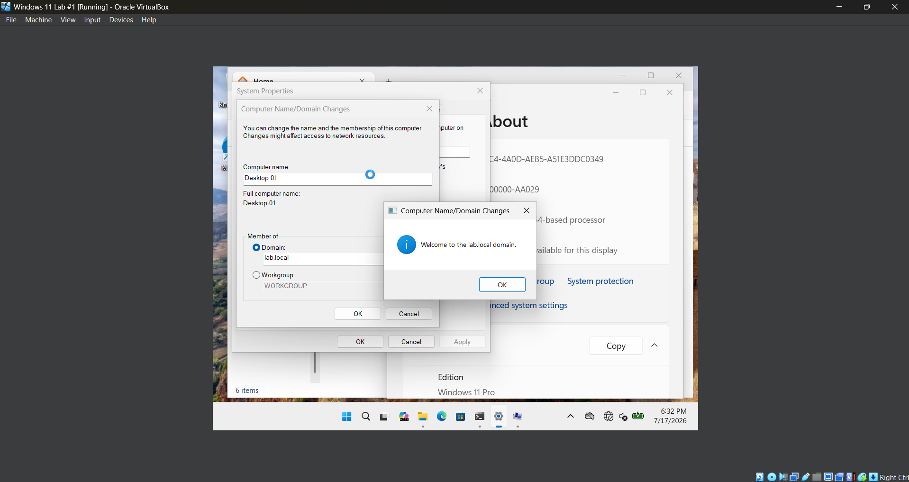

First, I double-check the server's domain name by opening **Server Manager** and selecting **Local Server**. The domain name for my server is `lab.local`.

On the Windows 11 VM, I open **File Explorer**, right-click **This PC**, and select **Properties**. I scroll down until I find **Domain or Workgroup** and click it. I then select **Change**, choose **Domain**, and enter `lab.local`. After entering the administrator credentials, the Windows 11 VM joins the domain. I restart the computer to apply the changes.

After restarting the Windows 11 VM, There should be an option to log in as a other user. Im gonna log in with the user I made earlier in the lab named **Sedin**. 

### *Step 13 - Checking Domain Connection on Server 2022*

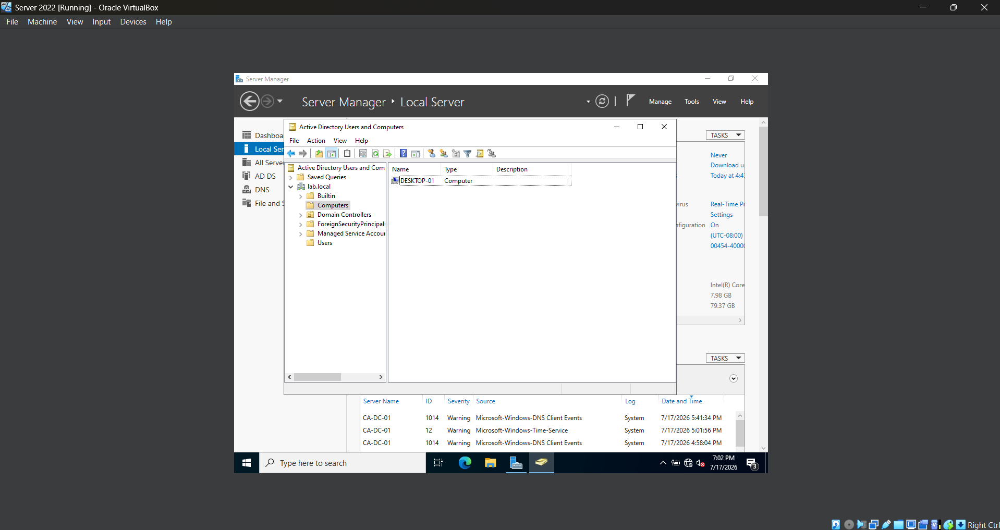

I open **Active Directory Users and Computers** and navigate to **lab.local > Computers**. As shown in the image above, `DESKTOP-01` appears in the list, confirming that the Windows 11 VM successfully joined the domain. This is also confirmed by the fact that I was able to log in using the domain account in the previous step.

## *Challenges*
When setting up the windows 11 VM i didn't give it the correct system requirements of 2 cores, supporting TPM 2.0 and supporting secure boot. I fixed this by going into the settings of the VM and changing those respective settings to go through.
Another issue was not giving the VM enough storage as well so i made sure it could handle the 52gb requirements. To fix this I just remade the profile since at this point nothing is really on the computer so its fine to delete it all.

## *What I Learned*
- Read documentation on software before setting it up.
- 
## *Next Steps*
