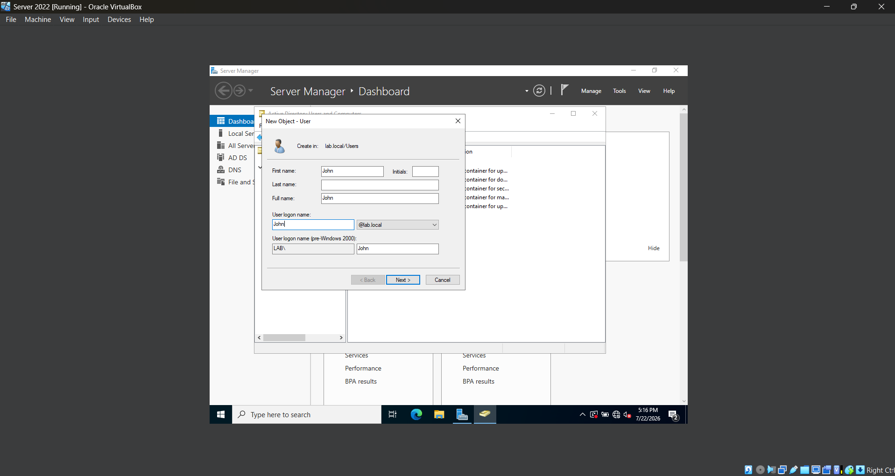
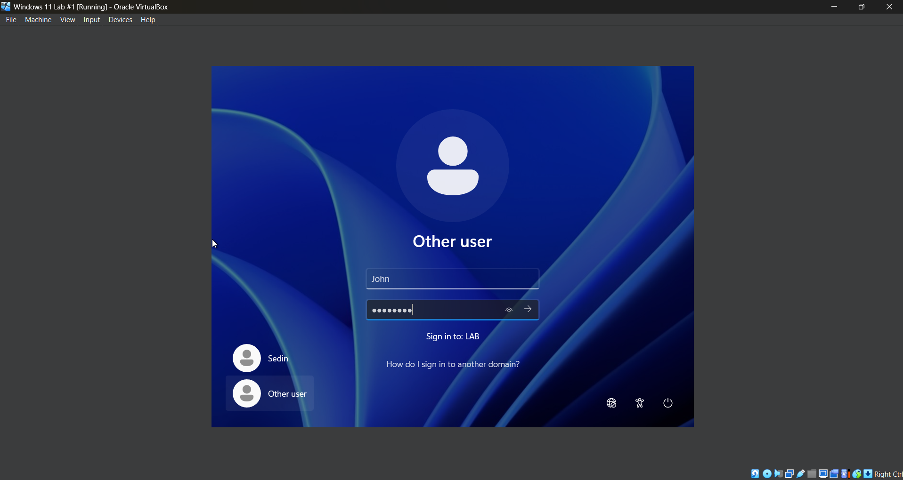
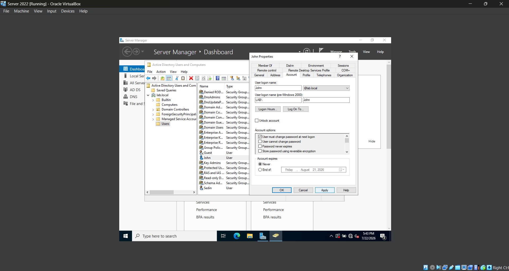
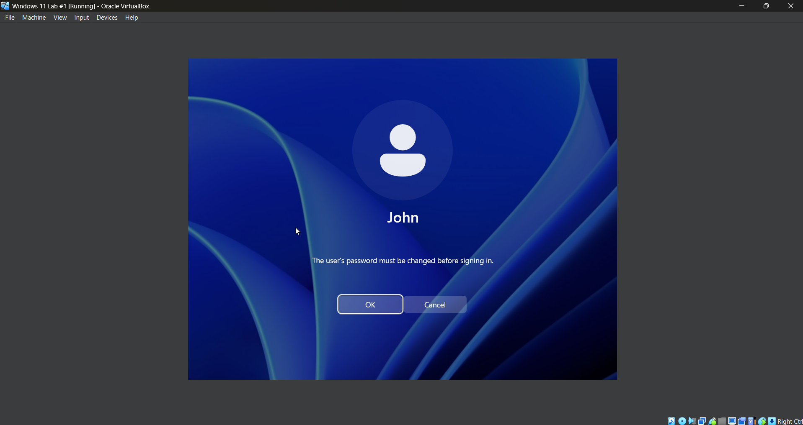
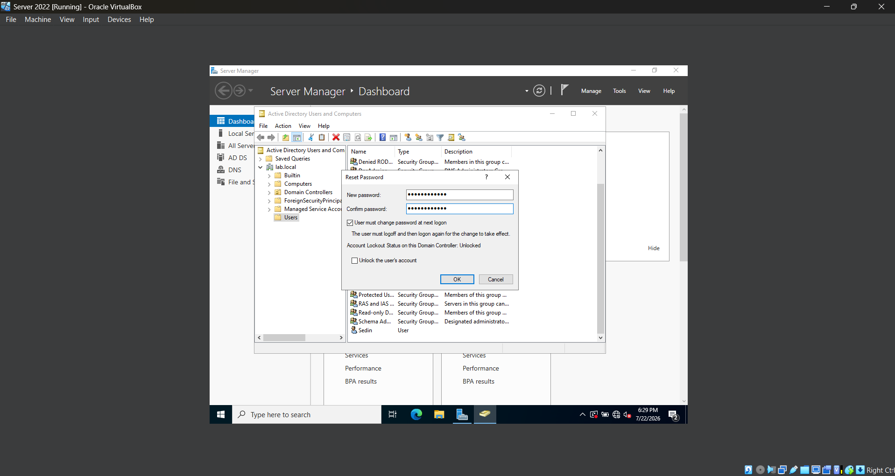

# *Lab 03 - Active Directory User Account Management*

## *Objective*
Learning how to manage user accounts in Active Directory by creating, modifying, securing, and removing users.

## *Environment*
The following software was used:
- Oracle VirtualBox
- Windows Server 2022
- Windows 11
- Active Directory Domain Services (AD DS)

## *Skills Demonstrated*

## *Steps*

### *Step 1 - Create a New User*

In the Windows Server 2022 VM, I open **Active Directory Users and Computers** and navigate to the `lab.local` domain. I then open the **Users** folder, right-click it, and select **New > User**. From there, I fill out the user's information, including their name, user logon name, and password.

### *Step 2 - Testing New User Login*

In the Windows 11 VM, I select **Other user** and enter the user logon name and password created in the previous step. Successfully logging in confirms that the new domain user account is working correctly.

### *Step 3 - Forcing Password Change*

In the Windows Server 2022 VM, I locate the user account created earlier in **Active Directory Users and Computers**, right-click it, and select **Properties**. I then open the **Account** tab, check **User must change password at next logon**, and click **Apply**.

In the Windows 11 VM, I sign out of the current account and log back in using the domain user account. Windows requires the user to create a new password before continuing. I enter and confirm the new password, then complete the login process.

When creating a new user account or resetting a user's password, IT administrators often assign a temporary password and require the user to change it at the next logon. This helps ensure that only the account owner knows the permanent password, reducing the risk of unauthorized access to company resources and confidential information.

### *Step 4 - Resetting Password*

In the Windows Server 2022 VM, I locate the user account created earlier in **Active Directory Users and Computers**, right-click it, and select **Properties**. I then open the **Account** tab, check **User must change password at next logon**, and click **Apply**.

In the Windows 11 VM, I sign out of the current account and log back in using the temporary password. Windows requires the user to create a new password before continuing. I enter and confirm the new password, then complete the login process.

When creating a new user account or resetting a user's password, IT administrators often assign a temporary password and require the user to change it at the next logon. This helps ensure that only the account owner knows the permanent password, reducing the risk of unauthorized access to company resources and confidential information.

## *Challenges*

## *What I Learned*

## *Next Steps*
