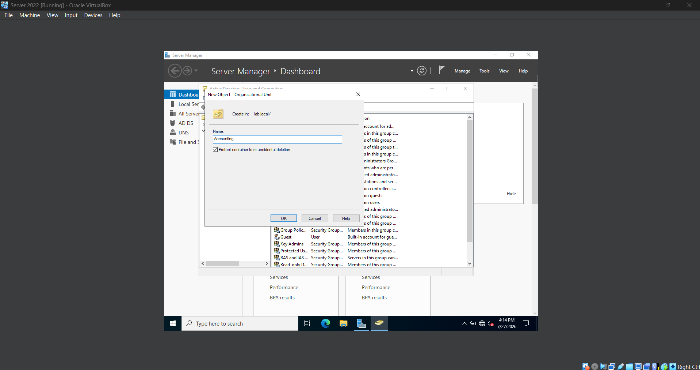
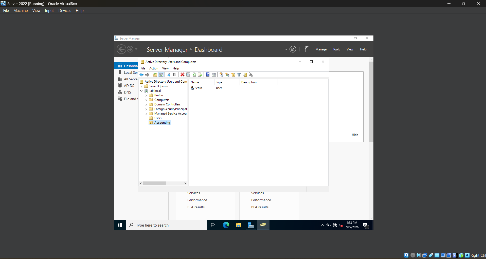
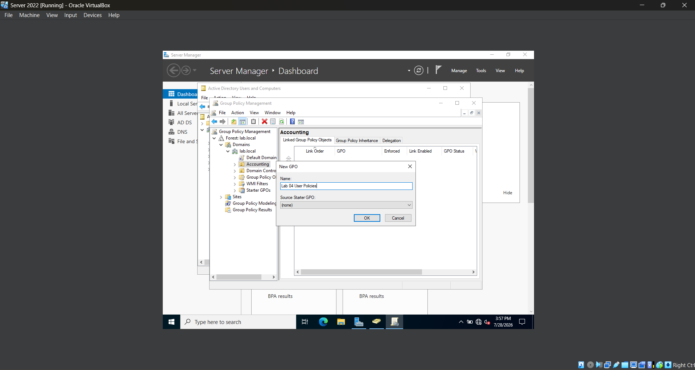
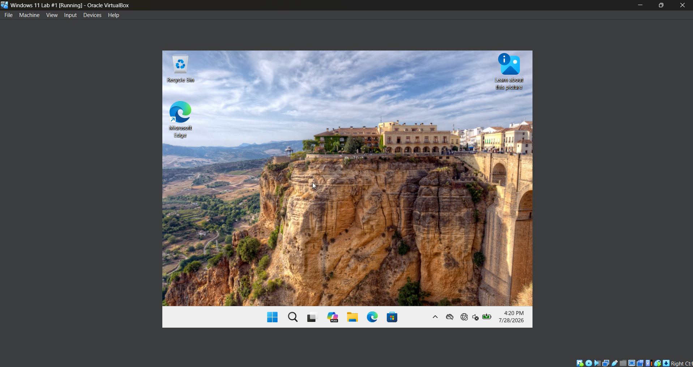
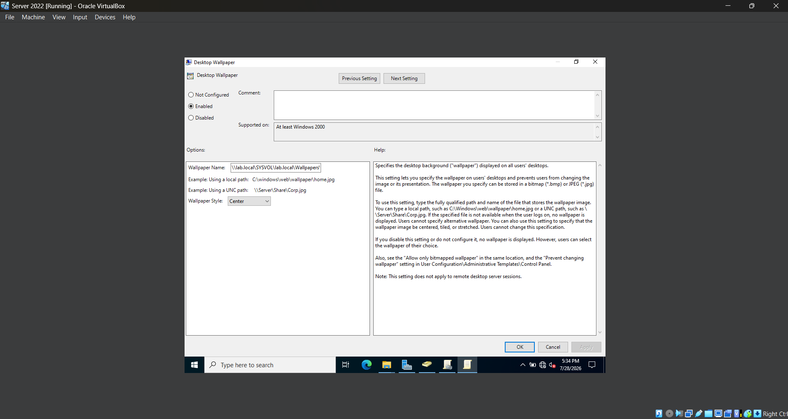
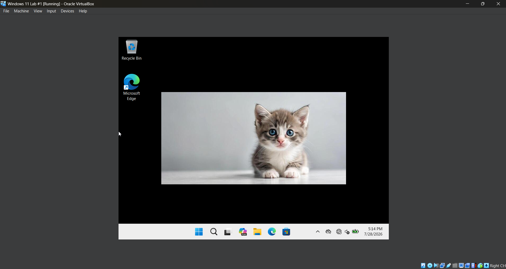

# *Lab 04 - Group Policy Management*

## *Objective*
Learn how Organizational Units (OUs) and Group Policy Objects (GPOs) work together to centrally manage user settings in an Active Directory environment.

## *Environment*
- Oracle VirtualBox
- Windows Server 2022
- Windows 11
- Active Directory Domain Services
- Group Policy Management Console (GPMC)

## *Skills Demonstrated*

## *Steps*

### *Step 1 - Create an Organizational Unit (OU)*

In the Windows Server 2022 VM, I open **Active Directory Users and Computers**, right-click the `lab.local` domain, and select **New > Organizational Unit**. I then name the OU **Accounting**.

Organizational Units (OUs) are containers used to organize users, computers, and groups within Active Directory. They allow administrators to logically organize domain objects and apply Group Policies to specific users or computers without affecting the entire domain. In business environments, OUs are commonly used to separate departments such as Accounting, Human Resources, and IT, making administration and policy management more efficient.

### *Step 2 - Move the User into the OU*

I move the test user created in the previous lab into the new Organizational Unit. 

Because Group Policies are linked to OUs, placing the user inside this OU allows any policies applied to it to automatically affect that user.

### *Step 3 - Create a Group Policy Object*

In the Windows Server 2022 VM, I open **Group Policy Management** from the Start menu. I then expand the `lab.local` domain until I locate the **Accounting** Organizational Unit (OU) created earlier. I right-click the OU and select **Create a GPO in this domain, and Link it here...**. I then give the Group Policy Object (GPO) a descriptive name. For this lab, I name it **Lab 04 User Policies**.

Group Policy Objects (GPOs) are collections of Windows settings that administrators use to centrally manage users and computers in an Active Directory domain. By linking a GPO to an Organizational Unit, the configured settings are automatically applied to the users or computers within that OU. This allows organizations to efficiently enforce security settings, standardize system configurations, and simplify administration across multiple devices.

### *Step 4 – Configure Desktop Wallpaper*

In the Windows Server 2022 VM, I configure the **Desktop Wallpaper** policy and specify a wallpaper image stored in the domain's **SYSVOL** share using a UNC path. After saving the policy, I run `gpupdate /force` to refresh Group Policy. 

I then restart the Windows 11 VM and sign back into the domain account to ensure the updated policy is applied. Once the system finishes processing the policy, the desktop wallpaper is successfully displayed.

Storing the wallpaper image in the domain's **SYSVOL** share provides a centralized location that all authenticated domain users can access. This allows administrators to deploy a consistent desktop background to users through Group Policy without storing separate copies of the image on each computer.

Organizations commonly use desktop wallpaper policies to maintain company branding, display important information, or provide a standardized desktop experience across managed devices.

## *Challenges*
- While configuring the desktop wallpaper policy, I initially selected the **Force a specific default lock screen and logon image** policy instead of the **Desktop Wallpaper** policy. After reviewing the available Group Policy settings, I realized the lock screen policy only controls the Windows lock screen and sign-in image, while the **Desktop Wallpaper** policy is responsible for configuring the user's desktop background.
- After correcting the policy, I stored the wallpaper image in the domain's **SYSVOL** share and referenced it using a UNC path so it could be accessed by domain users. Although I initially ran `gpupdate /force` and signed back into the Windows 11 VM, the wallpaper did not immediately appear. After restarting the virtual machine and logging back into the domain account, the wallpaper applied successfully.
- This lab reinforced the importance of selecting the correct Group Policy setting, verifying that the policy is applied using `gpresult`, and understanding that some Group Policy changes may require a system restart before they fully take effect.

## *What I Learned*

## *Next Steps*
