# **Lab 05 - Domain Password and Account Security Policies**

## **Objective**

Learn how to configure domain-wide security policies that protect user accounts and workstations by enforcing password requirements, account lockout settings, and automatic workstation locking.

## **Environment**

- **Hypervisor / Virtualization:** Oracle VirtualBox
- **Server Operating System:** Windows Server 2022
- **Client Operating System:** Windows 11 Pro
- **Active Directory Domain:** `lab.local`
- **Core Services & Roles:** Active Directory Domain Services (AD DS), Domain Controller, Group Policy
- **Group Policy Scope:** Default Domain Policy
- **Management Tools:** Group Policy Management Console (GPMC), Group Policy Management Editor, Active Directory Users and Computers (ADUC)
- **Security Policies:** Password Policy, Account Lockout Policy, Automatic Workstation Locking
- **Command-Line Tools:** `gpupdate`
- **Client Testing:** Domain-joined Windows 11 workstation

## **Skills Demonstrated**

- Configuring domain-wide Group Policy settings
- Managing the Default Domain Policy
- Configuring password complexity requirements
- Configuring minimum password length and password history
- Configuring password expiration policies
- Configuring account lockout policies
- Testing Group Policy changes from a domain-joined Windows 11 workstation
- Troubleshooting user account lockouts
- Unlocking Active Directory user accounts
- Configuring automatic workstation locking
- Using `gpupdate` to apply Group Policy changes
- Active Directory security administration

## **Steps**

### *Step 1 - Open the Default Domain Policy*

In the Windows Server 2022 VM, I open **Group Policy Management**, expand the `lab.local` domain, right-click **Default Domain Policy**, and select **Edit**.

Unlike the Group Policy Object created in the previous lab, password and account lockout policies are configured through the **Default Domain Policy** because they apply to every user account in the Active Directory domain. Configuring these settings at the domain level ensures that all domain users follow the same security requirements.

### *Step 2 – Configure Screen Saver Lock*

In the Windows Server 2022 VM, I edit the **Default Domain Policy** and navigate to **User Configuration > Policies > Administrative Templates > Control Panel > Personalization**. I enable **Enable screen saver**, **Force specific screen saver**, **Password protect the screen saver**, and **Screen saver timeout**, configuring the timeout to **2 minutes**. I specify **scrnsave.scr** as the screen saver, then run `gpupdate /force` before restarting the Windows 11 VM.

After signing back into the domain account and remaining idle for two minutes, the screen saver activates and the workstation locks. When I move the mouse or press a key, Windows returns to the sign-in screen and requires the user's password before access is restored, confirming that the policy has been successfully applied.

Organizations commonly configure automatic workstation locking to protect sensitive information when employees leave their computers unattended. Requiring users to authenticate after a period of inactivity helps reduce the risk of unauthorized access while still allowing employees to securely resume their work. For demonstration purposes, I configured the timeout to **2 minutes** so the policy could be tested quickly within the lab.

### *Step 3 – Password Complexity*

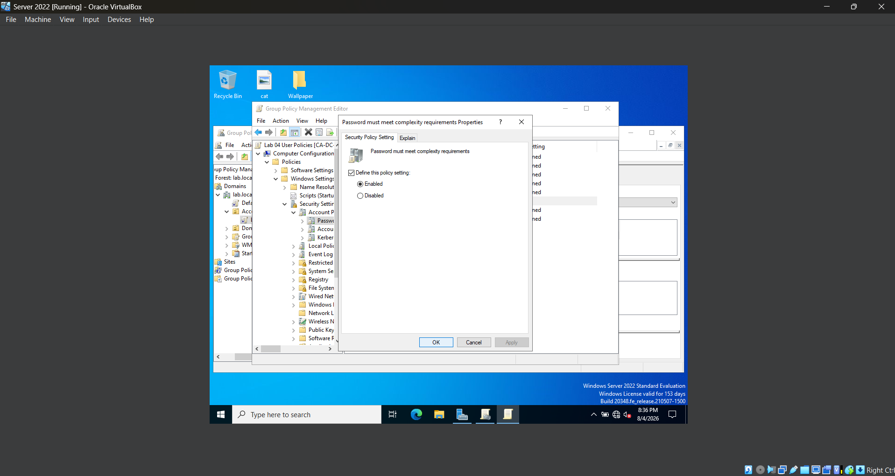

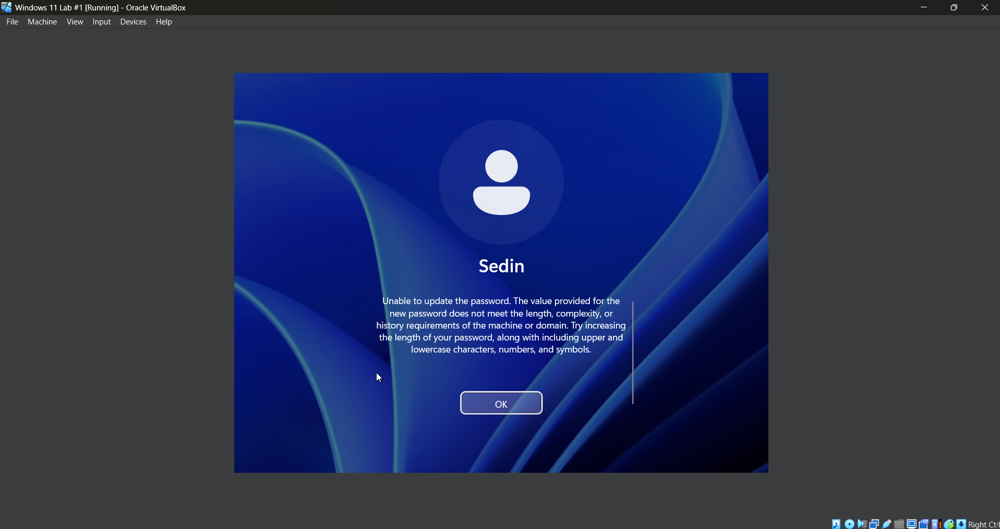

In the Windows Server 2022 VM, I edit the **Default Domain Policy** and navigate to **Computer Configuration > Policies > Windows Settings > Security Settings > Account Policies > Password Policy**. I enable **Password must meet complexity requirements**, then run `gpupdate /force` before restarting the Windows 11 VM.

To verify the policy, I attempt to change the user's password from the Windows 11 VM using **password123**, which contains only lowercase letters and numbers. Windows rejects the password and displays a message indicating that it does not satisfy the domain's password policy. I then create a password containing uppercase letters, lowercase letters, and numbers, such as **Password123**, which Windows accepts because it satisfies the configured complexity requirements.

Organizations enforce password complexity requirements to reduce the likelihood of weak or easily guessed passwords. Requiring users to create more complex passwords helps protect accounts against brute-force attacks, dictionary attacks, and other common password-related threats.

### *Step 4 - Configure Minimum Password Length*

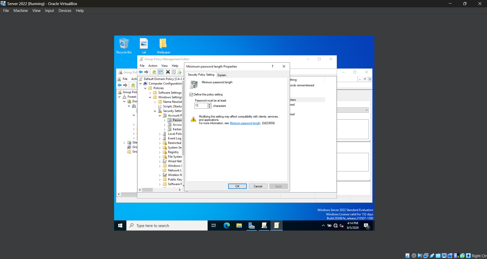

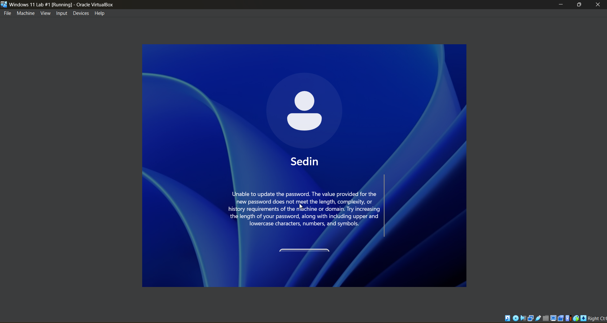

In the Windows Server 2022 VM, I edit the **Default Domain Policy** and navigate to **Computer Configuration > Policies > Windows Settings > Security Settings > Account Policies > Password Policy**. I configure **Minimum password length** to require passwords to be at least **12 characters** long. I then run `gpupdate /force` before restarting the Windows 11 VM.

To verify the policy, I attempt to change the user's password from the Windows 11 VM using **Password1**, which satisfies the password complexity requirements but is only **9 characters** long. Windows rejects the password and displays a message indicating that it does not satisfy the domain's password policy, confirming that the minimum password length requirement has been successfully applied.

Organizations commonly require longer passwords because they are more resistant to brute-force attacks and generally provide stronger protection for user accounts and sensitive organizational data.

### *Step 5 - Configure Password History*

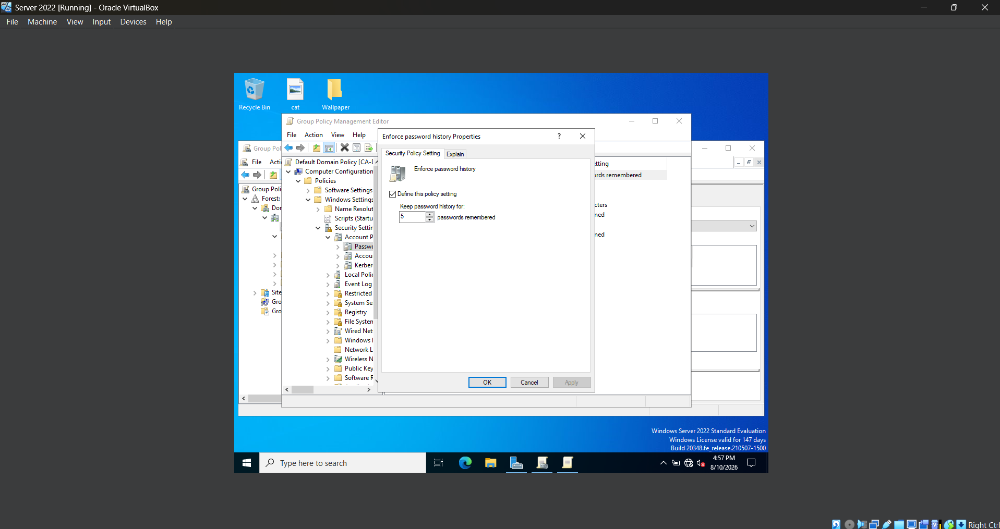

In the Windows Server 2022 VM, I edit the **Default Domain Policy** and navigate to **Computer Configuration > Policies > Windows Settings > Security Settings > Account Policies > Password Policy**. I configure **Enforce password history** to remember the previous **5 passwords**, then run `gpupdate /force` before restarting the Windows 11 VM.

To verify the policy, I change the user's password and then attempt to reuse one of the recently used passwords. Windows prevents the password from being reused, confirming that the policy has been successfully applied.

Organizations commonly enforce password history policies to prevent users from repeatedly cycling between the same passwords. This encourages users to create new passwords rather than continually reusing previous credentials.

### *Step 6 - Configure Maximum Password Age*

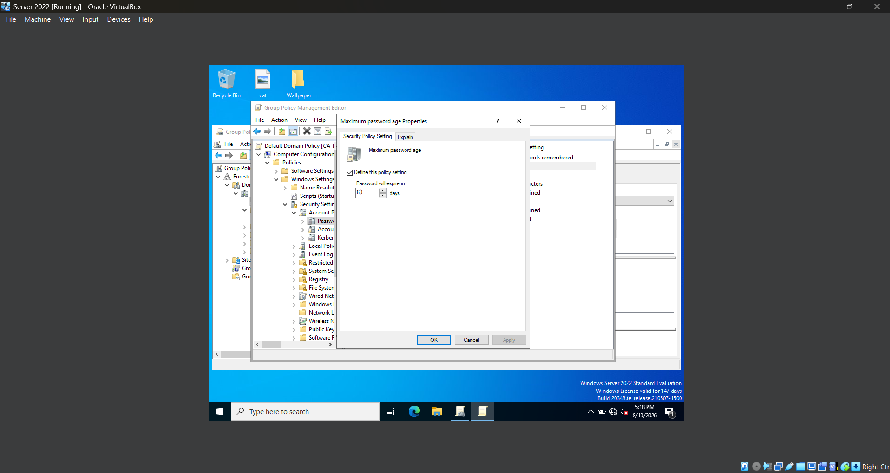

In the Windows Server 2022 VM, I edit the **Default Domain Policy** and navigate to **Computer Configuration > Policies > Windows Settings > Security Settings > Account Policies > Password Policy**. I configure the **Maximum password age** policy to **60 days**, then run `gpupdate /force` before restarting the Windows 11 VM.

The maximum password age determines how long a password may be used before Windows requires the user to create a new one.

Organizations commonly configure password expiration policies to reduce the amount of time a compromised password can remain valid. Requiring periodic password changes helps improve overall account security while encouraging users to regularly update their credentials.

### *Step 7 - Configure Account Lockout Threshold*

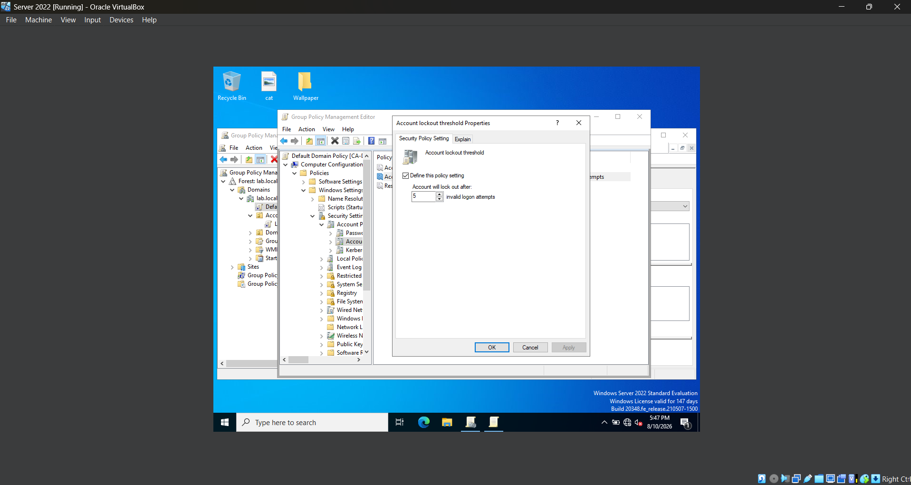

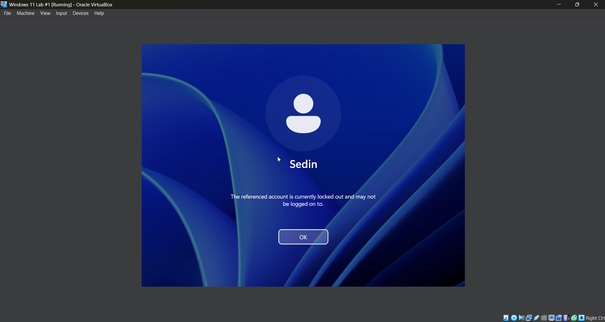

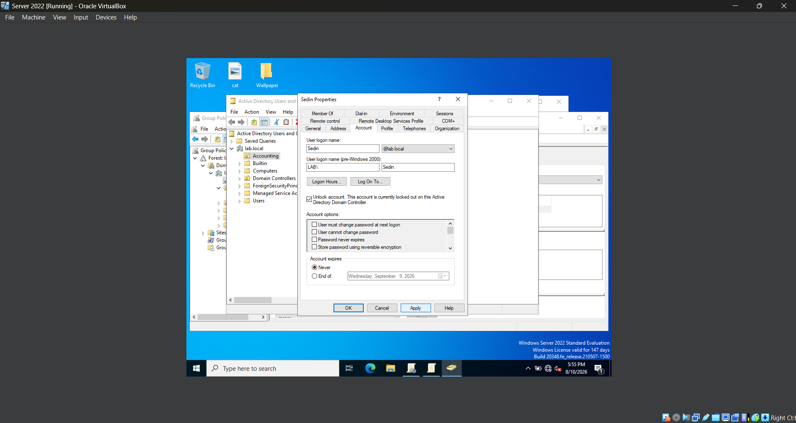

In the Windows Server 2022 VM, I edit the **Default Domain Policy** and navigate to **Computer Configuration > Policies > Windows Settings > Security Settings > Account Policies > Account Lockout Policy**. I configure the **Account lockout threshold** to **5 invalid logon attempts**, then run `gpupdate /force` before restarting the Windows 11 VM.

To verify the policy, I intentionally enter the wrong password five consecutive times while attempting to sign in to the Windows 11 VM. After the fifth failed attempt, Windows locks the account and prevents additional login attempts, even if the correct password is entered.

To restore access, I return to the Windows Server 2022 VM and open **Active Directory Users and Computers**. I locate the locked user account, open **Properties > Account**, select **Unlock account**, and apply the change. I then return to the Windows 11 VM and successfully sign in using the correct password, confirming that the account has been unlocked.

Organizations commonly configure account lockout thresholds to help defend against repeated password-guessing attacks by limiting the number of consecutive failed login attempts. IT administrators may also need to unlock accounts when legitimate users accidentally trigger the lockout policy, making account lockout troubleshooting and recovery a common user support task.

### *Step 8 - Configure Account Lockout Duration*

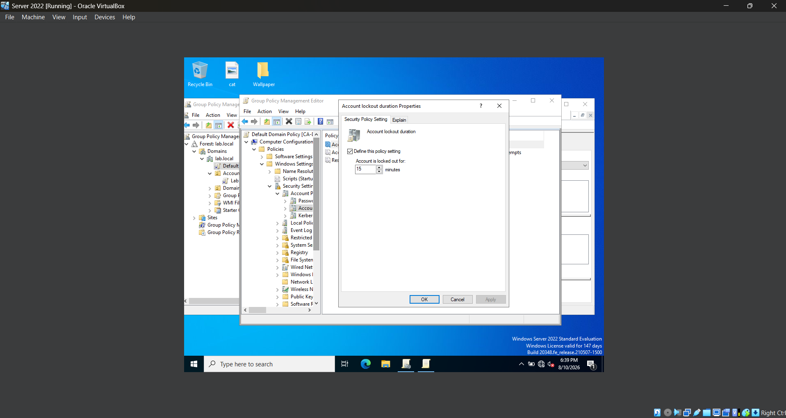

In the Windows Server 2022 VM, I edit the **Default Domain Policy** and navigate to **Computer Configuration > Policies > Windows Settings > Security Settings > Account Policies > Account Lockout Policy**. I configure the **Account lockout duration** to **15 minutes**, then run `gpupdate /force` before restarting the Windows 11 VM.

The account lockout duration determines how long a locked account remains inaccessible before Windows automatically unlocks it.

Organizations commonly configure a lockout duration to temporarily block unauthorized login attempts while reducing the need for administrators to manually unlock user accounts after accidental lockouts.

### *Step 9 - Configure Reset Account Lockout Counter*

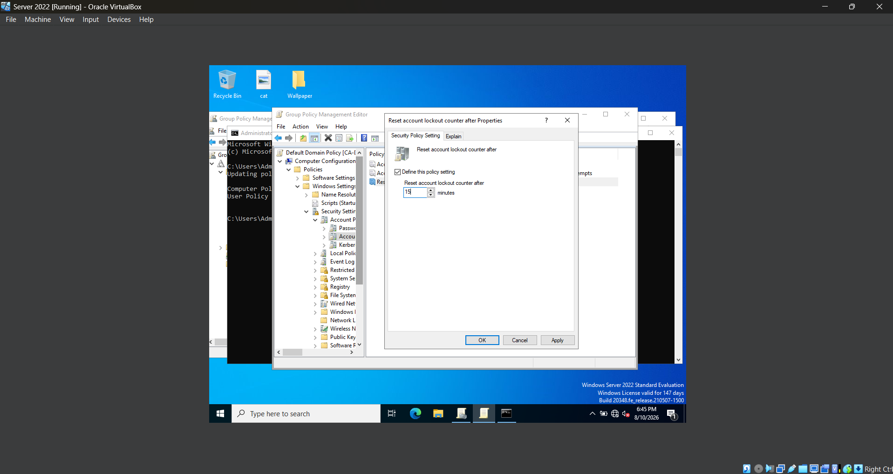

In the Windows Server 2022 VM, I edit the **Default Domain Policy** and navigate to **Computer Configuration > Policies > Windows Settings > Security Settings > Account Policies > Account Lockout Policy**. I configure **Reset account lockout counter after** to **15 minutes**, then run `gpupdate /force` before restarting the Windows 11 VM.

The **Reset account lockout counter** determines how long Windows waits before clearing the count of failed logon attempts. Unlike the **Account lockout duration**, which controls how long an account remains locked, this policy resets the failed login counter if no additional unsuccessful logon attempts occur during the specified time period.

Organizations commonly configure this policy alongside the account lockout threshold and lockout duration to balance account security with usability by preventing occasional login mistakes from permanently counting toward an account lockout.

## **Challenges**

- While testing the password policies, I initially created a password that satisfied the specific policy I was testing but Windows still rejected it. I realized that multiple password policies were being enforced at the same time, so a password could pass one requirement while still failing another. For example, a password could meet the minimum length requirement but still fail the complexity requirement. I adjusted my testing by creating passwords that satisfied all of the other active requirements while intentionally failing only the specific policy I wanted to verify. This allowed me to test each password policy more accurately.

## **What I Learned**

- I learned the difference between policies applied to specific Organizational Units and security policies that apply across an entire Active Directory domain.
- I learned how to configure and enforce domain password requirements including complexity, minimum length, password history, and maximum password age.
- I learned how password requirements work together to determine whether a user's new password is accepted.
- I learned how account lockout thresholds can help protect user accounts against repeated password-guessing attempts.
- I learned the difference between the **account lockout duration** and the **reset account lockout counter**.
- I learned how to identify and manually unlock a locked Active Directory user account.
- I learned how to test domain policies from a Windows 11 client to verify that configurations made on the server are actually affecting domain users.
- I learned how automatic workstation locking can help protect unattended computers from unauthorized access.

## **Next Steps**

In future labs, I plan to continue expanding the Active Directory environment by focusing on additional services and administrative tasks commonly used in business networks. Potential next steps include configuring shared folders and NTFS permissions, deploying and managing DHCP, exploring DNS administration and troubleshooting, using PowerShell to automate Active Directory tasks, and practicing remote administration of Windows clients.
