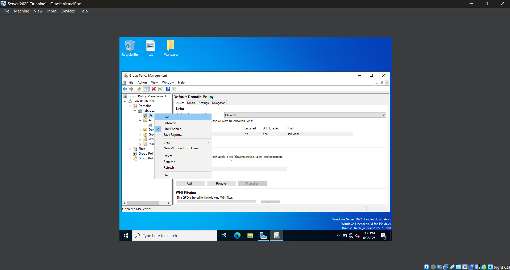
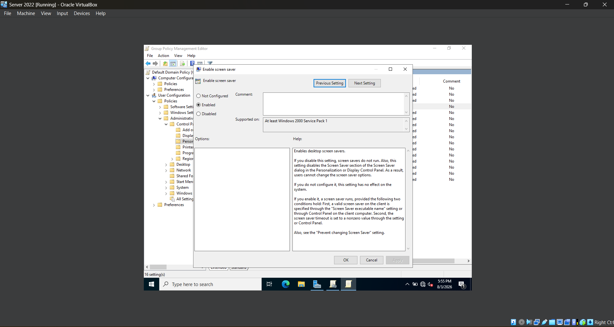
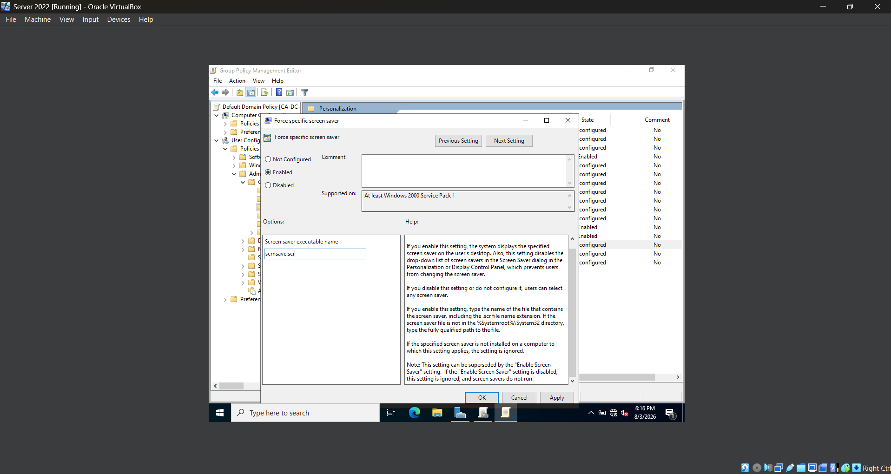
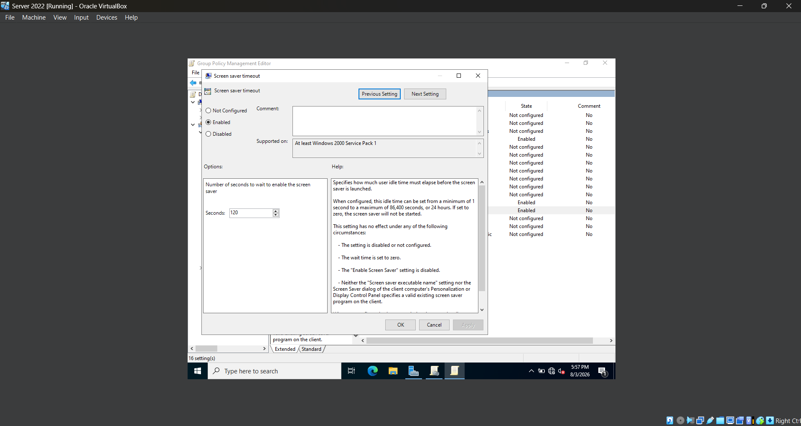
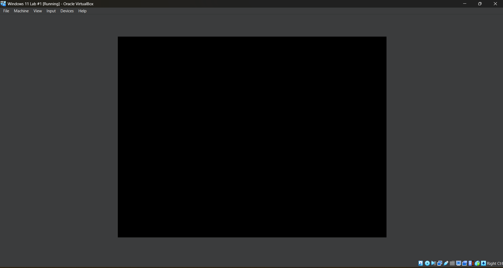

# *Lab 05 - Domain Password and Account Security Policies*

## *Objective*
Learn how to configure domain-wide security policies that protect user accounts and workstations by enforcing password requirements, account lockout settings, and automatic workstation locking.

## *Environment*
- Oracle VirtualBox
- Windows Server 2022
- Windows 11
- Active Directory Domain Services (AD DS)
- Group Policy Management

## *Skills Demonstrated*

## *Steps*

### *Step 1 - Open the Default Domain Policy*

In the Windows Server 2022 VM, I open **Group Policy Management**, expand the `lab.local` domain, right-click **Default Domain Policy**, and select **Edit**.

Unlike the Group Policy Object created in the previous lab, password and account lockout policies are configured through the **Default Domain Policy** because they apply to every user account in the Active Directory domain. Configuring these settings at the domain level ensures that all domain users follow the same security requirements.

### *Step 2 – Configure Screen Saver Lock*

In the Windows Server 2022 VM, I edit the **Default Domain Policy** and navigate to **User Configuration > Policies > Administrative Templates > Control Panel > Personalization**. I enable **Enable screen saver**, **Force specific screen saver**, **Password protect the screen saver**, and **Screen saver timeout**, configuring the timeout to **2 minutes**. I specify **scrnsave.scr** as the screen saver, then run `gpupdate /force` before restarting the Windows 11 VM.

After signing back into the domain account and remaining idle for two minutes, the screen saver activates and the workstation locks. When I move the mouse or press a key, Windows returns to the sign-in screen and requires the user's password before access is restored, confirming that the policy has been successfully applied.

Organizations commonly configure automatic workstation locking to protect sensitive information when employees leave their computers unattended. Requiring users to authenticate after a period of inactivity helps reduce the risk of unauthorized access while still allowing employees to securely resume their work. For demonstration purposes, I configured the timeout to **2 minutes** so the policy could be tested quickly within the lab.

## *Challenges*
- One of the key concepts in this lab was understanding the difference between **OU-linked Group Policy Objects** and the **Default Domain Policy**. Unlike the policies configured in the previous lab, password and account lockout settings must be configured through the Default Domain Policy because they are intended to apply consistently across the entire Active Directory domain.

## *What I Learned*

