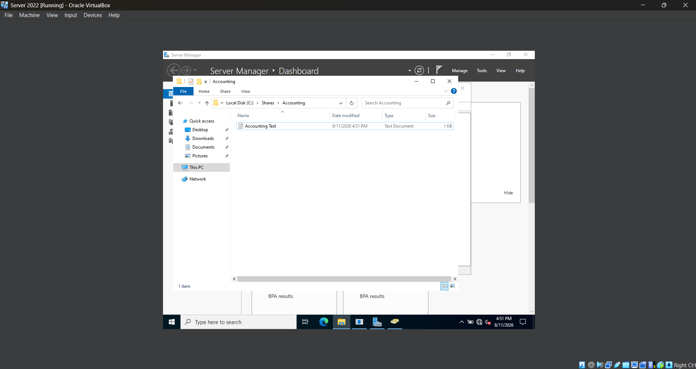
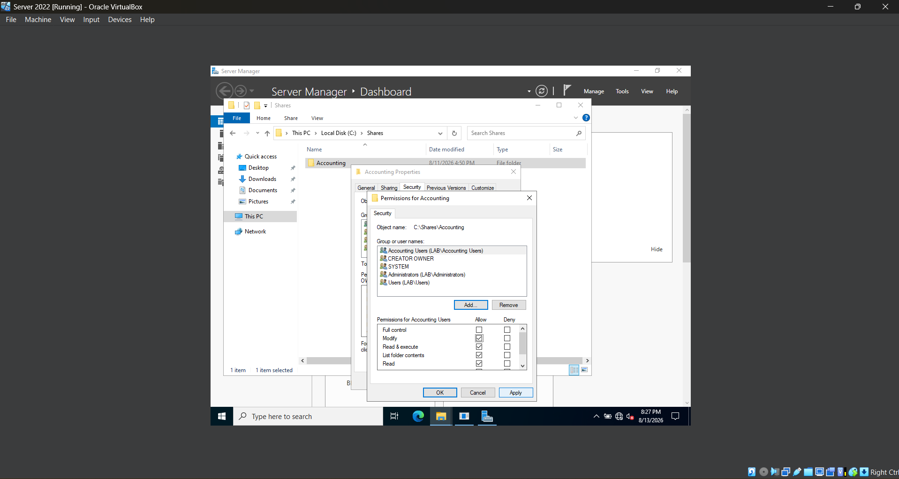
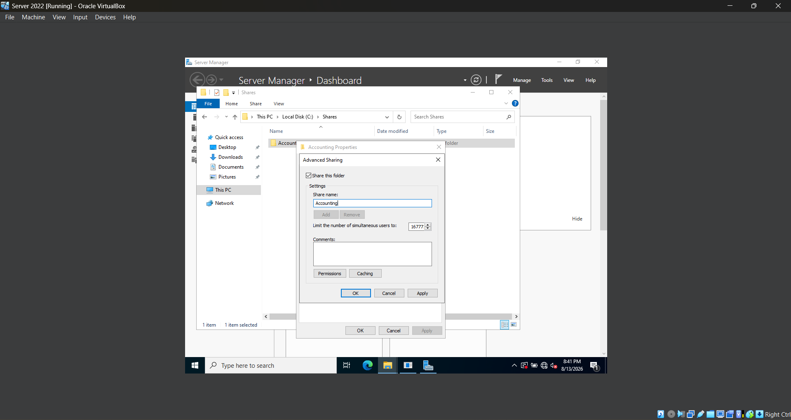
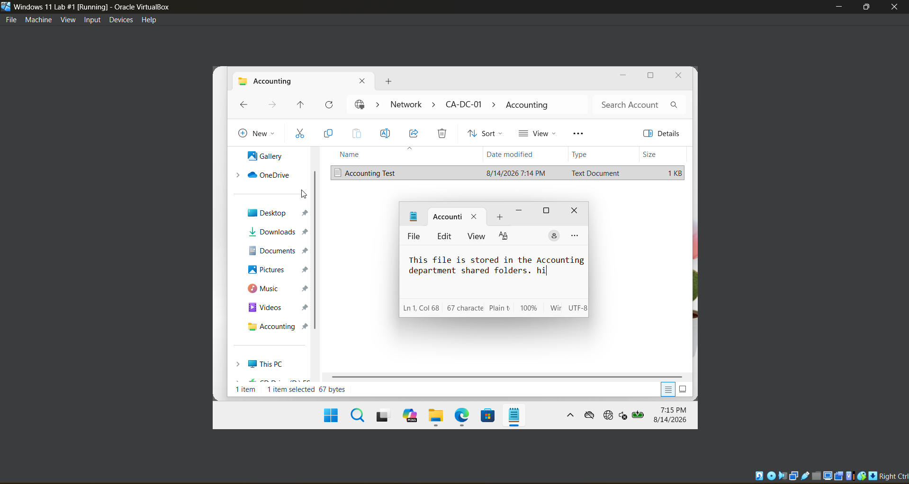
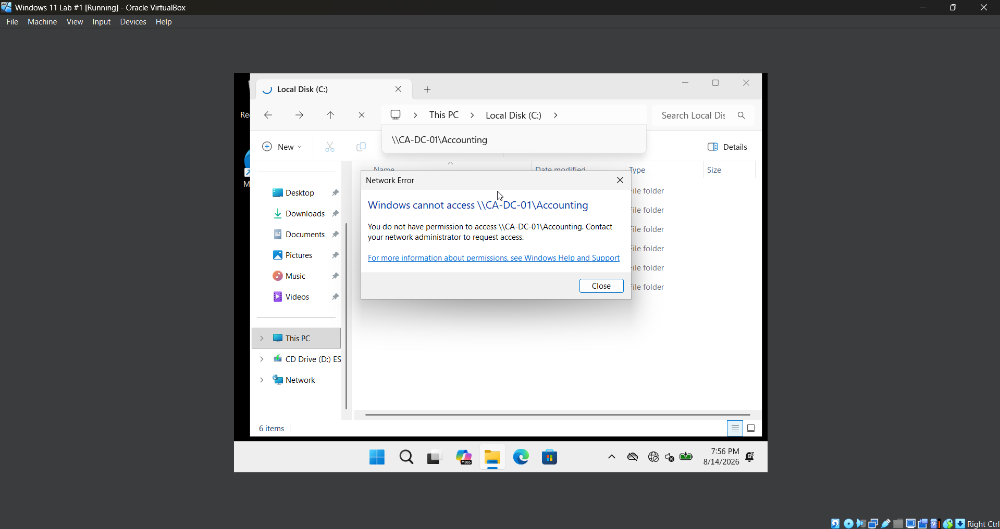
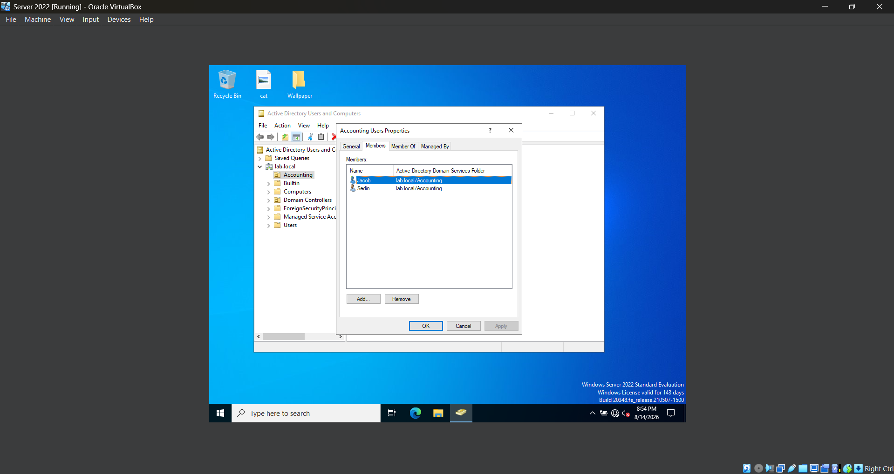
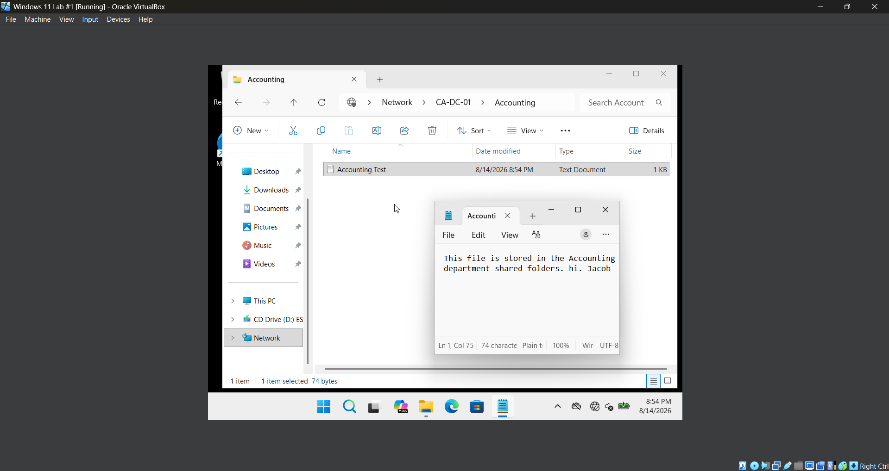
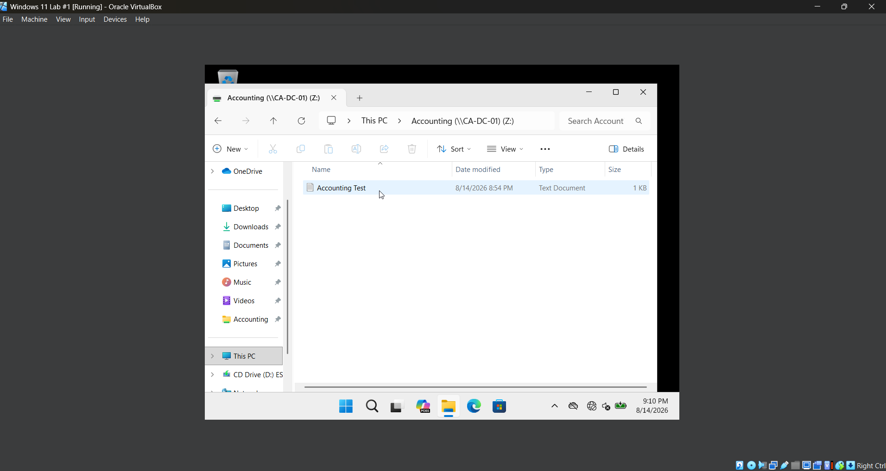

# **Lab 06 - Domain Password and Account Security Policies**

## **Objective**

Learn how to configure and manage shared folders in a Windows Server Active Directory environment by using security groups, NTFS permissions, and share permissions. This lab focuses on controlling access to organizational resources, testing authorized and unauthorized access from a domain-joined Windows 11 workstation, and managing access through Active Directory group membership.

## **Environment**

- Oracle VirtualBox
- Windows Server 2022
- Windows 11
- Active Directory Domain Services (AD DS)
- Active Directory Users and Computers (ADUC)
- Windows File Sharing
- NTFS File System

## **Skills Demonstrated**

## **Steps**

### *Step 1 - Create an Accounting Security Group*

First, I open the Windows Server 2022 VM and open **Active Directory Users and Computers**. I navigate to the **Accounting** Organizational Unit (OU) that was created in Lab 04. I right-click the Accounting OU, select **New > Group**, and name the group **Accounting Users**. I set the **Group scope** to **Global** and the **Group type** to **Security**, then click **OK** to create the group.

After creating the group, I open **Accounting Users**, select the **Members** tab, and add the domain user that I will be using to test access to the shared folder.

Creating a security group allows administrators to manage access to resources based on group membership instead of assigning permissions individually to each user. For example, if multiple employees need access to the Accounting shared folder, they can be added to the **Accounting Users** group and receive the permissions assigned to that group.

I use a **Global Security** group because the group is being used to organize users from the same domain and assign them permissions to a network resource.

### *Step 2 - Create the Accounting Shared Folder*

In the Windows Server 2022 VM, I open **File Explorer** and navigate to the `C:` drive. I create a new folder named **Shares**, and inside it I create another folder named **Accounting**. This creates the folder path `C:\Shares\Accounting`.

Inside the Accounting folder, I create a text document named **Accounting Test** that will be used later to verify that users can access and modify files through the network share.

Creating a dedicated `C:\Shares` directory provides an organized location for folders that will be shared across the network. At this point, the Accounting folder only exists locally on the server and has not yet been configured as a network share.

### *Step 3 - Configure NTFS Permissions*

In the Windows Server 2022 VM, I right-click the **Accounting** folder located at `C:\Shares\Accounting` and select **Properties > Security > Edit**. I then add the **Accounting Users** security group that was created earlier in the lab.

After adding the group, I grant **Modify** permission to the **Accounting Users** group. This automatically allows the group to read, write, create, edit, and delete files inside the Accounting folder without giving users full administrative control over the folder.

NTFS permissions control what users and groups are allowed to do with files and folders stored on an NTFS-formatted drive. Assigning permissions to a security group instead of individual users makes access easier to manage because administrators can grant or remove access simply by changing a user's group membership.

For this lab, **Modify** permission provides the Accounting users with the level of access they need to work with departmental files while avoiding the broader permissions provided by **Full Control**.

### *Step 4 - Share the Folder*

In the Windows Server 2022 VM, I right-click the **Accounting** folder and select **Properties > Sharing > Advanced Sharing**. I check **Share this folder** and set the share name to **Accounting**. I then configure the share permissions and apply the changes to make the folder accessible over the network.

Once the folder is shared, domain users can attempt to access it from another computer on the network using its UNC path, such as `\\CA-DC-01\Accounting`.

Share permissions control what users are allowed to do with a folder when accessing it over the network, while the NTFS permissions configured in the previous step control access to the files and folders themselves. When a shared folder is accessed over the network, both share and NTFS permissions must be considered when determining a user's effective access.

For this lab, the **Accounting Users** security group will be used to control which users are authorized to modify the contents of the Accounting folder. This allows access to be managed through Active Directory group membership rather than assigning permissions individually to each user.

### *Step 5 - Test Authorized Access*

On the Windows 11 VM, I sign in using the domain user that was previously added to the **Accounting Users** security group. I open **File Explorer** and navigate to the Accounting shared folder on the Windows Server 2022 VM through the network at `\\CA-DC-01\Accounting`.

I open the **Accounting Test** text file that was created earlier and verify that I can read its contents. To test whether the user also has permission to modify the file, I add **"hi"** to the existing text and save the file. The changes save successfully, confirming that the user has both read and modify access to the shared file.

This confirms that members of the **Accounting Users** security group have the intended access to the Accounting network share. The user's **Change** share permission and **Modify** NTFS permission allow them to read, create, edit, and delete files within the shared folder without providing Full Control.

### *Step 6 - Test Unauthorized Access*

In the Windows Server 2022 VM, I open **Active Directory Users and Computers** and create a second domain user that will be used to test unauthorized access to the Accounting shared folder. I do not add this user to the **Accounting Users** security group.

I then sign out of the current account on the Windows 11 VM and sign in using the unauthorized test account. From **File Explorer**, I attempt to access the Accounting network share at `\\CA-DC-01\Accounting`.

Windows denies access to the shared folder because the test user is not a member of the **Accounting Users** security group and therefore does not have the required share and NTFS permissions.

This confirms that the permissions configured earlier are successfully restricting access to authorized Accounting users rather than allowing every domain user to access the departmental files.

### *Step 7 - Grant Access Through Group Membership*

In the Windows Server 2022 VM, I open **Active Directory Users and Computers** and add the previously unauthorized test user to the **Accounting Users** security group. Instead of assigning permissions directly to the individual user, I grant access by changing the user's group membership.

After adding the user to the group, I sign out of the Windows 11 VM and sign back in using the same test account. Signing back in allows Windows to update the user's security token with the new group membership.

I then return to `\\CA-DC-01\Accounting` and successfully access the shared folder. To test whether the user also has permission to modify the file, I add **"Jacob"** to the existing text and save the file. The changes save successfully, confirming that the user has both read and modify access to the shared file.

Using security groups to manage permissions makes administration more efficient because access can be granted or removed by changing group membership instead of modifying folder permissions for each individual user.

### *Step 8 - Map the Accounting Network Drive*

On the Windows 11 VM, I open **File Explorer**, navigate to **This PC**, and select **Map network drive**. I choose the drive letter `Z:` and enter the Accounting network share path `\\CA-DC-01\Accounting`. I also select **Reconnect at sign-in** so the mapped drive remains available after the user signs back into Windows.

After completing the setup, the Accounting shared folder appears as a mapped network drive under **This PC**. I open the `Z:` drive and verify that the Accounting files are accessible.

Mapping a network drive gives users a convenient way to access shared organizational resources without having to manually enter a UNC path each time. In business environments, mapped drives are commonly used to provide employees with quick access to departmental or shared company folders.

## **Challenges**

## **What I Learned**

## **Next Steps**
