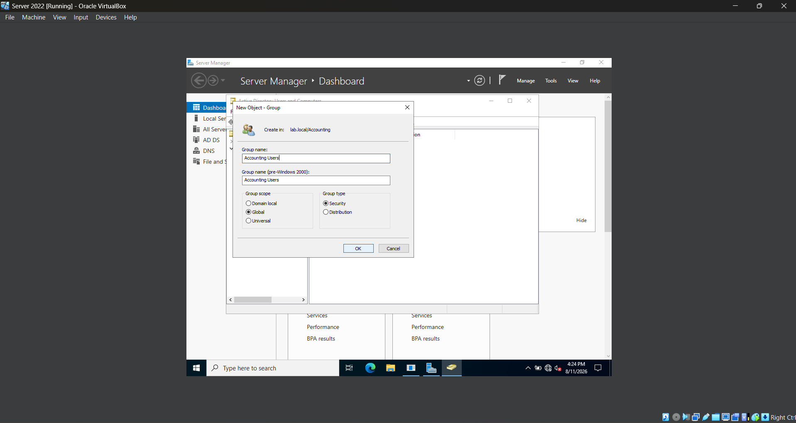
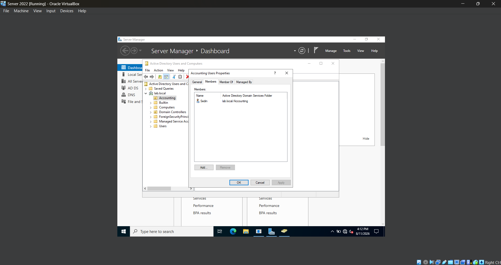

# **Lab 06 - Domain Password and Account Security Policies**

## **Objective**

Learn how to configure and manage shared folders in a Windows Server Active Directory environment by using security groups, NTFS permissions, and share permissions. This lab focuses on controlling access to organizational resources, testing authorized and unauthorized access from a domain-joined Windows 11 workstation, and managing access through Active Directory group membership.

## **Environment**

- Oracle VirtualBox
- Windows Server 2022
- Windows 11
- Active Directory Domain Services (AD DS)
- Active Directory Users and Computers (ADUC)
- Windows File Sharing
- NTFS File System

## **Skills Demonstrated**

## **Steps**

### *Step 1 - Create an Accounting Security Group*

First, I open the Windows Server 2022 VM and open **Active Directory Users and Computers**. I navigate to the **Accounting** Organizational Unit (OU) that was created in Lab 04. I right-click the Accounting OU, select **New > Group**, and name the group **Accounting Users**. I set the **Group scope** to **Global** and the **Group type** to **Security**, then click **OK** to create the group.

After creating the group, I open **Accounting Users**, select the **Members** tab, and add the domain user that I will be using to test access to the shared folder.

Creating a security group allows administrators to manage access to resources based on group membership instead of assigning permissions individually to each user. For example, if multiple employees need access to the Accounting shared folder, they can be added to the **Accounting Users** group and receive the permissions assigned to that group.

I use a **Global Security** group because the group is being used to organize users from the same domain and assign them permissions to a network resource.

### *Step 2 - Create the Accounting Shared Folder*

In the Windows Server 2022 VM, I open **File Explorer** and navigate to the `C:` drive. I create a new folder named **Shares**, and inside it I create another folder named **Accounting**. This creates the folder path `C:\Shares\Accounting`.

Inside the Accounting folder, I create a text document named **Accounting Test** that will be used later to verify that users can access and modify files through the network share.

Creating a dedicated `C:\Shares` directory provides an organized location for folders that will be shared across the network. At this point, the Accounting folder only exists locally on the server and has not yet been configured as a network share.

## **Challenges**

## **What I Learned**

## **Next Steps**
