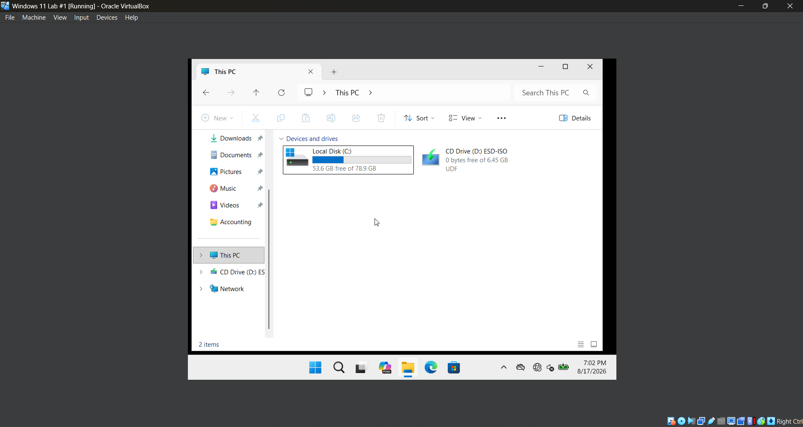

# **Lab 07 - Deploying Network Drives with Group Policy**

## **Objective**

Learn how to use Group Policy to automatically deploy a mapped network drive to authorized domain users and verify the policy from a domain-joined Windows 11 workstation.

## **Environment**

- Oracle VirtualBox
- Windows Server 2022
- Windows 11
- Active Directory Domain Services (AD DS)
- Group Policy Management Console (GPMC)
- Active Directory Security Groups
- Windows File Sharing

## **Skills Demonstrated**

## **Steps**

### *Step 1 - Remove the Manually Mapped Network Drive*

In the Windows 11 VM, I open **File Explorer** and navigate to **This PC**. I locate the **Accounting (Z:)** network drive that was manually mapped in the previous lab, right-click it, and select **Disconnect**.

After disconnecting the drive, I verify that the **Accounting (Z:)** drive no longer appears under **This PC**. Removing the existing mapped drive ensures that I can verify later in the lab that the drive is being automatically deployed through Group Policy rather than remaining from the manual configuration completed in Lab 06.

## **Challenges**

## **What I Learned**
