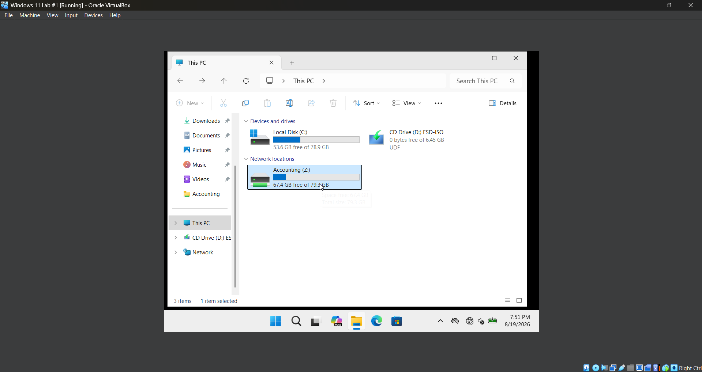
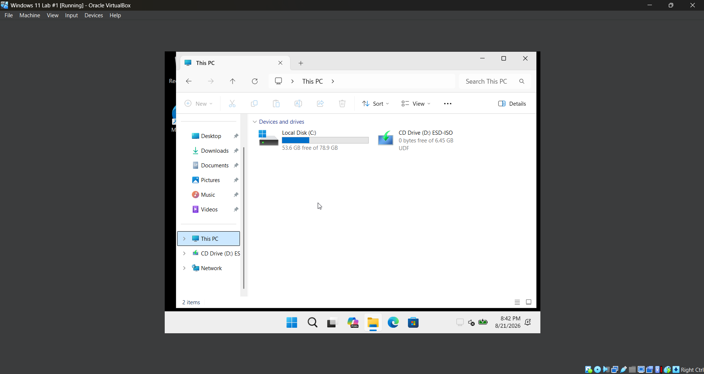

# **Lab 07 - Deploying Network Drives with Group Policy**

## **Objective**

Learn how to use Group Policy to automatically deploy a mapped network drive to authorized domain users and verify the policy from a domain-joined Windows 11 workstation.

## **Environment**

- Oracle VirtualBox
- Windows Server 2022
- Windows 11
- Active Directory Domain Services (AD DS)
- Group Policy Management Console (GPMC)
- Active Directory Security Groups
- Windows File Sharing

## **Skills Demonstrated**

- Creating and linking Group Policy Objects (GPOs)
- Configuring Group Policy Preferences
- Deploying mapped network drives through Group Policy
- Using UNC paths for shared network resources
- Applying user-based Group Policy settings
- Refreshing Group Policy with `gpupdate /force`
- Configuring Item-Level Targeting
- Using Active Directory security groups for targeted resource deployment
- Testing Group Policy behavior with multiple domain users
- Verifying mapped drive deployment from a domain-joined Windows 11 workstation
- Centralized Windows administration

## **Steps**

### *Step 1 - Remove the Manually Mapped Network Drive*

In the Windows 11 VM, I open **File Explorer** and navigate to **This PC**. I locate the **Accounting (Z:)** network drive that was manually mapped in the previous lab, right-click it, and select **Disconnect**.

After disconnecting the drive, I verify that the **Accounting (Z:)** drive no longer appears under **This PC**. Removing the existing mapped drive ensures that I can verify later in the lab that the drive is being automatically deployed through Group Policy rather than remaining from the manual configuration completed in Lab 06.

### *Step 2 - Create the Drive Mapping GPO*

In the Windows Server 2022 VM, I open **Group Policy Management** and navigate to the **Accounting** Organizational Unit (OU) that was created in a previous lab. I right-click the Accounting OU and select **Create a GPO in this domain, and Link it here...**. I name the new Group Policy Object **Lab 07 Accounting Drive Mapping**.

After creating the GPO, I verify that it is linked to the **Accounting** OU and that the link is enabled. Linking the GPO to the OU allows its user-based settings to be processed for applicable users within the Accounting OU.

This GPO will be used to automatically map the Accounting network share that was configured in the previous lab, removing the need to manually map the network drive for each user.

### *Step 3 - Configure and Apply the Accounting Drive Mapping*

In the Windows Server 2022 VM, I edit the **Lab 07 Accounting Drive Mapping** Group Policy Object and navigate to **User Configuration > Preferences > Windows Settings > Drive Maps**. I create a new mapped drive and configure the location as `\\CA-DC-01\Accounting`, set the drive letter to `Z:`, and label the drive **Accounting**. I use the **Update** action so the drive can be created if it does not already exist and updated if the configuration changes later.

After saving the configuration, I switch to the Windows 11 VM and run `gpupdate /force` to immediately refresh Group Policy. I then sign out and back into the domain account so the updated user policy can be processed.

After signing back in, I open **File Explorer > This PC** and verify that **Accounting (Z:)** appears automatically under Network locations. This confirms that the Accounting network share is being deployed through Group Policy rather than being manually mapped on the workstation.

Using Group Policy to deploy mapped drives allows administrators to centrally provide users with access to shared network resources without configuring each workstation individually. If the share path or drive configuration needs to be changed later, the administrator can update the Group Policy instead of manually changing every user's computer.

### *Step 4 - Configure Item-Level Targeting*

In the Windows Server 2022 VM, I edit the **Lab 07 Accounting Drive Mapping** Group Policy Object and navigate to **User Configuration > Preferences > Windows Settings > Drive Maps**. I open the properties for the existing **Accounting (Z:)** drive mapping and select the **Common** tab.

I enable **Item-level targeting** and open the **Targeting Editor**. I then create a new **Security Group** condition and select the **LAB\Accounting Users** security group. I configure the condition so that the drive mapping only applies when the logged-in user is a member of the Accounting Users group.

Item-Level Targeting allows administrators to apply a Group Policy Preference only when specific conditions are met. In this lab, it ensures that the Accounting network drive is automatically mapped only for authorized users who belong to the **Accounting Users** security group.

This provides more precise control than relying only on the Organizational Unit where the GPO is linked, because users within the same OU can receive different settings depending on their group membership.

### *Step 5 - Test Group-Based Drive Mapping*

To verify that Item-Level Targeting is working correctly, I test the drive mapping using two different domain user accounts on the Windows 11 VM.

First, I sign in using the user account that is a member of the **Accounting Users** security group. After Group Policy is applied, I open **File Explorer > This PC** and confirm that the **Accounting (Z:)** network drive appears under Network locations. This verifies that users who are members of the Accounting Users group receive the mapped drive automatically.

Next, I sign out and log in using a second test user that is located in the same **Accounting OU** but is not a member of the **Accounting Users** security group. After Group Policy is applied, I open **File Explorer > This PC** again and confirm that the Accounting network drive does not appear.

Because both users are located within the same OU but only the Accounting Users group member receives the mapped drive, this confirms that the **Item-Level Targeting** condition is working correctly.

Using security group membership with Item-Level Targeting allows administrators to automatically provide network resources only to the users who require them. This makes drive deployment easier to manage because access can be controlled centrally through Active Directory group membership rather than manually configuring each user's computer.

## **Challenges**
- One of the main concepts in this lab was understanding the difference between simply linking a GPO to an Organizational Unit and using **Item-Level Targeting** to control whether a specific Group Policy Preference applies. Although both test users were located in the same **Accounting OU**, only the user who was a member of the **Accounting Users** security group received the mapped drive.

- While working in the Group Policy Management Editor, I initially looked under the **Computer Configuration** section and could not find the **Drive Maps** option. I learned that mapped drives are configured under **User Configuration > Preferences > Windows Settings > Drive Maps** because the network drive is being assigned to the logged-in user rather than directly to the computer.

- Testing the policy with both an authorized and unauthorized user helped confirm that the Item-Level Targeting configuration was working correctly rather than assuming the drive mapping was being applied based only on the OU.

## **What I Learned**
- I learned how to automatically deploy a mapped network drive using **Group Policy Preferences** instead of manually configuring the drive on each workstation.
- I learned how to use the **Update** action when configuring a mapped drive so that the drive can be created if it does not already exist and updated if its configuration changes.
- I learned that mapped drives are configured through the **User Configuration** section of Group Policy because they are associated with the logged-in user's session.
- I learned how **Item-Level Targeting** can apply a specific Group Policy Preference only when certain conditions are met.
- I learned how Active Directory security group membership can be used to control which users automatically receive access to network resources.
- I learned the difference between the scope of a GPO linked to an Organizational Unit and the additional targeting conditions applied to individual Group Policy Preferences.
- I learned how to verify Group Policy changes from a domain-joined Windows 11 workstation by running `gpupdate /force`, signing back into the user account, and confirming the expected configuration in File Explorer.
- I learned how centralized drive deployment can reduce the need for administrators to manually configure shared resources on individual computers.

## **Next Steps**
