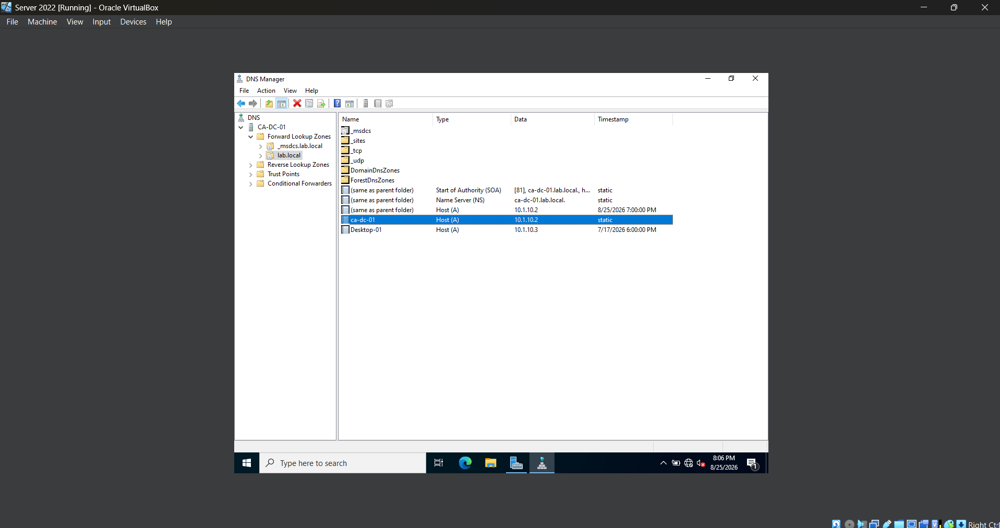
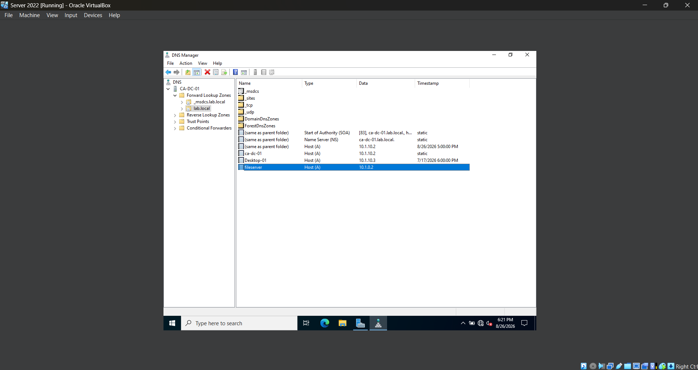
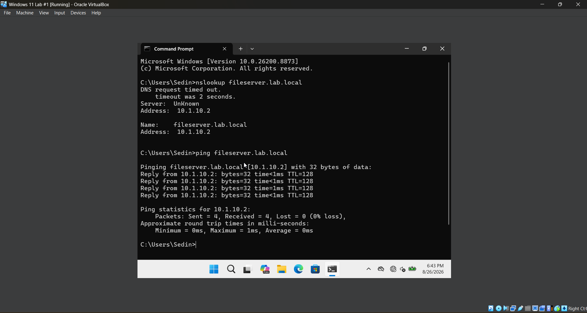
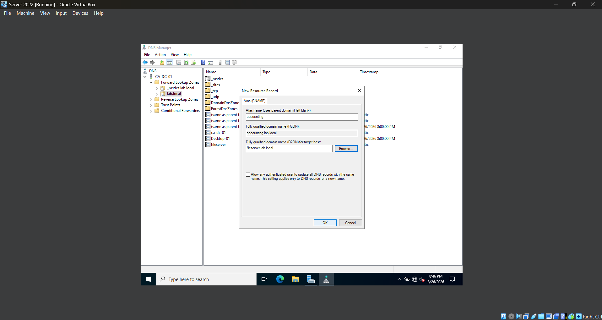

# **Lab 08 - DNS Administration and Troubleshooting**

## **Objective**
Learn how DNS supports an Active Directory domain by creating and managing DNS records, testing name resolution from a domain-joined workstation, and troubleshooting common DNS issues.

## **Environment**

## **Skills Demonstrated**

## **Steps**

### *Step 1 — Explore the Existing DNS Configuration*

In the Windows Server 2022 VM, I open **Server Manager > Tools > DNS** to launch DNS Manager. I expand the DNS server and navigate to **Forward Lookup Zones > lab.local**. This zone was automatically created when Active Directory Domain Services and DNS were configured for the `lab.local` domain.

Inside the `lab.local` zone, I review the existing DNS records and become familiar with how the DNS server stores information about devices and services within the domain.

A **Forward Lookup Zone** is used to translate a hostname into an IP address. For example, the existing Host (A) record for the domain controller maps the hostname `ca-dc-01` to its IP address:

`ca-dc-01.lab.local` → `10.1.10.2`

This demonstrates how a Forward Lookup Zone allows devices on the network to locate another computer by its hostname instead of requiring the user or application to know its IP address.

### *Step 2 - Create a DNS a Record*

In the Windows Server 2022 VM, I open **DNS Manager** and navigate to **Forward Lookup Zones > lab.local**. I right-click the `lab.local` zone and select **New Host (A or AAAA)...** to create a new DNS record.

I enter `fileserver` as the hostname and `10.1.10.2` as the IP address. This creates the fully qualified domain name (FQDN) `fileserver.lab.local` and maps it to the IP address of my Windows Server 2022 VM.

After creating the record, I verify that `fileserver` appears in the `lab.local` Forward Lookup Zone as a **Host (A)** record pointing to `10.1.10.2`.

An **A record** maps a hostname to an IPv4 address. This allows devices on the network to locate the server using `fileserver.lab.local` instead of having to remember its IP address.

### *Step 3 — Test DNS Resolution*

On the domain-joined Windows 11 VM, I open Command Prompt and run `nslookup fileserver.lab.local` to test whether the DNS server can resolve the hostname that I created in the previous step.

The lookup successfully resolves `fileserver.lab.local` to `10.1.10.2`, confirming that the new Host (A) record is working and that the Windows 11 client can query the DNS server for records within the `lab.local` domain.

I then run `ping fileserver.lab.local` to test both name resolution and network connectivity. Windows first resolves the hostname to `10.1.10.2` and then successfully receives four replies from the server with 0% packet loss.

During the `nslookup` test, I also notice that the DNS server initially appears as `Unknown` and the request briefly times out before successfully returning the DNS record. I will explore reverse DNS later in the lab to better understand how DNS can resolve IP addresses back to hostnames.

### *Step 4 — Create a DNS CNAME Record*

In the Windows Server 2022 VM, I open **DNS Manager** and navigate to **Forward Lookup Zones > lab.local**. I right-click the `lab.local` zone and select **New Alias (CNAME)**.

For the alias name, I enter `accounting`, which creates the fully qualified domain name `accounting.lab.local`. I then set the target host to `fileserver.lab.local`, which is the DNS A record that I created earlier in the lab.

After entering the information, I click **OK** to create the CNAME record.

A CNAME record allows one hostname to act as an alias for another hostname. In this case, users can use `accounting.lab.local` to reach the same server represented by `fileserver.lab.local`. This makes network resources easier to identify and allows administrators to use descriptive names for different services without creating separate IP address mappings.

### *Step 5 - Test the CNAME Alias*

After creating the CNAME record, I switch to the Windows 11 VM to verify that the new DNS alias resolves correctly.

I open **Command Prompt** and run `nslookup accounting.lab.local` to query the DNS server for the new alias. The result shows that `accounting.lab.local` points to `fileserver.lab.local`, which resolves to the server's IP address of `10.1.10.2`.

I then run `ping accounting.lab.local` to test name resolution and connectivity using the new alias. The hostname successfully resolves to `10.1.10.2`, and the server responds to the ping requests.

This confirms that the CNAME record is working correctly and allows the server to be accessed using the more descriptive `accounting.lab.local` alias instead of its original hostname or IP address.

## **Challenges**
- misinputted the ip in step 2

## **What I Learned**

## **Next Steps**

