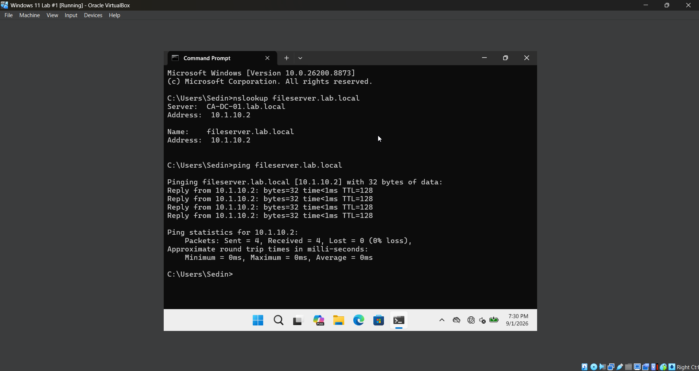
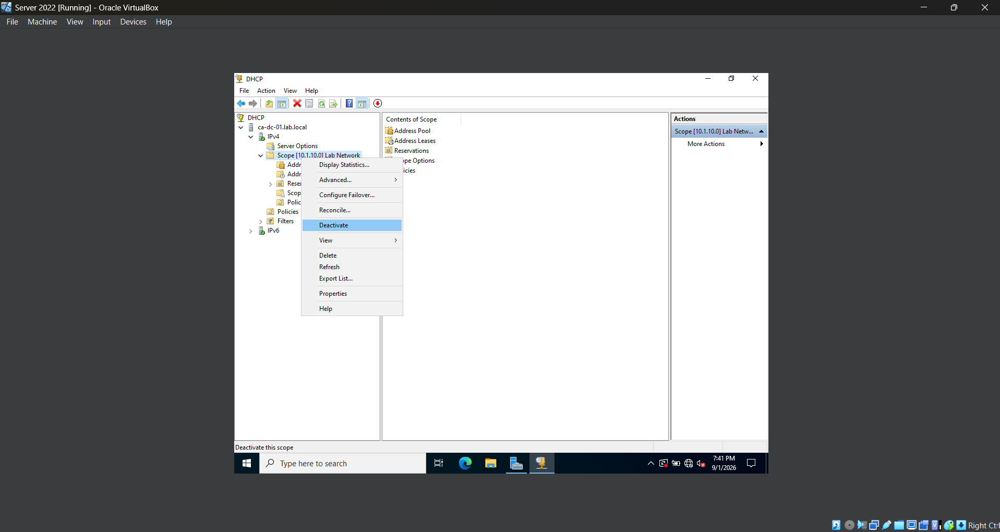
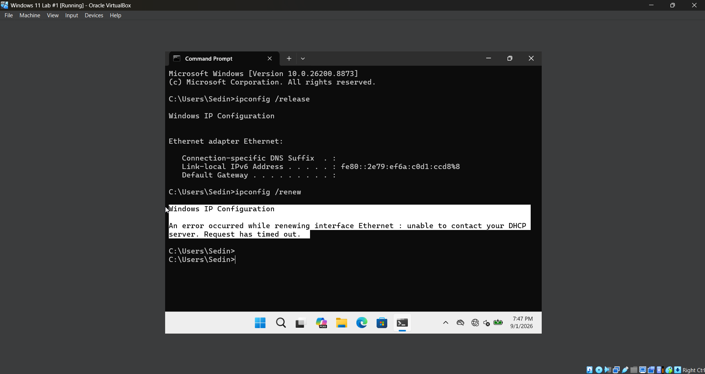
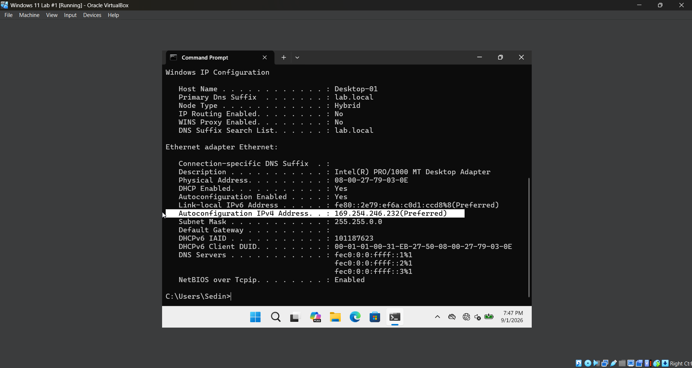
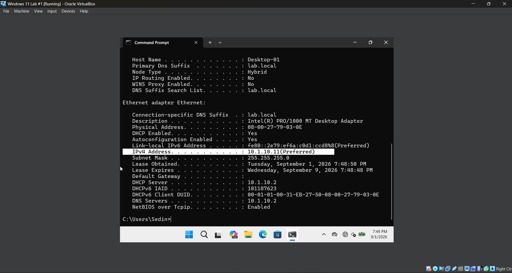

# **Lab 09 - DHCP Server Configuration**

## **Objective**

Learn how to install and configure DHCP Server on Windows Server 2022, create and manage an IPv4 DHCP scope, automatically provide network configuration to a domain-joined Windows 11 workstation, verify DHCP leases, and troubleshoot common DHCP issues.

## **Environment**

- **Hypervisor / Virtualization:** Oracle VirtualBox
- **Server Operating System:** Windows Server 2022 (Domain Controller)
- **Client Operating System:** Windows 11 (Domain-joined workstation)
- **Core Services & Roles:** Active Directory Domain Services (AD DS), DNS Server, DHCP Server
- **Management Tools:** Server Manager, DHCP Management Console, Command Prompt
- **Domain:** `lab.local`
- **Network:** `10.1.10.0/24`

## **Skills Demonstrated**

- Installing and configuring the Windows Server DHCP role
- Authorizing a DHCP server in Active Directory
- Creating and configuring IPv4 DHCP scopes
- Configuring DHCP address pools and lease settings
- Configuring DHCP scope options
- Providing DNS configuration through DHCP
- Configuring Windows clients to obtain IP addresses automatically
- Using `ipconfig /release`, `ipconfig /renew`, and `ipconfig /all`
- Monitoring active DHCP leases
- Testing DHCP and DNS integration
- Identifying APIPA (`169.254.x.x`) addresses
- Simulating and troubleshooting DHCP failures
- Identifying and resolving competing DHCP servers
- Troubleshooting VirtualBox Host-Only networking

## **Steps**

### *Step 1 - Review the Current Static Network Configuration*

Before configuring DHCP, I open **Command Prompt** on the Windows 11 VM and run `ipconfig /all` to review the client's existing network configuration.

The workstation is currently configured with a static IPv4 address, meaning its IP address and DNS server information were manually assigned rather than automatically provided by a DHCP server.

Reviewing the existing configuration provides a baseline that I can compare against later when the Windows 11 client is changed to obtain its network configuration automatically through DHCP.

### *Step 2 - Install the DHCP Server Role*

In the Windows Server 2022 VM, I open **Server Manager** and use **Add Roles and Features** to install the **DHCP Server** role.

Installing the DHCP Server role allows the Windows Server to automatically provide network configuration to client devices instead of requiring administrators to manually configure network settings on every workstation.

After the installation completes, Server Manager indicates that additional DHCP configuration is required before the server can begin providing addresses to clients.

### *Step 3 - Authorize the DHCP Server*

After installing the DHCP Server role, I complete the DHCP post-installation configuration through **Server Manager**. During this process, I authorize the DHCP server within the Active Directory domain.

I then open the **DHCP Management Console** and verify that the `CA-DC-01` DHCP server is available for configuration.

Authorizing a DHCP server in an Active Directory environment helps ensure that only approved DHCP servers can provide network configuration to domain clients. This reduces the risk of an unauthorized DHCP server distributing incorrect network settings.

### *Step 4 - Create an IPv4 DHCP Scope*

In the **DHCP Management Console**, I expand the DHCP server, right-click **IPv4**, and create a new scope named **Lab Network**.

I configure the scope to provide addresses from `10.1.10.10` through `10.1.10.100` using the subnet mask `255.255.255.0` (`/24`).

The DHCP scope defines the pool of IPv4 addresses that the server is allowed to automatically lease to client devices. I intentionally keep the server's static address of `10.1.10.2` outside of the DHCP address pool to prevent DHCP from assigning that address to another device.

I keep the default lease duration, which determines how long a client is allowed to use an assigned IP address before the lease must be renewed.

### *Step 5 - Configure DHCP Scope Options*

After creating the DHCP scope, I configure the network information that will be automatically provided to DHCP clients.

I configure the DNS server as `10.1.10.2`, which is the IP address of the Windows Server 2022 domain controller and DNS server, and configure `lab.local` as the DNS domain name.

Because the current VirtualBox lab network does not use a router for external network connectivity, I do not configure a default gateway for this scope.

DHCP scope options allow administrators to centrally provide clients with additional network configuration along with their IP address. This reduces the need to manually configure settings such as DNS on each workstation.

After completing the configuration, I activate the DHCP scope so that it can begin providing leases to clients.

### *Step 6 - Configure the Windows 11 Client to Use DHCP*

On the Windows 11 VM, I open the IPv4 properties for the network adapter and change the configuration from a manually assigned static address to **Obtain an IP address automatically** and **Obtain DNS server address automatically**.

I then open **Command Prompt** and run `ipconfig /release` followed by `ipconfig /renew` to request a new network configuration from the DHCP server.

After renewing the configuration, I run `ipconfig /all` and verify that DHCP is enabled and that the Windows 11 client has received an IPv4 address from the DHCP scope.

I also verify that the client received `10.1.10.2` as its DNS server, confirming that the DHCP scope options configured on the server were successfully provided to the workstation.

This demonstrates how DHCP allows administrators to centrally provide network configuration to client devices without manually assigning an IP address and DNS settings to every workstation.

### *Step 7 - Verify the DHCP Lease*

After the Windows 11 client receives its network configuration, I return to the **DHCP Management Console** on Windows Server 2022 and navigate to the **Address Leases** section of the Lab Network scope.

I verify that the Windows 11 workstation appears as an active DHCP client and confirm the IPv4 address that was leased to the device.

The DHCP lease information allows administrators to identify which devices have received addresses from the DHCP server and view information such as the assigned IP address, client name, and lease expiration.

This confirms that the Windows 11 client successfully communicated with the DHCP server and received an address from the configured scope.

### *Step 8 - Verify DNS Resolution After DHCP Configuration*

After receiving the new network configuration through DHCP, I test whether the Windows 11 workstation can still resolve resources within the Active Directory domain.

I run `nslookup fileserver.lab.local` and verify that the hostname resolves to `10.1.10.2`. I then run `ping fileserver.lab.local` and confirm that the server responds successfully.

This verifies that the DHCP server provided the Windows 11 client with the correct DNS server configuration and that DNS resolution continues to function without manually configuring DNS on the workstation.

This also demonstrates how DHCP and DNS work together in a Windows domain environment. DHCP automatically provides the client with its network configuration, while DNS allows the client to locate domain resources using hostnames.

### *Step 9 - Test DHCP Failure and Recovery*

After confirming that the Windows 11 client was successfully receiving an IP address from the Windows Server DHCP service, I intentionally created a DHCP failure to practice troubleshooting.

In the Windows Server 2022 VM, I opened **DHCP Manager**, right-clicked the `10.1.10.0 Lab Network` scope, and selected **Deactivate**. Deactivating the scope prevents the DHCP server from assigning new addresses or renewing leases from that scope. On the Windows 11 VM, I opened **Command Prompt** and ran `ipconfig /release` to release the client's existing DHCP lease. I then ran `ipconfig /renew` to request a new IP address. Because the DHCP scope was deactivated, the client was unable to contact an available DHCP server and the request timed out.

I then used `ipconfig /all` to examine the client's network configuration. Since Windows was configured to obtain an IP address automatically but could not receive one from DHCP, it assigned itself an **Automatic Private IP Addressing (APIPA)** address in the `169.254.x.x` range instead of an address from the `10.1.10.0/24` network. Seeing an APIPA address is a useful troubleshooting indicator because it can indicate that a DHCP-enabled client was unable to successfully obtain a lease from a DHCP server.

To resolve the issue, I returned to **DHCP Manager** on Windows Server 2022 and reactivated the DHCP scope. I then returned to the Windows 11 VM and renewed its network configuration. After the DHCP scope was restored, the Windows 11 client successfully received the IPv4 address `10.1.10.11` from the DHCP server at `10.1.10.2`. The client also received the correct subnet mask, DNS server, DNS suffix, and DHCP lease information.

This test demonstrated how a DHCP failure affects a Windows client and how tools such as `ipconfig /release`, `ipconfig /renew`, and `ipconfig /all` can be used to identify and troubleshoot DHCP connectivity problems. It also demonstrated how an APIPA address can help identify a situation where a DHCP client is unable to obtain a valid lease.

## **Challenges**

- While testing the DHCP configuration, the Windows 11 client initially received an IP address in the `192.168.56.x` range instead of an address from the `10.1.10.x` DHCP scope configured on Windows Server. Running `ipconfig /all` showed that the client was receiving its lease from `192.168.56.100` rather than my Windows Server DHCP server at `10.1.10.2`.

- I discovered that VirtualBox's built-in DHCP server for the Host-Only network was competing with the DHCP service running on Windows Server. Because both DHCP servers were available to the client, Windows 11 was receiving a lease from VirtualBox instead of the DHCP scope I had configured. I disabled the VirtualBox DHCP server, but the Windows 11 VM continued receiving `192.168.56.x` addresses. This initially made it appear that disabling the VirtualBox DHCP configuration had not solved the problem.

- While troubleshooting further, I checked the running processes on the host computer and discovered that the **VirtualBox DHCP Server** process was still running even though the DHCP server had been disabled in VirtualBox's network settings. After fully stopping VirtualBox and restarting the environment, the updated configuration took effect. I then renewed the Windows 11 client's DHCP lease and verified with `ipconfig /all` that it received the address `10.1.10.11` from the correct DHCP server at `10.1.10.2`. The client also received `10.1.10.2` as its DNS server, confirming that the Windows Server DHCP scope and scope options were being applied successfully.

## **What I Learned**

- I learned how DHCP automatically assigns IP addresses and other network configuration to client devices.
- I learned how to install and authorize the DHCP Server role within an Active Directory environment.
- I learned how to create an IPv4 DHCP scope and define the range of addresses available for clients.
- I learned how DHCP scope options can automatically provide clients with settings such as DNS servers and domain names.
- I learned how to configure a Windows 11 workstation to obtain its IP address and DNS configuration automatically.
- I learned how to use `ipconfig /release`, `ipconfig /renew`, and `ipconfig /all` to test and troubleshoot DHCP configuration.
- I learned how to use the DHCP Management Console to identify active leases and determine which addresses have been assigned to clients.
- I learned that an APIPA address in the `169.254.x.x` range can indicate that a DHCP-enabled client was unable to obtain a valid lease.
- I learned how DHCP and DNS work together by allowing clients to automatically receive network configuration while still resolving resources within the Active Directory domain.
- I learned how multiple DHCP servers on the same network can cause clients to receive configuration from an unintended server.
- I learned how virtualization networking can affect DHCP testing and how to identify when VirtualBox's built-in DHCP service is interfering with a Windows Server DHCP environment.

## **Next Steps**

In the next lab, I will continue expanding the networking side of my Active Directory home lab by working with additional Windows Server and network administration features. Future labs will build on the DNS and DHCP services configured in this environment while introducing more troubleshooting and administrative tasks.
