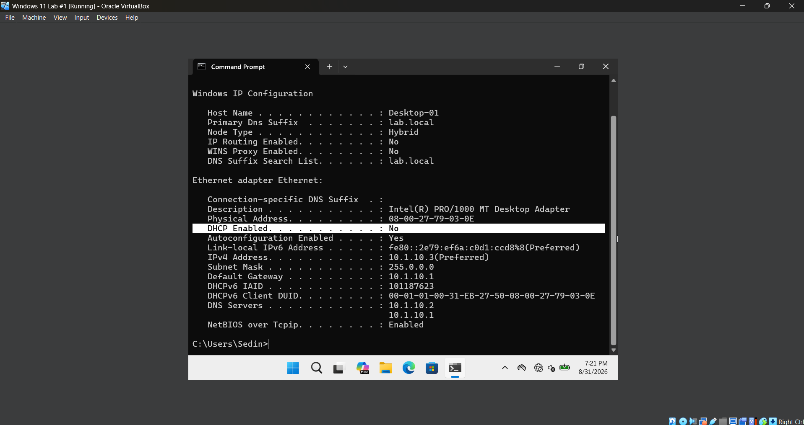
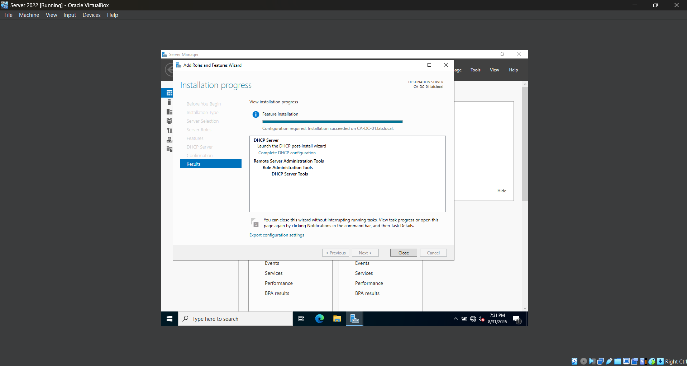
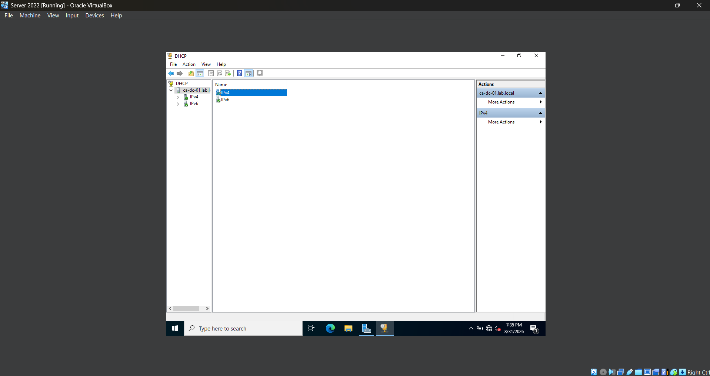
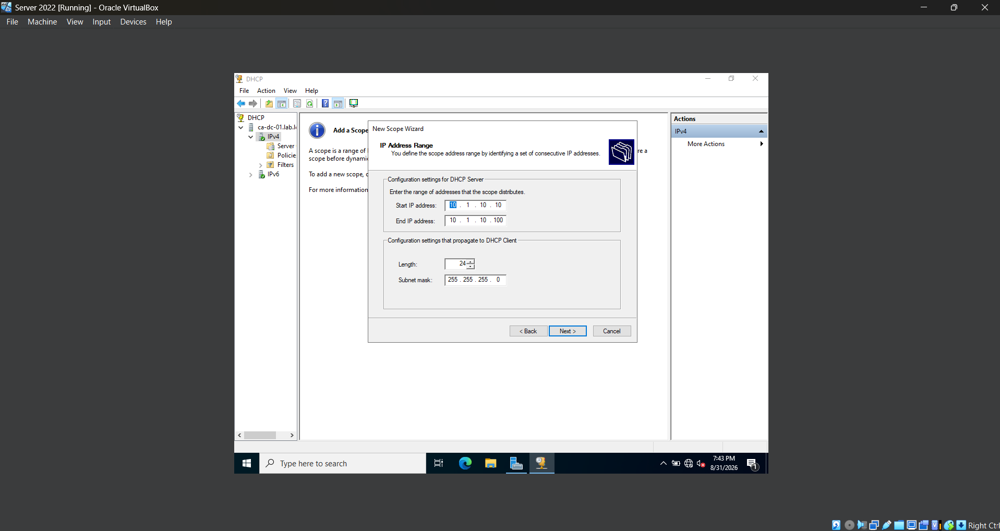
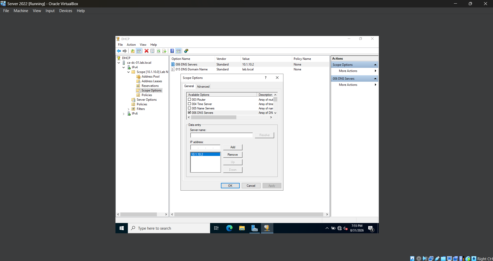
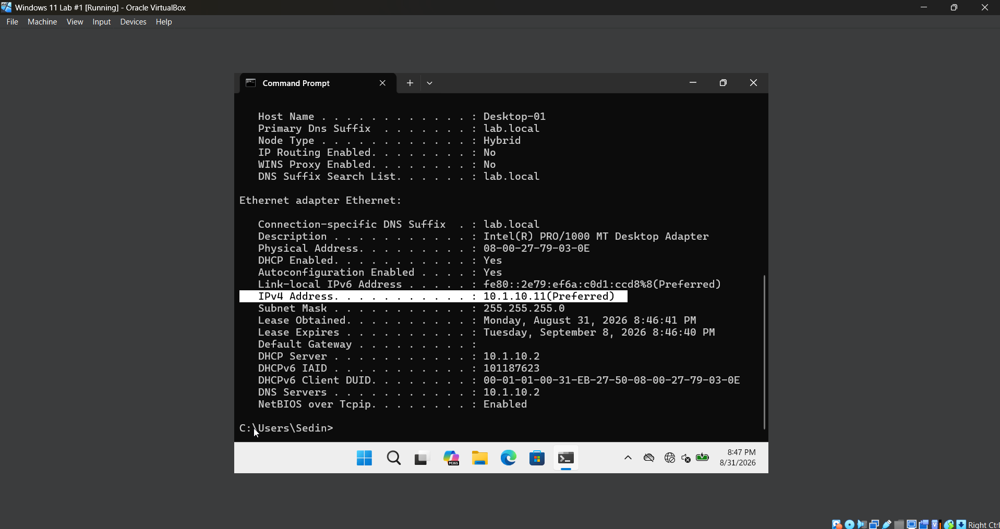
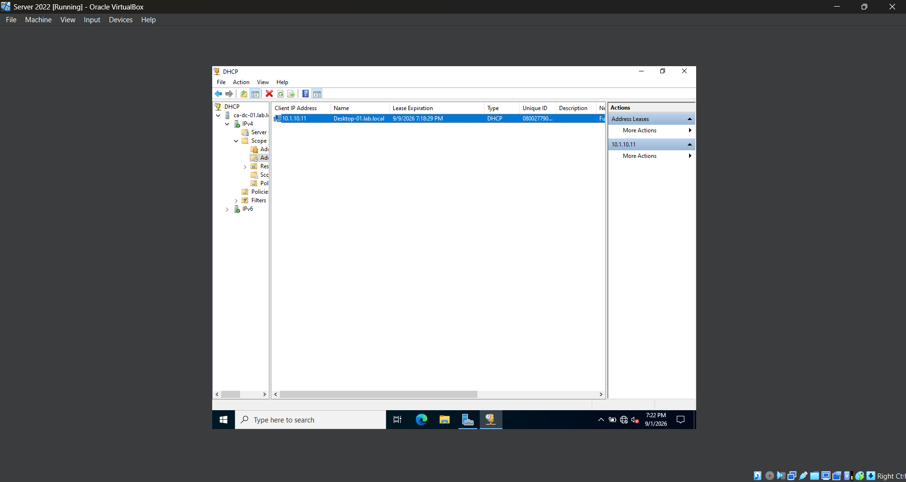

# **Lab 09 - DHCP Server Configuration**

## **Objective**

## **Environment**

## **Skills Demonstrated**

## **Steps**

### *Step 1 - Review the Current Static Network Configuration*

Before configuring DHCP, I open **Command Prompt** on the Windows 11 VM and run `ipconfig /all` to review the client's existing network configuration.

The workstation is currently configured with a static IPv4 address, meaning its IP address and DNS server information were manually assigned rather than automatically provided by a DHCP server.

Reviewing the existing configuration provides a baseline that I can compare against later when the Windows 11 client is changed to obtain its network configuration automatically through DHCP.

### *Step 2 - Install the DHCP Server Role*

In the Windows Server 2022 VM, I open **Server Manager** and use **Add Roles and Features** to install the **DHCP Server** role.

Installing the DHCP Server role allows the Windows Server to automatically provide network configuration to client devices instead of requiring administrators to manually configure network settings on every workstation.

After the installation completes, Server Manager indicates that additional DHCP configuration is required before the server can begin providing addresses to clients.

### *Step 3 - Authorize the DHCP Server*

After installing the DHCP Server role, I complete the DHCP post-installation configuration through **Server Manager**. During this process, I authorize the DHCP server within the Active Directory domain.

I then open the **DHCP Management Console** and verify that the `CA-DC-01` DHCP server is available for configuration.

Authorizing a DHCP server in an Active Directory environment helps ensure that only approved DHCP servers can provide network configuration to domain clients. This reduces the risk of an unauthorized DHCP server distributing incorrect network settings.

### *Step 4 - Create an IPv4 DHCP Scope*

In the **DHCP Management Console**, I expand the DHCP server, right-click **IPv4**, and create a new scope named **Lab Network**.

I configure the scope to provide addresses from `10.1.10.10` through `10.1.10.100` using the subnet mask `255.255.255.0` (`/24`).

The DHCP scope defines the pool of IPv4 addresses that the server is allowed to automatically lease to client devices. I intentionally keep the server's static address of `10.1.10.2` outside of the DHCP address pool to prevent DHCP from assigning that address to another device.

I keep the default lease duration, which determines how long a client is allowed to use an assigned IP address before the lease must be renewed.

### *Step 5 - Configure DHCP Scope Options*

After creating the DHCP scope, I configure the network information that will be automatically provided to DHCP clients.

I configure the DNS server as `10.1.10.2`, which is the IP address of the Windows Server 2022 domain controller and DNS server, and configure `lab.local` as the DNS domain name.

Because the current VirtualBox lab network does not use a router for external network connectivity, I do not configure a default gateway for this scope.

DHCP scope options allow administrators to centrally provide clients with additional network configuration along with their IP address. This reduces the need to manually configure settings such as DNS on each workstation.

After completing the configuration, I activate the DHCP scope so that it can begin providing leases to clients.

### *Step 6 - Configure the Windows 11 Client to Use DHCP*

On the Windows 11 VM, I open the IPv4 properties for the network adapter and change the configuration from a manually assigned static address to **Obtain an IP address automatically** and **Obtain DNS server address automatically**.

I then open **Command Prompt** and run `ipconfig /release` followed by `ipconfig /renew` to request a new network configuration from the DHCP server.

After renewing the configuration, I run `ipconfig /all` and verify that DHCP is enabled and that the Windows 11 client has received an IPv4 address from the DHCP scope.

I also verify that the client received `10.1.10.2` as its DNS server, confirming that the DHCP scope options configured on the server were successfully provided to the workstation.

This demonstrates how DHCP allows administrators to centrally provide network configuration to client devices without manually assigning an IP address and DNS settings to every workstation.

### *Step 7 - Verify the DHCP Lease*

After the Windows 11 client receives its network configuration, I return to the **DHCP Management Console** on Windows Server 2022 and navigate to the **Address Leases** section of the Lab Network scope.

I verify that the Windows 11 workstation appears as an active DHCP client and confirm the IPv4 address that was leased to the device.

The DHCP lease information allows administrators to identify which devices have received addresses from the DHCP server and view information such as the assigned IP address, client name, and lease expiration.

This confirms that the Windows 11 client successfully communicated with the DHCP server and received an address from the configured scope.

## **Challenges**

- While testing the DHCP configuration, the Windows 11 client initially received an IP address in the `192.168.56.x` range instead of an address from the `10.1.10.x` DHCP scope configured on Windows Server. Running `ipconfig /all` showed that the client was receiving its lease from `192.168.56.100` rather than my Windows Server DHCP server at `10.1.10.2`.

- I discovered that VirtualBox's built-in DHCP server for the Host-Only network was competing with the DHCP service running on Windows Server. Because both DHCP servers were available to the client, Windows 11 was receiving a lease from VirtualBox instead of the DHCP scope I had configured. I disabled the VirtualBox DHCP server, but the Windows 11 VM continued receiving `192.168.56.x` addresses. This initially made it appear that disabling the VirtualBox DHCP configuration had not solved the problem.

- While troubleshooting further, I checked the running processes on the host computer and discovered that the **VirtualBox DHCP Server** process was still running even though the DHCP server had been disabled in VirtualBox's network settings. After fully stopping VirtualBox and restarting the environment, the updated configuration took effect. I then renewed the Windows 11 client's DHCP lease and verified with `ipconfig /all` that it received the address `10.1.10.11` from the correct DHCP server at `10.1.10.2`. The client also received `10.1.10.2` as its DNS server, confirming that the Windows Server DHCP scope and scope options were being applied successfully.

## **Next Steps**
