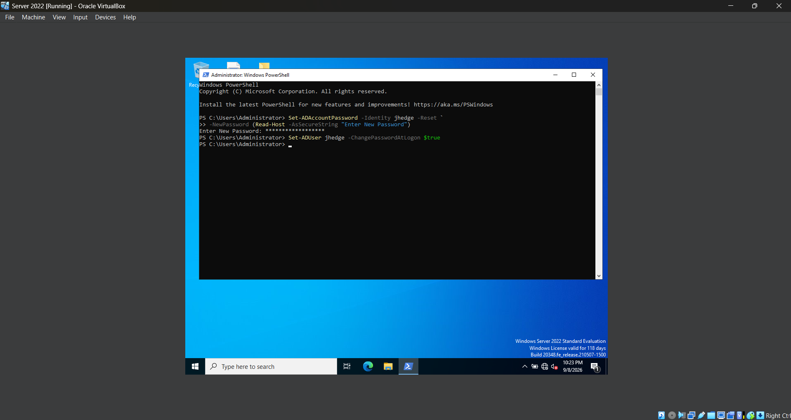
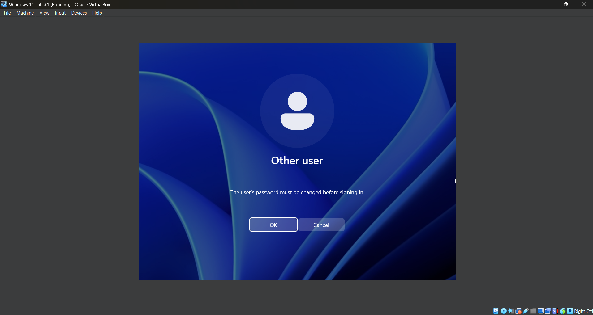
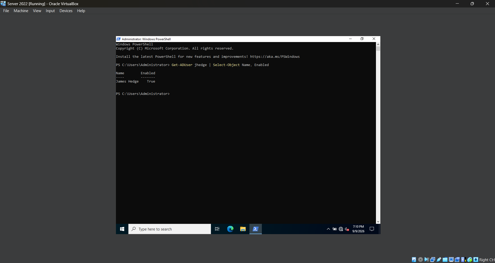
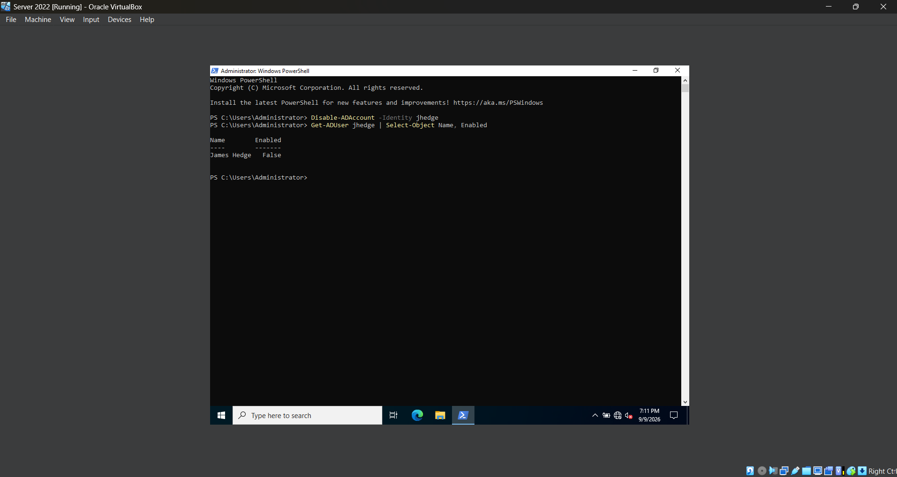
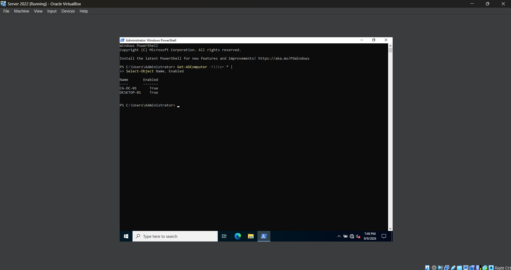
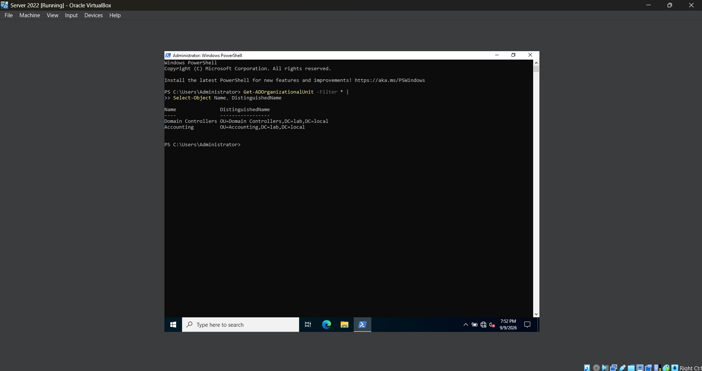
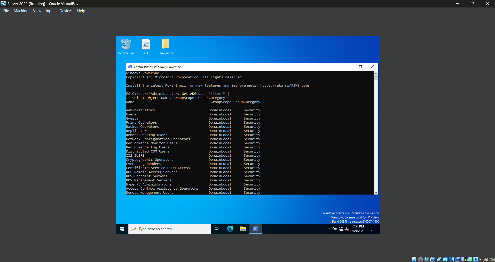
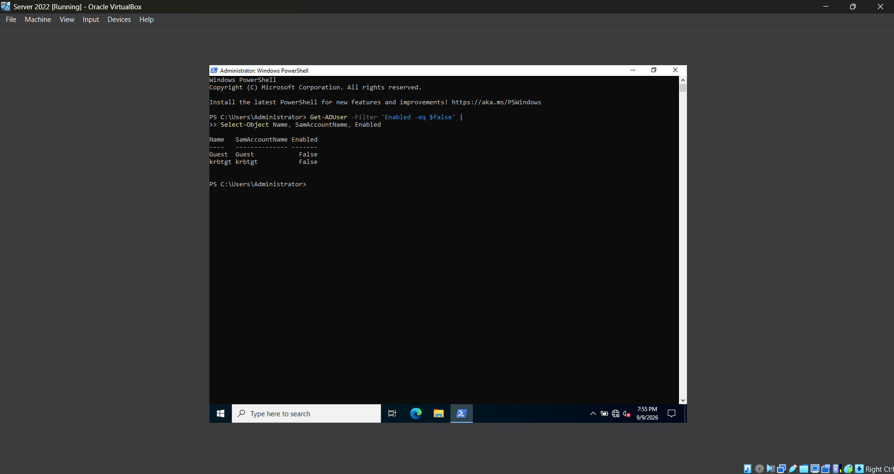
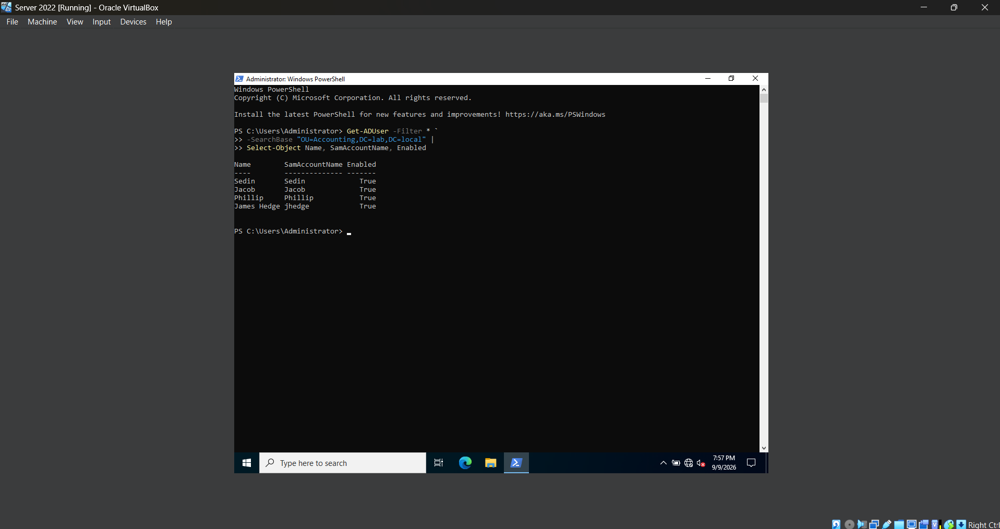

# **Lab 10 - Active Directory Administration with Powershell**

## **Objective**

## **Environment**

## **Skills Demonstrated**

## **Steps**

### *Step 1 — Load the Active Directory PowerShell Module*


In the Windows Server 2022 VM, I opened **Windows PowerShell as Administrator** and ran `Get-Module -ListAvailable ActiveDirectory` to check whether the Active Directory PowerShell module is available on the server.

The command returns the **ActiveDirectory** module, confirming that it is already installed and available for use. I then run `Import-Module ActiveDirectory` to load the module into the current PowerShell session.

The **Active Directory PowerShell module** provides commands that allow administrators to manage Active Directory directly through PowerShell. These commands can be used to perform tasks such as viewing and creating users, managing groups, modifying accounts, and querying Active Directory objects.

Loading the module gives me access to the Active Directory commands that I will use throughout this lab instead of performing each administrative task through the graphical Active Directory management tools.

### *Step 2 — Query Active Directory Users with PowerShell*


In the Windows Server 2022 VM, I use the `Get-ADUser` command to retrieve information about user accounts stored in Active Directory. I first run `Get-ADUser -Filter *` to display all user accounts within the `lab.local` domain.

The `Get-ADUser` command retrieves Active Directory user objects, while `-Filter *` tells PowerShell to return all users instead of searching for one specific account.

I then run:

`Get-ADUser -Filter * | Select-Object Name, SamAccountName, Enabled`

This command uses the PowerShell pipeline (`|`) to take the users returned by `Get-ADUser` and pass them to `Select-Object`. I use `Select-Object` to display only the user's name, logon name, and whether the account is currently enabled.

Using PowerShell to query Active Directory allows administrators to quickly retrieve information about multiple user accounts without opening and checking each account individually in Active Directory Users and Computers.

This step also introduced me to the PowerShell pipeline, which allows the output of one command to be passed into another command for additional processing.

### *Step 3 — Create an Active Directory User with PowerShell*


In the Windows Server 2022 VM, I use the `New-ADUser` command to create a new Active Directory user account directly through PowerShell. I create a test user named **James Hedge** with the logon name `jhedge`.

I use the following command:

```powershell
New-ADUser -Name "James Hedge" `
    -GivenName "James" `
    -Surname "Hedge" `
    -SamAccountName "jhedge" `
    -UserPrincipalName "jhedge@lab.local" `
    -Path "OU=Accounting,DC=lab,DC=local" `
    -AccountPassword (Read-Host -AsSecureString "Enter Password") `
    -Enabled $true
```

The `New-ADUser` command creates the account, while the additional parameters define information such as the user's first name, last name, logon name, password, and location within Active Directory.

The `-Path` parameter specifies where the account should be created. I use the Distinguished Name `OU=Accounting,DC=lab,DC=local`, which places the new user inside the **Accounting Organizational Unit** within the `lab.local` domain.

The password is entered through `Read-Host -AsSecureString`, which allows me to type the password without displaying it directly in the PowerShell window. I also use `-Enabled $true` so the account is enabled immediately after it is created.

After running the command successfully, I open **Active Directory Users and Computers** and navigate to the **Accounting OU** to verify that the new `James Hedge` user account was created in the correct location.

### *Step 4 — Modifying an Active Directory User with PowerShell*


In the Windows Server 2022 VM, I use the `Set-ADUser` command to modify an existing Active Directory user account. I update the **Department** attribute for the `jhedge` account and set it to **Accounting**.

I use the following command:

```powershell
Set-ADUser jhedge -Department "Accounting"
```

The `Set-ADUser` command allows me to modify properties of an existing Active Directory user. In this command, `jhedge` identifies the account I want to modify, while the `-Department` parameter specifies which user attribute I want to change.

After making the change, I verify the updated information with:

```powershell
Get-ADUser jhedge -Properties Department |
    Select-Object Name, SamAccountName, Department
```

The `-Properties Department` parameter tells `Get-ADUser` to retrieve the user's **Department** attribute in addition to the properties it normally returns. I then use the pipeline (`|`) to send the result to `Select-Object` and display only the user's name, logon name, and department.

The output confirms that **James Hedge** now has **Accounting** listed as his department, verifying that the account was successfully modified through PowerShell.

### *Step 5 — Manage Active Directory Group Membership with PowerShell*


In the Windows Server 2022 VM, I use PowerShell to add the `jhedge` account to the existing **Accounting Users** security group. This allows me to manage group membership without opening Active Directory Users and Computers.

I use the following command:

```powershell
Add-ADGroupMember -Identity "Accounting Users" -Members jhedge
```

The `Add-ADGroupMember` command adds one or more Active Directory objects to a group. The `-Identity` parameter identifies the group I want to modify, while `-Members` identifies the user account I want to add.

I then verify the membership by running:

```powershell
Get-ADGroupMember -Identity "Accounting Users" |
    Select-Object Name, SamAccountName
```

The `Get-ADGroupMember` command retrieves the members of the **Accounting Users** group. I use the pipeline (`|`) to pass the results to `Select-Object` and display only the name and logon name of each member.

The output confirms that **James Hedge (`jhedge`)** is now a member of the **Accounting Users** security group, verifying that the group membership was successfully changed through PowerShell.

### *Step 6 — Reset a User Password with PowerShell*





In the Windows Server 2022 VM, I use PowerShell to reset the password for the `jhedge` account. Instead of entering the new password directly into the command, I use `Read-Host -AsSecureString` so PowerShell prompts me to enter it securely.

I use the following command:

```powershell
Set-ADAccountPassword -Identity jhedge -Reset `
    -NewPassword (Read-Host -AsSecureString "Enter New Password")
```

The `Set-ADAccountPassword` command allows me to change the password of an Active Directory account. The `-Identity` parameter specifies the `jhedge` account, while `-Reset` indicates that I am performing an administrative password reset rather than changing the password using the user's existing password.

The `-NewPassword` parameter specifies the new password, and `Read-Host -AsSecureString` prompts me to enter it without displaying the password in plain text in the PowerShell window.

After resetting the password, I configure the account to require a password change the next time the user logs in:

```powershell
Set-ADUser -Identity jhedge -ChangePasswordAtLogon $true
```

The `-ChangePasswordAtLogon $true` parameter enables the **User must change password at next logon** setting for the account. This allows an administrator to provide a temporary password while requiring the user to create their own password when they next sign in.

This demonstrates how common account support tasks such as password resets and forced password changes can be performed directly through PowerShell instead of Active Directory Users and Computers.

### *Step 7 — Disable and Re-Enable an Active Directory Account with PowerShell*





In the Windows Server 2022 VM, I use PowerShell to disable and re-enable the `jhedge` Active Directory account. I first check the current status of the account with:

```powershell
Get-ADUser jhedge | Select-Object Name, Enabled
```

The `Get-ADUser` command retrieves the `jhedge` account, and I use the pipeline (`|`) with `Select-Object` to display only the user's name and enabled status. The output shows **True**, confirming that the account is currently enabled.

I then disable the account using:

```powershell
Disable-ADAccount -Identity jhedge
```

The `Disable-ADAccount` command prevents the account from being used to sign in while keeping the user object and its information in Active Directory. The `-Identity` parameter specifies which account I want to disable.

After disabling the account, I run the previous `Get-ADUser` command again:

```powershell
Get-ADUser jhedge | Select-Object Name, Enabled
```

The output now shows **False**, confirming that the `jhedge` account was successfully disabled.

I can re-enable the account using:

```powershell
Enable-ADAccount -Identity jhedge
```

Disabling an account instead of immediately deleting it allows an administrator to prevent access while preserving the user's account, group memberships, and other Active Directory information.

### *Step 8 — Query Active Directory Objects with PowerShell*











In the Windows Server 2022 VM, I use PowerShell to query different types of objects and information stored in Active Directory. This allows me to quickly retrieve information about computers, Organizational Units, groups, and users without manually searching through Active Directory Users and Computers.

I first query the computer accounts in the domain:

```powershell
Get-ADComputer -Filter * |
    Select-Object Name, Enabled
```

The `Get-ADComputer` command retrieves computer objects from Active Directory. I use `-Filter *` to retrieve all computer accounts and then pass the results through the pipeline (`|`) to `Select-Object`, which displays only the computer name and enabled status. The output shows both `CA-DC-01` and `DESKTOP-01` as enabled computer accounts.

I then query the Organizational Units within the domain:

```powershell
Get-ADOrganizationalUnit -Filter * |
    Select-Object Name, DistinguishedName
```

The `Get-ADOrganizationalUnit` command retrieves the OUs stored in Active Directory. I display both the OU name and its Distinguished Name. This shows the full Active Directory path for each OU, including the **Accounting OU** at `OU=Accounting,DC=lab,DC=local`.

Next, I query the Active Directory groups:

```powershell
Get-ADGroup -Filter * |
    Select-Object Name, GroupScope, GroupCategory
```

The `Get-ADGroup` command retrieves groups from Active Directory. I use `Select-Object` to display each group's name, scope, and category. This allows me to quickly review information about multiple groups without opening each group individually.

I also use a filter to search specifically for disabled user accounts:

```powershell
Get-ADUser -Filter 'Enabled -eq $false' |
    Select-Object Name, SamAccountName, Enabled
```

Instead of using `-Filter *` to return every user, I use the condition `Enabled -eq $false` to return only accounts where the **Enabled** property is set to False. The output shows the disabled `Guest` and `krbtgt` accounts.

Finally, I limit a user search to the **Accounting OU** by using the `-SearchBase` parameter:

```powershell
Get-ADUser -Filter * `
    -SearchBase "OU=Accounting,DC=lab,DC=local" |
    Select-Object Name, SamAccountName, Enabled
```

The `-SearchBase` parameter tells PowerShell where in Active Directory to begin the search. Instead of searching the entire domain, this command searches within `OU=Accounting,DC=lab,DC=local` and displays the users located there.

The output shows the user accounts stored in the Accounting OU, including the `jhedge` account I created earlier in this lab. This demonstrates how PowerShell can be used to narrow Active Directory searches to specific locations and return only the information needed.

### *Step 9 — Remove an Active Directory User with PowerShell*

In the Windows Server 2022 VM, I use PowerShell to remove the `jhedge` test account that I created earlier in the lab.

I use the following command:

```powershell
Remove-ADUser -Identity jhedge
```

The `Remove-ADUser` command deletes a user object from Active Directory. The `-Identity` parameter specifies the account I want to remove.

After running the command, PowerShell displays a confirmation prompt before deleting the account. The prompt also shows the full Distinguished Name of the user object:

```text
CN=James Hedge,OU=Accounting,DC=lab,DC=local
```

I confirm the deletion by entering `y`.

After removing the account, I verify that it no longer exists by running:

```powershell
Get-ADUser jhedge
```

PowerShell returns an error stating that it cannot find an object with the identity `jhedge` in the `lab.local` domain. In this case, the error confirms that the user account was successfully removed from Active Directory.

This step completes the cleanup of the test user account used throughout the lab.

## **Challenges**
While creating a new Active Directory user with PowerShell, I initially misspelled the `-SamAccountName` parameter as `-SameAccountName`, which caused the `New-ADUser` command to fail. I reviewed the PowerShell error message, identified the incorrect parameter name, corrected the spelling, and successfully reran the command.

## **What I Learned**

## **Next Steps**
