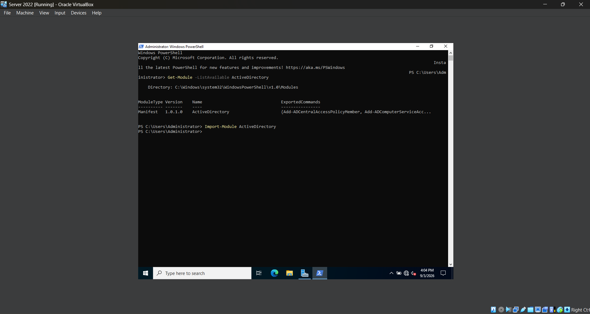
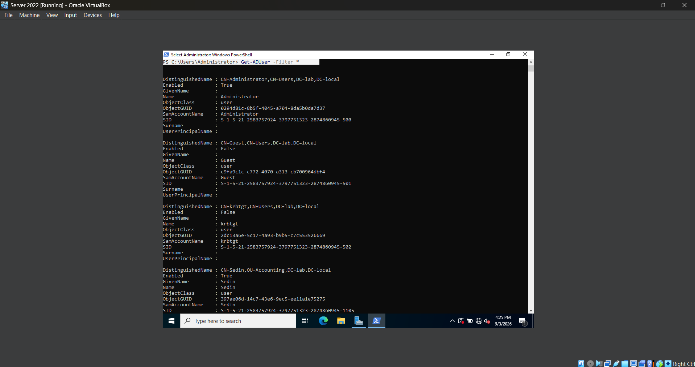
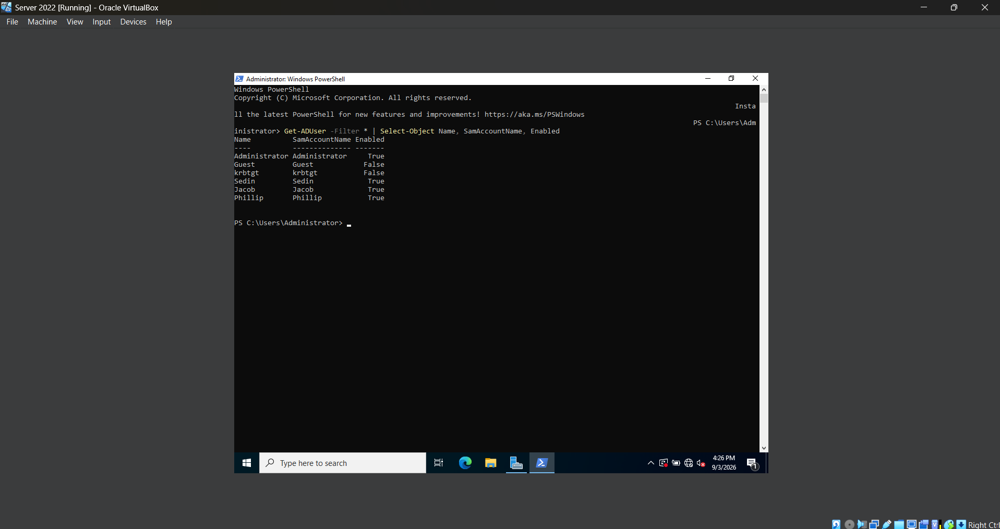

# **Lab 10 - Active Directory Administration with Powershell**

## **Objective**

## **Environment**

## **Skills Demonstrated**

## **Steps**

### *Step 1 — Load the Active Directory PowerShell Module*

In the Windows Server 2022 VM, I opened **Windows PowerShell as Administrator** and ran `Get-Module -ListAvailable ActiveDirectory` to check whether the Active Directory PowerShell module is available on the server.

The command returns the **ActiveDirectory** module, confirming that it is already installed and available for use. I then run `Import-Module ActiveDirectory` to load the module into the current PowerShell session.

The **Active Directory PowerShell module** provides commands that allow administrators to manage Active Directory directly through PowerShell. These commands can be used to perform tasks such as viewing and creating users, managing groups, modifying accounts, and querying Active Directory objects.

Loading the module gives me access to the Active Directory commands that I will use throughout this lab instead of performing each administrative task through the graphical Active Directory management tools.

### *Step 2 — Query Active Directory Users with PowerShell*

In the Windows Server 2022 VM, I use the `Get-ADUser` command to retrieve information about user accounts stored in Active Directory. I first run `Get-ADUser -Filter *` to display all user accounts within the `lab.local` domain.

The `Get-ADUser` command retrieves Active Directory user objects, while `-Filter *` tells PowerShell to return all users instead of searching for one specific account.

I then run:

`Get-ADUser -Filter * | Select-Object Name, SamAccountName, Enabled`

This command uses the PowerShell pipeline (`|`) to take the users returned by `Get-ADUser` and pass them to `Select-Object`. I use `Select-Object` to display only the user's name, logon name, and whether the account is currently enabled.

Using PowerShell to query Active Directory allows administrators to quickly retrieve information about multiple user accounts without opening and checking each account individually in Active Directory Users and Computers.

This step also introduced me to the PowerShell pipeline, which allows the output of one command to be passed into another command for additional processing.

## **Challenges**

## **What I Learned**

## **Next Steps**
