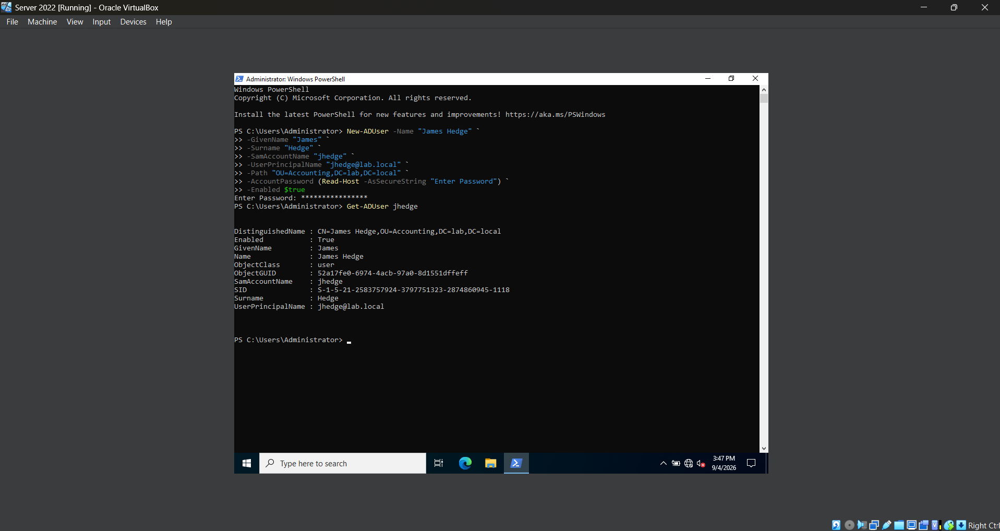
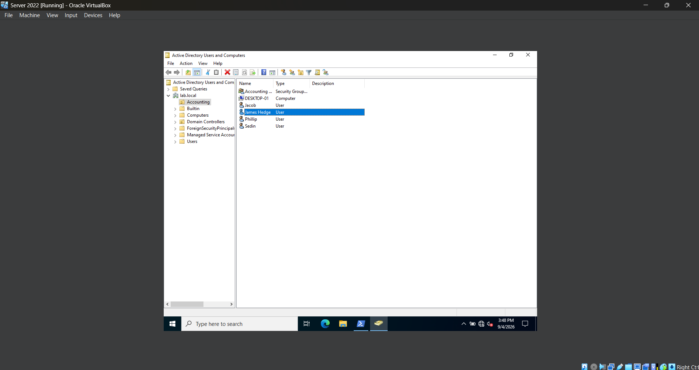
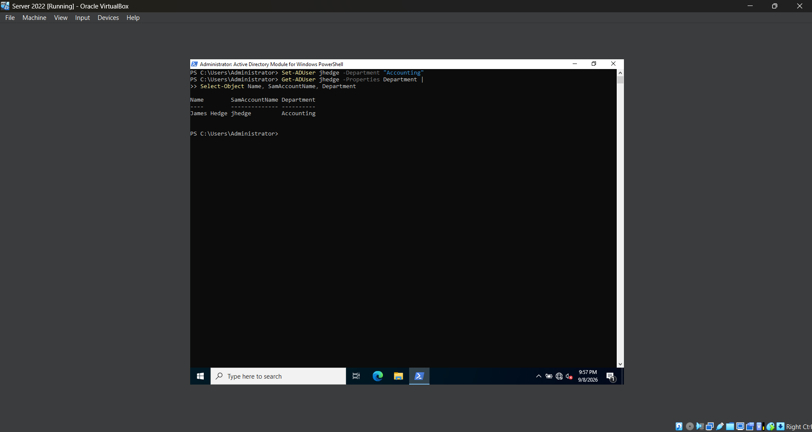
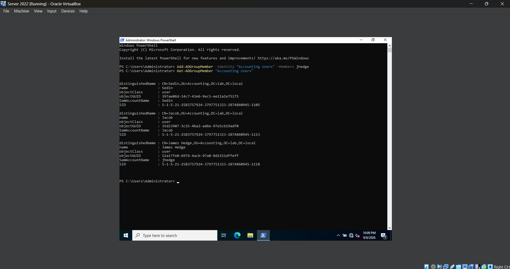

# **Lab 10 - Active Directory Administration with Powershell**

## **Objective**

## **Environment**

## **Skills Demonstrated**

## **Steps**

### *Step 1 — Load the Active Directory PowerShell Module*


In the Windows Server 2022 VM, I opened **Windows PowerShell as Administrator** and ran `Get-Module -ListAvailable ActiveDirectory` to check whether the Active Directory PowerShell module is available on the server.

The command returns the **ActiveDirectory** module, confirming that it is already installed and available for use. I then run `Import-Module ActiveDirectory` to load the module into the current PowerShell session.

The **Active Directory PowerShell module** provides commands that allow administrators to manage Active Directory directly through PowerShell. These commands can be used to perform tasks such as viewing and creating users, managing groups, modifying accounts, and querying Active Directory objects.

Loading the module gives me access to the Active Directory commands that I will use throughout this lab instead of performing each administrative task through the graphical Active Directory management tools.

### *Step 2 — Query Active Directory Users with PowerShell*


In the Windows Server 2022 VM, I use the `Get-ADUser` command to retrieve information about user accounts stored in Active Directory. I first run `Get-ADUser -Filter *` to display all user accounts within the `lab.local` domain.

The `Get-ADUser` command retrieves Active Directory user objects, while `-Filter *` tells PowerShell to return all users instead of searching for one specific account.

I then run:

`Get-ADUser -Filter * | Select-Object Name, SamAccountName, Enabled`

This command uses the PowerShell pipeline (`|`) to take the users returned by `Get-ADUser` and pass them to `Select-Object`. I use `Select-Object` to display only the user's name, logon name, and whether the account is currently enabled.

Using PowerShell to query Active Directory allows administrators to quickly retrieve information about multiple user accounts without opening and checking each account individually in Active Directory Users and Computers.

This step also introduced me to the PowerShell pipeline, which allows the output of one command to be passed into another command for additional processing.

### *Step 3 — Create an Active Directory User with PowerShell*





In the Windows Server 2022 VM, I use the `New-ADUser` command to create a new Active Directory user account directly through PowerShell. I create a test user named **James Hedge** with the logon name `jhedge`.

I use the following command:

```powershell
New-ADUser -Name "James Hedge" `
    -GivenName "James" `
    -Surname "Hedge" `
    -SamAccountName "jhedge" `
    -UserPrincipalName "jhedge@lab.local" `
    -Path "OU=Accounting,DC=lab,DC=local" `
    -AccountPassword (Read-Host -AsSecureString "Enter Password") `
    -Enabled $true
```

The `New-ADUser` command creates the account, while the additional parameters define information such as the user's first name, last name, logon name, password, and location within Active Directory.

The `-Path` parameter specifies where the account should be created. I use the Distinguished Name `OU=Accounting,DC=lab,DC=local`, which places the new user inside the **Accounting Organizational Unit** within the `lab.local` domain.

The password is entered through `Read-Host -AsSecureString`, which allows me to type the password without displaying it directly in the PowerShell window. I also use `-Enabled $true` so the account is enabled immediately after it is created.

After running the command successfully, I open **Active Directory Users and Computers** and navigate to the **Accounting OU** to verify that the new `James Hedge` user account was created in the correct location.

### *Step 4 — Modifying an Active Directory User with PowerShell*



In the Windows Server 2022 VM, I use the `Set-ADUser` command to modify an existing Active Directory user account. I update the **Department** attribute for the `jhedge` account and set it to **Accounting**.

I use the following command:

```powershell
Set-ADUser jhedge -Department "Accounting"
```

The `Set-ADUser` command allows me to modify properties of an existing Active Directory user. In this command, `jhedge` identifies the account I want to modify, while the `-Department` parameter specifies which user attribute I want to change.

After making the change, I verify the updated information with:

```powershell
Get-ADUser jhedge -Properties Department |
    Select-Object Name, SamAccountName, Department
```

The `-Properties Department` parameter tells `Get-ADUser` to retrieve the user's **Department** attribute in addition to the properties it normally returns. I then use the pipeline (`|`) to send the result to `Select-Object` and display only the user's name, logon name, and department.

The output confirms that **James Hedge** now has **Accounting** listed as his department, verifying that the account was successfully modified through PowerShell.

### *Step 5 — Manage Active Directory Group Membership with PowerShell*



In the Windows Server 2022 VM, I use PowerShell to add the `jhedge` account to the existing **Accounting Users** security group. This allows me to manage group membership without opening Active Directory Users and Computers.

I use the following command:

```powershell
Add-ADGroupMember -Identity "Accounting Users" -Members jhedge
```

The `Add-ADGroupMember` command adds one or more Active Directory objects to a group. The `-Identity` parameter identifies the group I want to modify, while `-Members` identifies the user account I want to add.

I then verify the membership by running:

```powershell
Get-ADGroupMember -Identity "Accounting Users" |
    Select-Object Name, SamAccountName
```

The `Get-ADGroupMember` command retrieves the members of the **Accounting Users** group. I use the pipeline (`|`) to pass the results to `Select-Object` and display only the name and logon name of each member.

The output confirms that **James Hedge (`jhedge`)** is now a member of the **Accounting Users** security group, verifying that the group membership was successfully changed through PowerShell.

## **Challenges**
While creating a new Active Directory user with PowerShell, I initially misspelled the `-SamAccountName` parameter as `-SameAccountName`, which caused the `New-ADUser` command to fail. I reviewed the PowerShell error message, identified the incorrect parameter name, corrected the spelling, and successfully reran the command.

## **What I Learned**

## **Next Steps**
