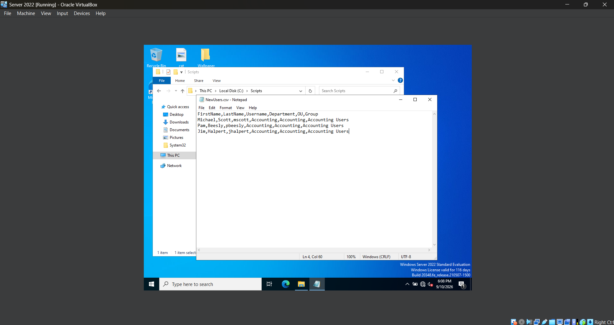
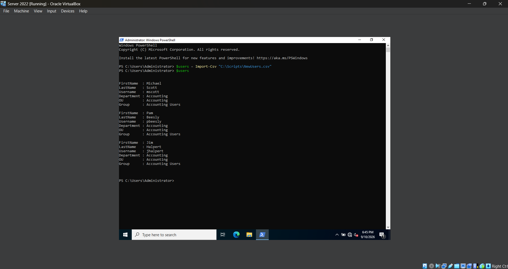
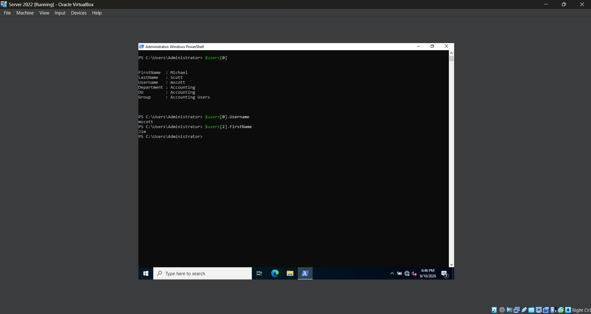

# **Lab 11 - Bulk Active Directory User Provisioning with Powershell**

## **Objective**

## **Environment**

## **Skills Demonstrated**

## **Steps**

### *Step 1 — Create a CSV File for New Users*



In the Windows Server 2022 VM, I create a new folder named `Scripts` on the `C:` drive and create a CSV file named `NewUsers.csv`. This file will act as the data source for the Active Directory accounts that I will provision with PowerShell.

I add the following columns to the CSV:

`FirstName`, `LastName`, `Username`, `Department`, `OU`, and `Group`

I then add three test users:

- Michael Scott (`mscott`)
- Pam Beesly (`pbeesly`)
- Jim Halpert (`jhalpert`)

Each row represents a separate user account, while each column stores information that PowerShell can access when creating and configuring the accounts.

The file is saved at:

`C:\Scripts\NewUsers.csv`

This allows the same PowerShell commands to be applied to multiple users instead of manually creating and configuring each account individually.

### *Step 2 — Import the CSV into PowerShell*





In the Windows Server 2022 VM, I open PowerShell as Administrator and use `Import-Csv` to import the user information stored in `NewUsers.csv`. I store the imported data inside a variable named `$users`.

I use the following command:

```powershell
$users = Import-Csv "C:\Scripts\NewUsers.csv"
```

I then enter `$users` to display the imported data and verify that PowerShell successfully reads all three user records and their corresponding properties, including their first name, last name, username, department, OU, and group.

Next, I experiment with accessing individual objects within the `$users` collection:

```powershell
$users[0]
```

PowerShell uses zero-based indexing, so `[0]` represents the first object in the collection. In this case, `$users[0]` returns the complete record for Michael Scott.

I can also access a specific property of an individual object by placing the property name after the object:

```powershell
$users[0].Username
```

This returns only the `Username` property of the first user:

`mscott`

I also test:

```powershell
$users[2].FirstName
```

This accesses the third object in the collection and returns its `FirstName` property:

`Jim`

This demonstrates how CSV data can be stored as PowerShell objects and how individual users and properties can be accessed programmatically. This data can now be processed with a loop rather than manually entering information for each user.

## **Challenges**

## **What I Learned**

## **Next Steps**
