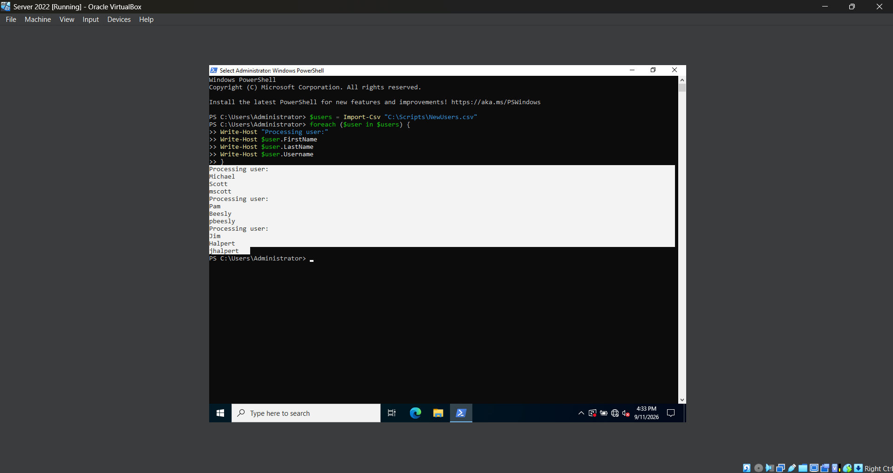
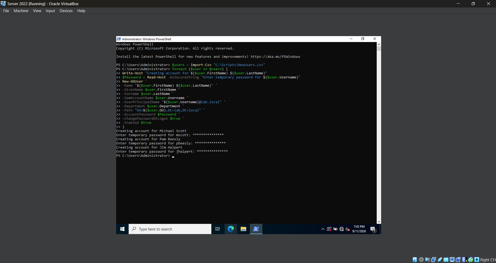
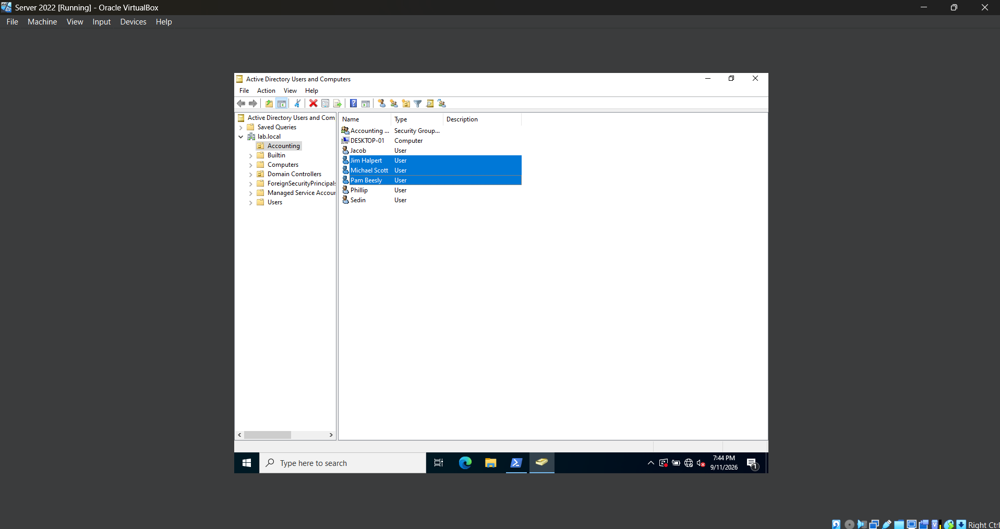

# **Lab 11 - Bulk Active Directory User Provisioning with Powershell**

## **Objective**

## **Environment**

## **Skills Demonstrated**

## **Steps**

### *Step 1 — Create a CSV File for New Users*


In the Windows Server 2022 VM, I create a new folder named `Scripts` on the `C:` drive and create a CSV file named `NewUsers.csv`. This file will act as the data source for the Active Directory accounts that I will provision with PowerShell.

I add the following columns to the CSV:

`FirstName`, `LastName`, `Username`, `Department`, `OU`, and `Group`

I then add three test users:

- Michael Scott (`mscott`)
- Pam Beesly (`pbeesly`)
- Jim Halpert (`jhalpert`)

Each row represents a separate user account, while each column stores information that PowerShell can access when creating and configuring the accounts.

The file is saved at:

`C:\Scripts\NewUsers.csv`

This allows the same PowerShell commands to be applied to multiple users instead of manually creating and configuring each account individually.

### *Step 2 — Import the CSV into PowerShell*


In the Windows Server 2022 VM, I open PowerShell as Administrator and use `Import-Csv` to import the user information stored in `NewUsers.csv`. I store the imported data inside a variable named `$users`.

I use the following command:

```powershell
$users = Import-Csv "C:\Scripts\NewUsers.csv"
```

I then enter `$users` to display the imported data and verify that PowerShell successfully reads all three user records and their corresponding properties, including their first name, last name, username, department, OU, and group.

Next, I experiment with accessing individual objects within the `$users` collection:

```powershell
$users[0]
```

PowerShell uses zero-based indexing, so `[0]` represents the first object in the collection. In this case, `$users[0]` returns the complete record for Michael Scott.

I can also access a specific property of an individual object by placing the property name after the object:

```powershell
$users[0].Username
```

This returns only the `Username` property of the first user:

`mscott`

I also test:

```powershell
$users[2].FirstName
```

This accesses the third object in the collection and returns its `FirstName` property:

`Jim`

This demonstrates how CSV data can be stored as PowerShell objects and how individual users and properties can be accessed programmatically. This data can now be processed with a loop rather than manually entering information for each user.

### *Step 3 - Test a Powershell 'foreach' Loop*



In the Windows Server 2022 VM, I use a PowerShell `foreach` loop to process each user stored in the `$users` variable. Before using the loop to create Active Directory accounts, I first test it by displaying information from each CSV record.

I use the following command:

```powershell
foreach ($user in $users) {
    Write-Host "Processing user:"
    Write-Host $user.FirstName
    Write-Host $user.LastName
    Write-Host $user.Username
}
```

The `foreach` loop processes each object stored inside the `$users` collection one at a time. During each iteration, the current user is temporarily stored in the `$user` variable.

This allows me to access individual properties from each CSV record using values such as `$user.FirstName`, `$user.LastName`, and `$user.Username`.

The `Write-Host` command displays the information in the PowerShell window so I can verify that the loop is correctly reading and processing every user from the CSV file.

The output shows the information for Michael Scott, Pam Beesly, and Jim Halpert, confirming that PowerShell successfully processes all three records.

Testing the loop before making changes to Active Directory allows me to verify that the CSV data and loop logic are working correctly before using the same structure to automatically create multiple user accounts.

### *Step 4 - Bulk Create Active Directory Users with Powershell*





In the Windows Server 2022 VM, I use a PowerShell `foreach` loop to automatically create the Active Directory users stored in the `$users` collection that was imported from the CSV file.

For each user, I enter a unique temporary password and then use the values from the CSV to populate the Active Directory account information.

I use the following script:

```powershell
foreach ($user in $users) {

    Write-Host "Creating account for $($user.FirstName) $($user.LastName)"

    $Password = Read-Host -AsSecureString "Enter temporary password for $($user.Username)"

    New-ADUser `
        -Name "$($user.FirstName) $($user.LastName)" `
        -GivenName $user.FirstName `
        -Surname $user.LastName `
        -SamAccountName $user.Username `
        -UserPrincipalName "$($user.Username)@lab.local" `
        -Department $user.Department `
        -Path "OU=$($user.OU),DC=lab,DC=local" `
        -AccountPassword $Password `
        -ChangePasswordAtLogon $true `
        -Enabled $true
}
```

The `foreach` loop processes each user in the `$users` collection one at a time. Instead of manually entering the account information for every user, PowerShell reads values such as the first name, last name, username, department, and OU directly from the CSV file.

The `-Path` parameter dynamically builds the Distinguished Name using the OU value from the CSV, while `-AccountPassword` applies the temporary password entered for each user. I also use `-ChangePasswordAtLogon $true` so each user is required to create a new password during their first login.

After running the script, I open **Active Directory Users and Computers** and navigate to the **Accounting OU**. Michael Scott, Pam Beesly, and Jim Halpert appear in the OU, confirming that the accounts were successfully created through PowerShell.

This demonstrates how PowerShell can use CSV data and a loop to provision multiple Active Directory users more efficiently than creating each account manually.

## **Challenges**

## **What I Learned**

## **Next Steps**
