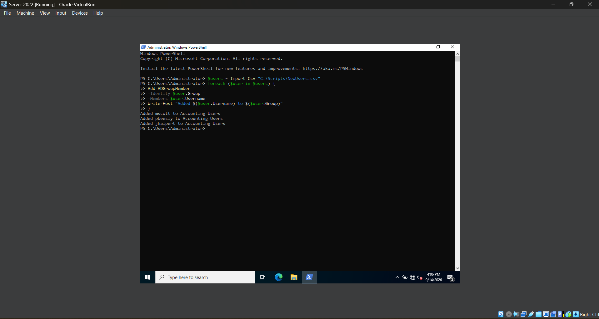
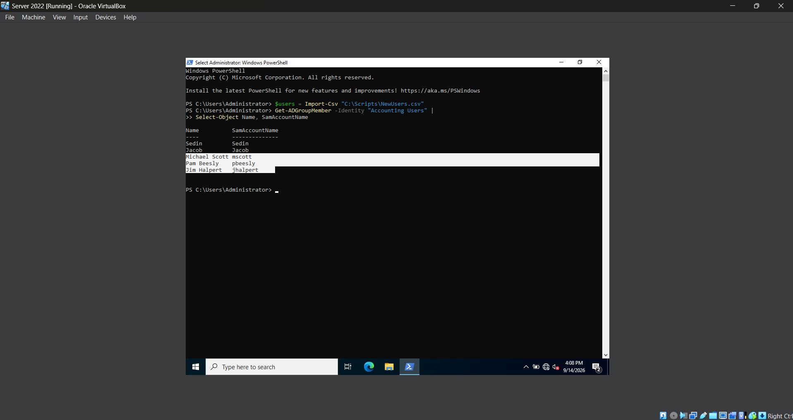
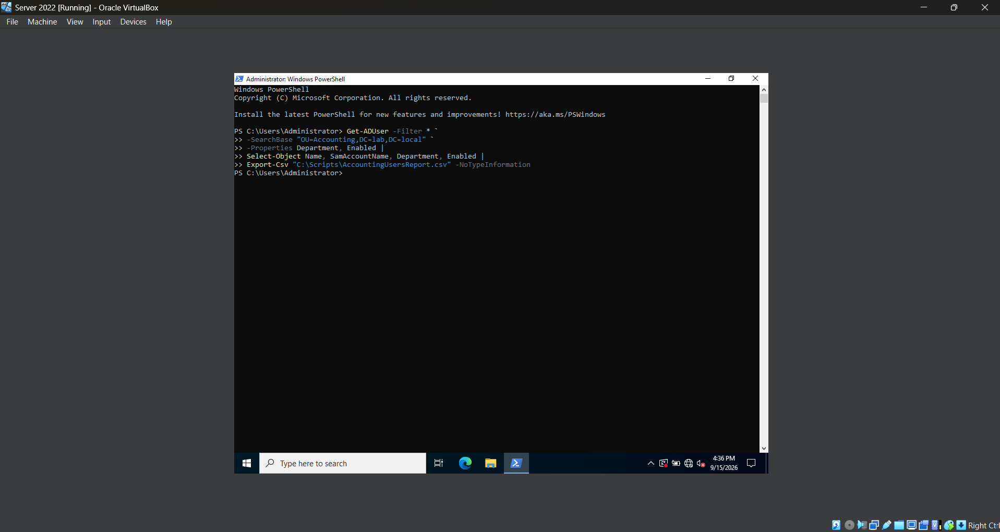
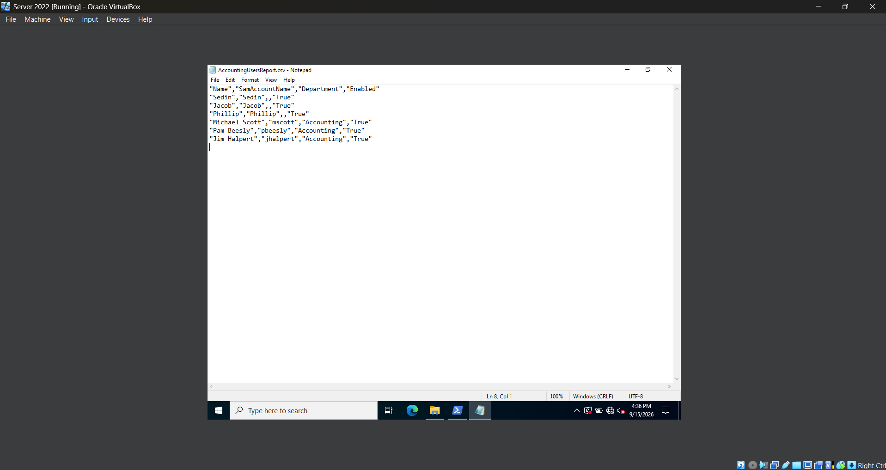
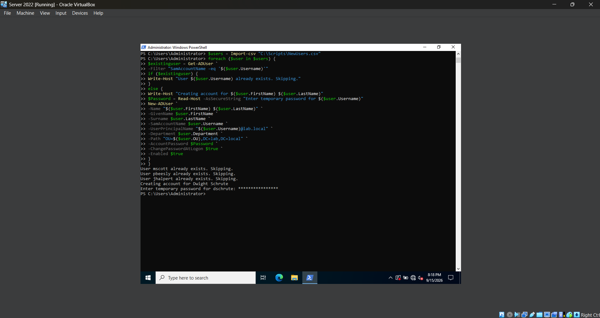
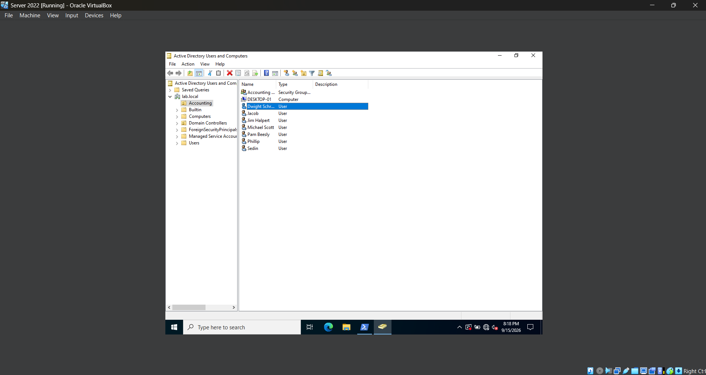

# **Lab 11 - Bulk Active Directory User Provisioning with Powershell**

## **Objective**

## **Environment**

## **Skills Demonstrated**

## **Steps**

### *Step 1 — Create a CSV File for New Users*


In the Windows Server 2022 VM, I create a new folder named `Scripts` on the `C:` drive and create a CSV file named `NewUsers.csv`. This file will act as the data source for the Active Directory accounts that I will provision with PowerShell.

I add the following columns to the CSV:

`FirstName`, `LastName`, `Username`, `Department`, `OU`, and `Group`

I then add three test users:

- Michael Scott (`mscott`)
- Pam Beesly (`pbeesly`)
- Jim Halpert (`jhalpert`)

Each row represents a separate user account, while each column stores information that PowerShell can access when creating and configuring the accounts.

The file is saved at:

`C:\Scripts\NewUsers.csv`

This allows the same PowerShell commands to be applied to multiple users instead of manually creating and configuring each account individually.

### *Step 2 — Import the CSV into PowerShell*


In the Windows Server 2022 VM, I open PowerShell as Administrator and use `Import-Csv` to import the user information stored in `NewUsers.csv`. I store the imported data inside a variable named `$users`.

I use the following command:

```powershell
$users = Import-Csv "C:\Scripts\NewUsers.csv"
```

I then enter `$users` to display the imported data and verify that PowerShell successfully reads all three user records and their corresponding properties, including their first name, last name, username, department, OU, and group.

Next, I experiment with accessing individual objects within the `$users` collection:

```powershell
$users[0]
```

PowerShell uses zero-based indexing, so `[0]` represents the first object in the collection. In this case, `$users[0]` returns the complete record for Michael Scott.

I can also access a specific property of an individual object by placing the property name after the object:

```powershell
$users[0].Username
```

This returns only the `Username` property of the first user:

`mscott`

I also test:

```powershell
$users[2].FirstName
```

This accesses the third object in the collection and returns its `FirstName` property:

`Jim`

This demonstrates how CSV data can be stored as PowerShell objects and how individual users and properties can be accessed programmatically. This data can now be processed with a loop rather than manually entering information for each user.

### *Step 3 - Test a Powershell 'foreach' Loop*


In the Windows Server 2022 VM, I use a PowerShell `foreach` loop to process each user stored in the `$users` variable. Before using the loop to create Active Directory accounts, I first test it by displaying information from each CSV record.

I use the following command:

```powershell
foreach ($user in $users) {
    Write-Host "Processing user:"
    Write-Host $user.FirstName
    Write-Host $user.LastName
    Write-Host $user.Username
}
```

The `foreach` loop processes each object stored inside the `$users` collection one at a time. During each iteration, the current user is temporarily stored in the `$user` variable.

This allows me to access individual properties from each CSV record using values such as `$user.FirstName`, `$user.LastName`, and `$user.Username`.

The `Write-Host` command displays the information in the PowerShell window so I can verify that the loop is correctly reading and processing every user from the CSV file.

The output shows the information for Michael Scott, Pam Beesly, and Jim Halpert, confirming that PowerShell successfully processes all three records.

Testing the loop before making changes to Active Directory allows me to verify that the CSV data and loop logic are working correctly before using the same structure to automatically create multiple user accounts.

### *Step 4 - Bulk Create Active Directory Users with Powershell*


In the Windows Server 2022 VM, I use a PowerShell `foreach` loop to automatically create the Active Directory users stored in the `$users` collection that was imported from the CSV file.

For each user, I enter a unique temporary password and then use the values from the CSV to populate the Active Directory account information.

I use the following script:

```powershell
foreach ($user in $users) {

    Write-Host "Creating account for $($user.FirstName) $($user.LastName)"

    $Password = Read-Host -AsSecureString "Enter temporary password for $($user.Username)"

    New-ADUser `
        -Name "$($user.FirstName) $($user.LastName)" `
        -GivenName $user.FirstName `
        -Surname $user.LastName `
        -SamAccountName $user.Username `
        -UserPrincipalName "$($user.Username)@lab.local" `
        -Department $user.Department `
        -Path "OU=$($user.OU),DC=lab,DC=local" `
        -AccountPassword $Password `
        -ChangePasswordAtLogon $true `
        -Enabled $true
}
```

The `foreach` loop processes each user in the `$users` collection one at a time. Instead of manually entering the account information for every user, PowerShell reads values such as the first name, last name, username, department, and OU directly from the CSV file.

The `-Path` parameter dynamically builds the Distinguished Name using the OU value from the CSV, while `-AccountPassword` applies the temporary password entered for each user. I also use `-ChangePasswordAtLogon $true` so each user is required to create a new password during their first login.

After running the script, I open **Active Directory Users and Computers** and navigate to the **Accounting OU**. Michael Scott, Pam Beesly, and Jim Halpert appear in the OU, confirming that the accounts were successfully created through PowerShell.

This demonstrates how PowerShell can use CSV data and a loop to provision multiple Active Directory users more efficiently than creating each account manually.

### *Step 5 - Assign Security Group Membership with Powershell*





In the Windows Server 2022 VM, I use a PowerShell `foreach` loop to automatically add each user from the CSV file to the security group specified in their `Group` column.

I use the following commands:

```powershell
foreach ($user in $users) {

    Add-ADGroupMember `
        -Identity $user.Group `
        -Members $user.Username

    Write-Host "Added $($user.Username) to $($user.Group)"
}
```

The `Add-ADGroupMember` command adds an Active Directory user to a security group. The `-Identity` parameter uses the value stored in `$user.Group` to determine which group should be modified, while the `-Members` parameter uses `$user.Username` to identify the account that should be added.

Because the command is inside a `foreach` loop, PowerShell processes each user from the CSV file and automatically assigns the appropriate group membership without requiring me to manually add each account individually.

The `Write-Host` command displays a confirmation message after each user is processed. The output confirms that `mscott`, `pbeesly`, and `jhalpert` were all added to the **Accounting Users** security group.

After running the loop, I verify the group membership with:

```powershell
Get-ADGroupMember -Identity "Accounting Users" |
    Select-Object Name, SamAccountName
```

The output shows Michael Scott, Pam Beesly, and Jim Halpert as members of the **Accounting Users** group, confirming that the automated group assignment was successful.

This demonstrates how CSV data and PowerShell can be used together to automate security group membership for multiple Active Directory users.

### *Step 6 - Export an Active Directory User Report*





In the Windows Server 2022 VM, I use PowerShell to retrieve user account information from the **Accounting OU** and export the results into a CSV report. This demonstrates how PowerShell can be used to collect and report Active Directory information.

I use the following command:

```powershell
Get-ADUser -Filter * `
    -SearchBase "OU=Accounting,DC=lab,DC=local" `
    -Properties Department, Enabled |
    Select-Object Name, SamAccountName, Department, Enabled |
    Export-Csv "C:\Scripts\AccountingUsersReport.csv" -NoTypeInformation
```

The `Get-ADUser` command retrieves Active Directory user accounts, while `-Filter *` selects all users within the location specified by `-SearchBase`.

The `-SearchBase` parameter limits the search to the Accounting OU:

`OU=Accounting,DC=lab,DC=local`

I use `-Properties Department, Enabled` to retrieve the **Department** and **Enabled** attributes for each user. The results are then passed through the PowerShell pipeline (`|`) to `Select-Object`, where I select the specific information I want included in the report:

- `Name` — Displays the user's full name.
- `SamAccountName` — Displays the user's domain logon name.
- `Department` — Displays the department assigned to the account.
- `Enabled` — Shows whether the Active Directory account is currently enabled.

Finally, I pipe the selected information into `Export-Csv`, which creates the following report:

`C:\Scripts\AccountingUsersReport.csv`

The `-NoTypeInformation` parameter prevents unnecessary PowerShell object type information from being included in the CSV file.

After running the command, I open `AccountingUsersReport.csv` and verify that the users located in the Accounting OU were successfully exported along with their usernames, departments, and account status.

This step demonstrates how the PowerShell pipeline can retrieve Active Directory objects, select specific properties, and export the resulting information into a reusable administrative report.

### Step 7 - Prevent Duplicate User Creation





In the Windows Server 2022 VM, I update the bulk user creation process to check whether a user account already exists before attempting to create it. This makes the script safer to rerun because existing accounts can be skipped while new accounts can still be created from the CSV file.

I first import the user information from `NewUsers.csv`:

```powershell
$users = Import-Csv "C:\Scripts\NewUsers.csv"
```

I then use a `foreach` loop to process each user stored in the `$users` variable:

```powershell
foreach ($user in $users) {

    $existingUser = Get-ADUser `
        -Filter "SamAccountName -eq '$($user.Username)'"

    if ($existingUser) {
        Write-Host "User $($user.Username) already exists. Skipping."
    }
    else {
        Write-Host "Creating account for $($user.FirstName) $($user.LastName)"

        $Password = Read-Host -AsSecureString "Enter temporary password for $($user.Username)"

        New-ADUser `
            -Name "$($user.FirstName) $($user.LastName)" `
            -GivenName $user.FirstName `
            -Surname $user.LastName `
            -SamAccountName $user.Username `
            -UserPrincipalName "$($user.Username)@lab.local" `
            -Department $user.Department `
            -Path "OU=$($user.OU),DC=lab,DC=local" `
            -AccountPassword $Password `
            -ChangePasswordAtLogon $true `
            -Enabled $true
    }
}
```

For each row in the CSV file, `$user` represents the user currently being processed. I use `Get-ADUser` with `-Filter` to search Active Directory for an account whose `SamAccountName` matches the username stored in `$user.Username`.

The result of the search is stored in the `$existingUser` variable:

`$existingUser = Get-ADUser -Filter "SamAccountName -eq '$($user.Username)'"`

I then use an `if/else` statement to decide what should happen:

- `if ($existingUser)` — If a matching Active Directory account is found, the script displays a message that the user already exists and skips creating another account.
- `else` — If no matching account is found, the script continues with the user creation process.

Inside the `else` block, `Read-Host -AsSecureString` prompts me to enter a temporary password for the new user without displaying the password in plain text. `New-ADUser` then uses the information from the current CSV row to create the account in the appropriate Organizational Unit.

To test both parts of the `if/else` statement, I add **Dwight Schrute** with the username `dschrute` to the CSV file and run the script again.

The existing accounts `mscott`, `pbeesly`, and `jhalpert` are detected and skipped. When the loop reaches `dschrute`, no existing account is found, so the `else` block runs and prompts me for a temporary password before creating the new account.

After the script completes, I open **Active Directory Users and Computers (ADUC)** and navigate to the **Accounting OU**. I verify that Dwight Schrute was successfully created while the existing accounts remained unchanged.

This step demonstrates how conditional logic can be combined with a `foreach` loop and Active Directory cmdlets to make a bulk user creation script safer and reusable by preventing duplicate accounts while still allowing new users to be provisioned.

### *Step 8 - Test a Created User Account*

## **Challenges**

## **What I Learned**

## **Next Steps**
