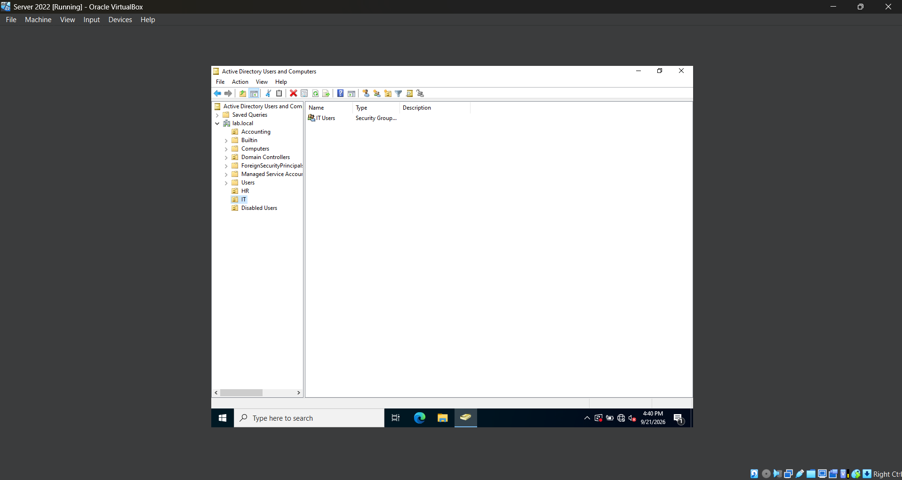
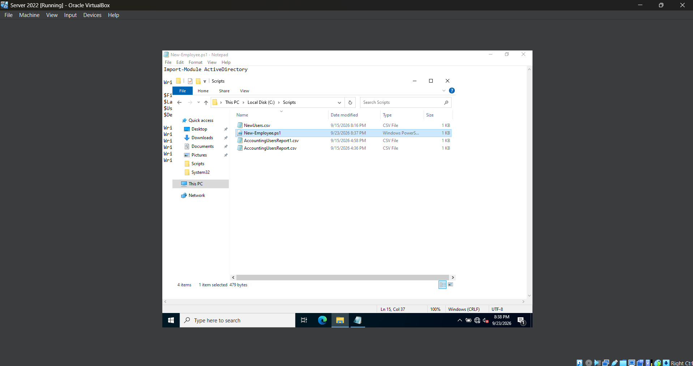
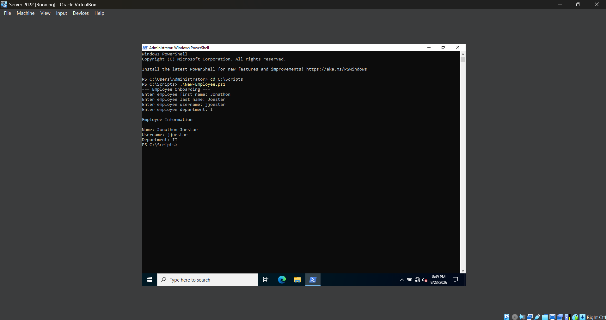
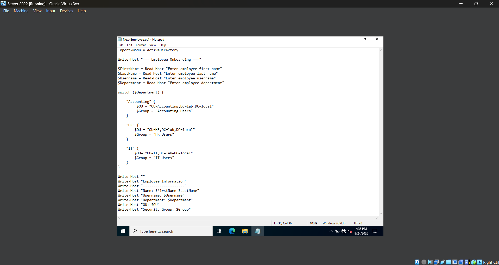
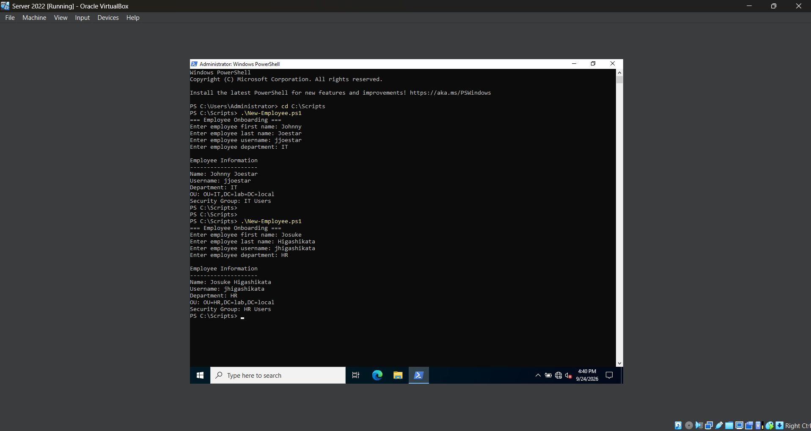

# **Lab 12 - Automated Employee Onboarding & Offboarding with Powershell**

## **Objective**

## **Environment**

## **Skills Demonstrated**

## **Steps**

### *Step 1 - Create the Department and Offboarding Structure*




In the Windows Server 2022 VM, I use **Active Directory Users and Computers (ADUC)** to expand the existing Active Directory structure before building the employee onboarding and offboarding scripts.

I create three new Organizational Units under the `lab.local` domain:

- **HR**
- **IT**
- **Disabled Users**

The **HR** and **IT** OUs provide separate locations for user accounts based on their department. I will use these alongside the existing **Accounting OU** so the onboarding script can automatically place new employees in the correct location within Active Directory.

The **Disabled Users OU** provides a separate location for accounts that have been offboarded. Instead of immediately deleting an employee's account, the offboarding process will disable the account and move it into this OU so the account can be retained while preventing the user from signing in.

I also create a new Global Security group inside each department OU:

- **HR Users**
- **IT Users**

These groups will be used to assign access based on the employee's department. The existing **Accounting Users** security group will continue to be used for employees placed in the Accounting department.

This creates the following structure for the onboarding process:

| Department | Organizational Unit | Security Group |
| --- | --- | --- |
| Accounting | Accounting | Accounting Users |
| HR | HR | HR Users |
| IT | IT | IT Users |

With this structure in place, the PowerShell onboarding script can later determine the appropriate OU and security group based on the employee's department. The **Disabled Users OU** will also be used during the offboarding portion of the lab to separate disabled employee accounts from active users.

### *Step 2 - Create the Employee Onboarding Powershell Script*





In the Windows Server 2022 VM, I begin building a reusable PowerShell script for employee onboarding. Instead of entering each administrative command manually into PowerShell, I create a script named `New-Employee.ps1` and save it in the existing `C:\Scripts` folder.

The script is saved at:

`C:\Scripts\New-Employee.ps1`

I start the script by loading the Active Directory PowerShell module:

```powershell
Import-Module ActiveDirectory
```

I then use `Read-Host` to collect information about the employee being onboarded:

```powershell
$FirstName = Read-Host "Enter employee first name"
$LastName = Read-Host "Enter employee last name"
$Username = Read-Host "Enter employee username"
$Department = Read-Host "Enter employee department"
```

Each value entered by the administrator is stored in a PowerShell variable. For example, the employee's username is stored in `$Username`, while the selected department is stored in `$Department`.

I also add several `Write-Host` commands to display the information that was entered:

```powershell
Write-Host ""
Write-Host "Employee Information"
Write-Host "--------------------"
Write-Host "Name: $FirstName $LastName"
Write-Host "Username: $Username"
Write-Host "Department: $Department"
```

At this stage, the script only collects and displays employee information and does not make any changes to Active Directory. This allows me to build and test the onboarding workflow in smaller sections before adding commands that create or modify user accounts.

Creating the onboarding process as a `.ps1` file also allows the script to be saved, modified, and reused for future employees instead of rebuilding the PowerShell commands each time.

### *Step 3 - Automatically Determine OU and Security Group*





In the Windows Server 2022 VM, I expand the `New-Employee.ps1` onboarding script by adding a `switch` statement. This allows the script to automatically determine the correct Organizational Unit and security group based on the department entered by the administrator.

I add the following `switch` statement after collecting the employee information:

```powershell
switch ($Department) {

    "Accounting" {
        $OU = "OU=Accounting,DC=lab,DC=local"
        $Group = "Accounting Users"
    }

    "HR" {
        $OU = "OU=HR,DC=lab,DC=local"
        $Group = "HR Users"
    }

    "IT" {
        $OU = "OU=IT,DC=lab,DC=local"
        $Group = "IT Users"
    }
}
```

The `switch` statement checks the value stored in `$Department` and runs the block of code that matches the department entered by the administrator.

For example, if I enter:

`IT`

the script automatically stores the following values:

```powershell
$OU = "OU=IT,DC=lab,DC=local"
$Group = "IT Users"
```

This means I only need to provide the employee's department instead of manually entering the appropriate OU path and security group for every new employee.

I also update the output section of the script to display the values selected by the `switch` statement:

```powershell
Write-Host "OU: $OU"
Write-Host "Security Group: $Group"
```

After updating the script, I run `New-Employee.ps1` and test the onboarding process using an employee in the **IT** department. The script correctly selects the IT OU and the `IT Users` security group.

I then run the script again using an employee in the **HR** department. This time, PowerShell automatically changes the selected values to the HR OU and the `HR Users` security group.

Testing two different departments verifies that the `switch` statement is making decisions based on the value stored in `$Department` rather than using a hardcoded OU or security group.

At this stage, the script still does not create an Active Directory account. It now collects employee information and automatically determines where the employee should be placed and which department security group should be assigned.

This step demonstrates how a `switch` statement can be used to add decision-making logic to a PowerShell automation script.

## **Challenges**

## **What I Learned**

## **Next Steps**
