# **Lab 12 - Automated Employee Onboarding & Offboarding with Powershell**

## **Objective**

## **Environment**

## **Skills Demonstrated**

## **Steps**

### *Step 1 - Create the Department and Offboarding Structure*


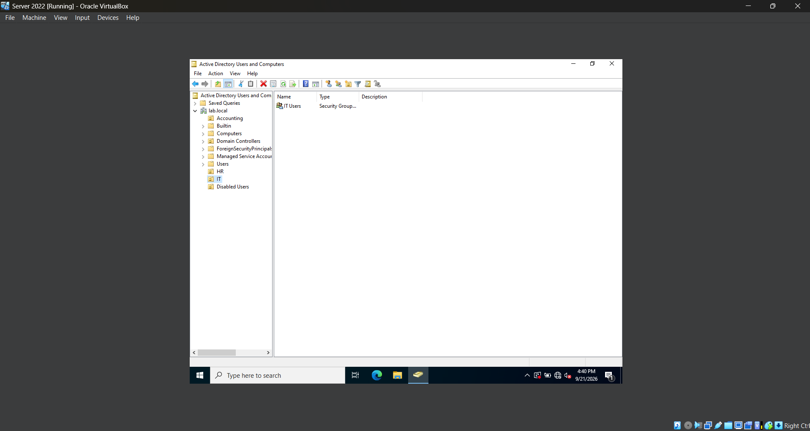

In the Windows Server 2022 VM, I use **Active Directory Users and Computers (ADUC)** to expand the existing Active Directory structure before building the employee onboarding and offboarding scripts.

I create three new Organizational Units under the `lab.local` domain:

- **HR**
- **IT**
- **Disabled Users**

The **HR** and **IT** OUs provide separate locations for user accounts based on their department. I will use these alongside the existing **Accounting OU** so the onboarding script can automatically place new employees in the correct location within Active Directory.

The **Disabled Users OU** provides a separate location for accounts that have been offboarded. Instead of immediately deleting an employee's account, the offboarding process will disable the account and move it into this OU so the account can be retained while preventing the user from signing in.

I also create a new Global Security group inside each department OU:

- **HR Users**
- **IT Users**

These groups will be used to assign access based on the employee's department. The existing **Accounting Users** security group will continue to be used for employees placed in the Accounting department.

This creates the following structure for the onboarding process:

| Department | Organizational Unit | Security Group |
| --- | --- | --- |
| Accounting | Accounting | Accounting Users |
| HR | HR | HR Users |
| IT | IT | IT Users |

With this structure in place, the PowerShell onboarding script can later determine the appropriate OU and security group based on the employee's department. The **Disabled Users OU** will also be used during the offboarding portion of the lab to separate disabled employee accounts from active users.

### *Step 2 - Create the Employee Onboarding Powershell Script*

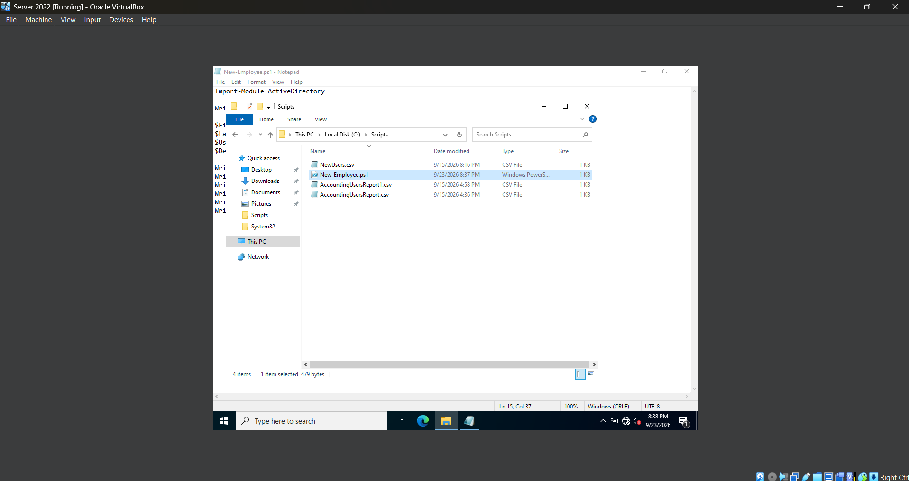

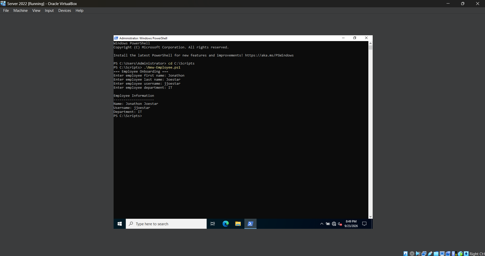

In the Windows Server 2022 VM, I begin building a reusable PowerShell script for employee onboarding. Instead of entering each administrative command manually into PowerShell, I create a script named `New-Employee.ps1` and save it in the existing `C:\Scripts` folder.

The script is saved at:

`C:\Scripts\New-Employee.ps1`

I start the script by loading the Active Directory PowerShell module:

```powershell
Import-Module ActiveDirectory
```

I then use `Read-Host` to collect information about the employee being onboarded:

```powershell
$FirstName = Read-Host "Enter employee first name"
$LastName = Read-Host "Enter employee last name"
$Username = Read-Host "Enter employee username"
$Department = Read-Host "Enter employee department"
```

Each value entered by the administrator is stored in a PowerShell variable. For example, the employee's username is stored in `$Username`, while the selected department is stored in `$Department`.

I also add several `Write-Host` commands to display the information that was entered:

```powershell
Write-Host ""
Write-Host "Employee Information"
Write-Host "--------------------"
Write-Host "Name: $FirstName $LastName"
Write-Host "Username: $Username"
Write-Host "Department: $Department"
```

At this stage, the script only collects and displays employee information and does not make any changes to Active Directory. This allows me to build and test the onboarding workflow in smaller sections before adding commands that create or modify user accounts.

Creating the onboarding process as a `.ps1` file also allows the script to be saved, modified, and reused for future employees instead of rebuilding the PowerShell commands each time.

### *Step 3 - Automatically Determine OU and Security Group*

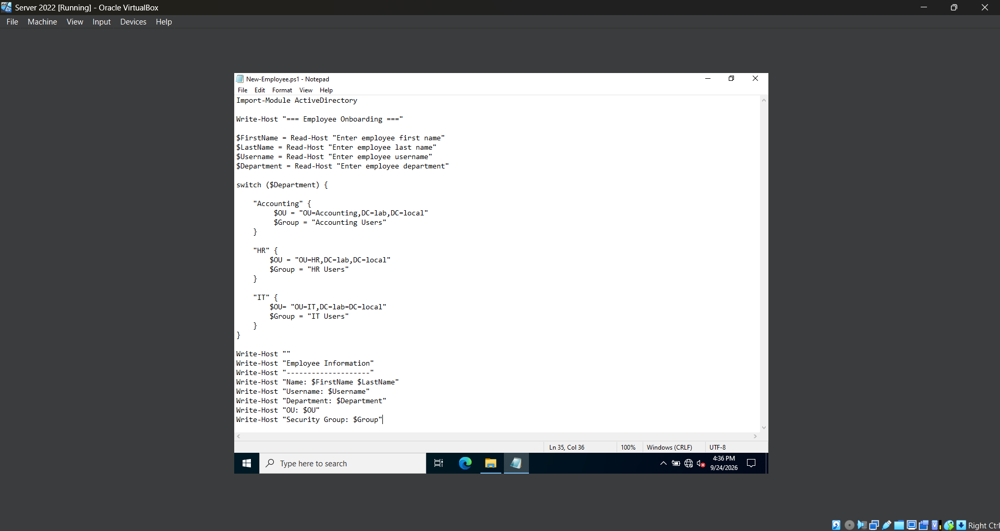

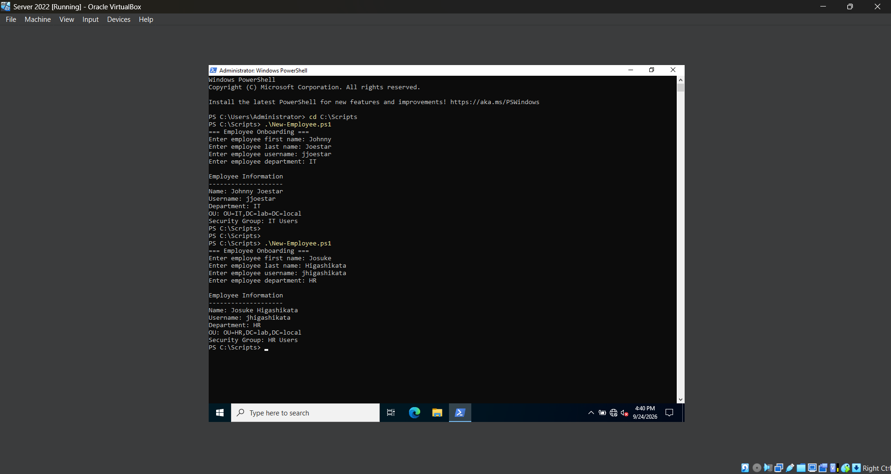

In the Windows Server 2022 VM, I expand the `New-Employee.ps1` onboarding script by adding a `switch` statement. This allows the script to automatically determine the correct Organizational Unit and security group based on the department entered by the administrator.

I add the following `switch` statement after collecting the employee information:

```powershell
switch ($Department) {

    "Accounting" {
        $OU = "OU=Accounting,DC=lab,DC=local"
        $Group = "Accounting Users"
    }

    "HR" {
        $OU = "OU=HR,DC=lab,DC=local"
        $Group = "HR Users"
    }

    "IT" {
        $OU = "OU=IT,DC=lab,DC=local"
        $Group = "IT Users"
    }
}
```

The `switch` statement checks the value stored in `$Department` and runs the block of code that matches the department entered by the administrator.

For example, if I enter:

`IT`

the script automatically stores the following values:

```powershell
$OU = "OU=IT,DC=lab,DC=local"
$Group = "IT Users"
```

This means I only need to provide the employee's department instead of manually entering the appropriate OU path and security group for every new employee.

I also update the output section of the script to display the values selected by the `switch` statement:

```powershell
Write-Host "OU: $OU"
Write-Host "Security Group: $Group"
```

After updating the script, I run `New-Employee.ps1` and test the onboarding process using an employee in the **IT** department. The script correctly selects the IT OU and the `IT Users` security group.

I then run the script again using an employee in the **HR** department. This time, PowerShell automatically changes the selected values to the HR OU and the `HR Users` security group.

Testing two different departments verifies that the `switch` statement is making decisions based on the value stored in `$Department` rather than using a hardcoded OU or security group.

At this stage, the script still does not create an Active Directory account. It now collects employee information and automatically determines where the employee should be placed and which department security group should be assigned.

This step demonstrates how a `switch` statement can be used to add decision-making logic to a PowerShell automation script.

### *Step 4 - Add Department Input Validation*

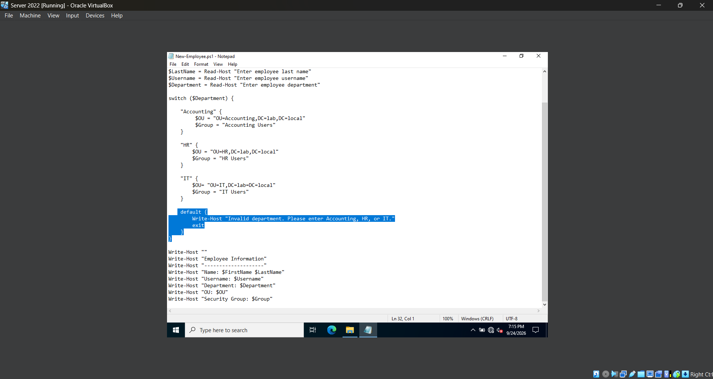


In the Windows Server 2022 VM, I improve the `New-Employee.ps1` onboarding script by adding input validation to the existing `switch` statement. This prevents the script from continuing if the administrator enters a department that is not supported by the onboarding workflow.

I add a `default` block to the existing `switch` statement:

```powershell
switch ($Department) {

    "Accounting" {
        $OU = "OU=Accounting,DC=lab,DC=local"
        $Group = "Accounting Users"
    }

    "HR" {
        $OU = "OU=HR,DC=lab,DC=local"
        $Group = "HR Users"
    }

    "IT" {
        $OU = "OU=IT,DC=lab,DC=local"
        $Group = "IT Users"
    }

    default {
        Write-Host "Invalid department. Please enter Accounting, HR, or IT."
        exit
    }
}
```

The `default` block runs when the value stored in `$Department` does not match any of the available cases in the `switch` statement. This works similarly to an `else` statement by providing an action for any value that was not previously matched.

If an unsupported department is entered, the script displays the following message:

`Invalid department. Please enter Accounting, HR, or IT.`

I also use the `exit` command immediately after the message. This stops the script from continuing with an invalid department and prevents later onboarding commands from attempting to use an empty or incorrect OU and security group.

To test the validation, I run `New-Employee.ps1` and enter `Finance` as the employee's department. Since Finance is not one of the configured departments, PowerShell runs the `default` block, displays the invalid department message, and stops the script before displaying the Employee Information section.

I then run the script again and enter `Accounting` as the department. This time, the input matches a valid case and the script continues normally. PowerShell automatically selects:

`OU=Accounting,DC=lab,DC=local`

and:

`Accounting Users`

This verifies that invalid department values are stopped while valid department values continue through the onboarding workflow.

This step demonstrates how input validation can make a PowerShell automation script safer by preventing unsupported information from being processed before changes are made to Active Directory.

### *Step 5 - Checking for Existing Username*

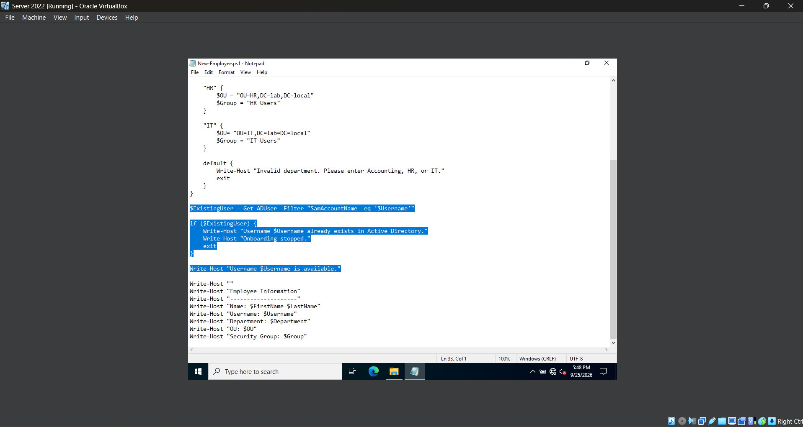


In the Windows Server 2022 VM, I continue improving the `New-Employee.ps1` onboarding script by adding a check for existing Active Directory usernames. Before creating a new employee account, the script now searches Active Directory to determine whether the requested username is already being used.

I add the following command after the department `switch` statement:

```powershell
$ExistingUser = Get-ADUser -Filter "SamAccountName -eq '$Username'"
```

The `Get-ADUser` command searches Active Directory for a user whose `SamAccountName` matches the username entered by the administrator. The result of the search is stored in the `$ExistingUser` variable.

For example, if the username entered is:

`Sedin`

the filter searches Active Directory for an account with the following value:

`SamAccountName = Sedin`

I then use an `if` statement to determine whether the search returned an existing account:

```powershell
if ($ExistingUser) {
    Write-Host "Username $Username already exists in Active Directory."
    Write-Host "Onboarding stopped."
    exit
}

Write-Host "Username $Username is available."
```

If `$ExistingUser` contains an Active Directory user object, the `if` condition evaluates as true. The script displays a message explaining that the username already exists and then uses `exit` to stop the onboarding process.

If no matching account is found, `$ExistingUser` does not contain a user object. The `if` block is skipped and the script continues to:

```powershell
Write-Host "Username $Username is available."
```

An `else` statement is not required in this case because `exit` completely stops the script when an existing account is detected. If PowerShell reaches the username available message, I already know that the existing-user check did not find a matching account.

To test the duplicate username check, I first run the script using `Sedin`, which is already an existing Active Directory username. PowerShell detects the existing account, displays that the username is already in use, and stops the onboarding process before reaching the Employee Information section.

I then run the script again using `ggiovanna`, a username that does not currently exist in Active Directory. PowerShell reports that the username is available and continues through the onboarding workflow. Since I enter `HR` as the department, the script also correctly selects:

`OU=HR,DC=lab,DC=local`

and:

`HR Users`

Testing both an existing and an available username verifies that the script can prevent duplicate Active Directory accounts while allowing new usernames to continue through the onboarding process.

At this stage, the script validates both the employee's department and username before any Active Directory account is created. This adds another safety check to the onboarding workflow and prepares the script for automated account creation in the next step.

### *Step 6 - Create the Active Directory User Account*

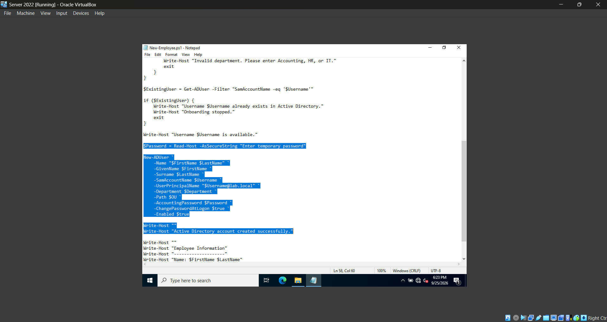

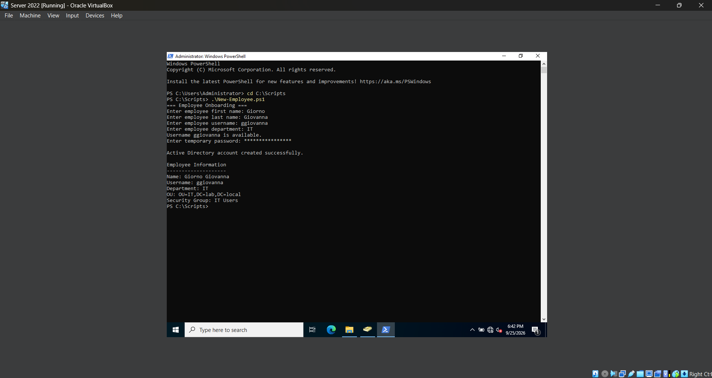

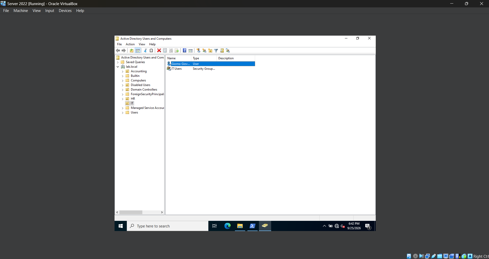

In the Windows Server 2022 VM, I expand the `New-Employee.ps1` onboarding script so it can now create the employee's Active Directory account. At this point in the workflow, the employee's department has already been validated, the correct OU and security group have been selected, and the requested username has been checked to make sure it is available.

Before creating the account, I prompt the administrator to enter a temporary password:

```powershell
$Password = Read-Host -AsSecureString "Enter temporary password"
```

The `Read-Host` command collects the password while `-AsSecureString` prevents the password from being stored as normal readable text. The resulting secure password is stored in the `$Password` variable and can then be passed to `New-ADUser`.

I use the following command to create the Active Directory account:

```powershell
New-ADUser `
    -Name "$FirstName $LastName" `
    -GivenName $FirstName `
    -Surname $LastName `
    -SamAccountName $Username `
    -UserPrincipalName "$Username@lab.local" `
    -Department $Department `
    -Path $OU `
    -AccountPassword $Password `
    -ChangePasswordAtLogon $true `
    -Enabled $true
```

Instead of manually entering the employee information directly into `New-ADUser`, the command uses the variables collected and generated earlier in the onboarding script.

The `-Name`, `-GivenName`, and `-Surname` parameters configure the employee's name, while `-SamAccountName` uses the username entered by the administrator. The `-UserPrincipalName` parameter combines the username with the `lab.local` domain to create the employee's user principal name.

The `-Department` parameter stores the employee's selected department in their Active Directory account.

I use:

```powershell
-Path $OU
```

to determine where the new account should be created. The value of `$OU` was automatically selected earlier by the department `switch` statement. This allows the same `New-ADUser` command to create employees in different Organizational Units without manually changing the OU path each time.

For example, because I select `IT` during this test, `$OU` contains:

`OU=IT,DC=lab,DC=local`

The new employee is therefore automatically created inside the **IT OU**.

The `-AccountPassword` parameter assigns the temporary password stored in `$Password`, while:

```powershell
-ChangePasswordAtLogon $true
```

requires the employee to change the temporary password the next time they sign in.

Finally:

```powershell
-Enabled $true
```

creates the account in an enabled state so it can be used for domain authentication.

After the `New-ADUser` command completes, the script displays:

`Active Directory account created successfully.`

To test the updated onboarding workflow, I run `New-Employee.ps1` and enter **Giorno Giovanna** as a new employee with the username `ggiovanna` and the **IT** department. The script confirms that the username is available, prompts for a temporary password, and creates the Active Directory account.

I then open **Active Directory Users and Computers (ADUC)** and navigate to the **IT OU**. I verify that the Giorno Giovanna account was successfully created in the OU selected by the script.

This step connects the information gathering, department selection, input validation, and username validation from the previous steps with actual Active Directory account provisioning. The onboarding script can now automatically create an enabled employee account in the appropriate Organizational Unit using the information entered by the administrator.

### *Step 7 - Automatically Assign Department Security Group*

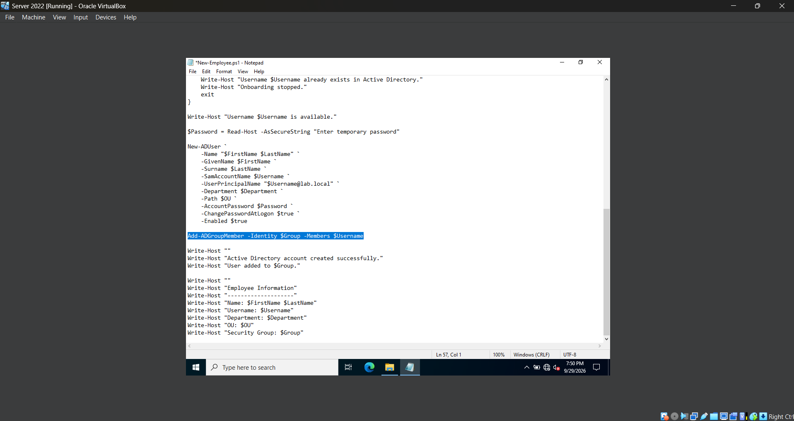


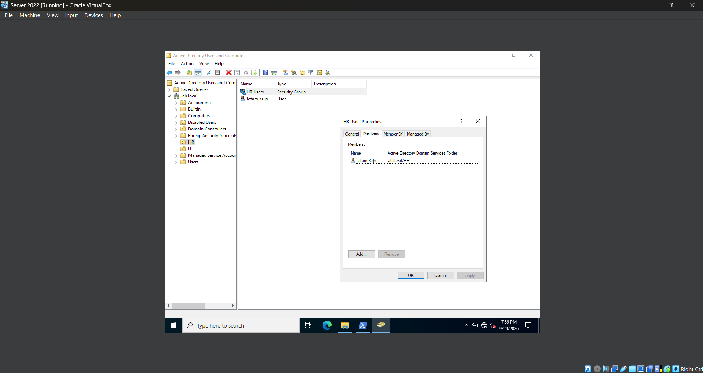

After creating the Active Directory account, I update the onboarding script to automatically add the new employee to the security group associated with their department.

I use the following command:

`Add-ADGroupMember -Identity $Group -Members $Username`

The `$Group` variable was previously assigned by the `switch` statement based on the employee's department. This allows the same command to work for Accounting, HR, or IT without manually specifying a security group each time.

The `$Username` variable identifies the newly created Active Directory account that should be added to the group.

To test the updated script, I onboard a new employee named Jotaro Kujo and assign the employee to the HR department. The script creates the account inside the HR OU and automatically adds the user to the `HR Users` security group.

Finally, I open **Active Directory Users and Computers**, navigate to the **HR** OU, and open the properties of the `HR Users` security group. Under the **Members** tab, I verify that Jotaro Kujo was successfully added to the group.

Using department security groups allows access to resources to be managed based on the employee's role instead of assigning permissions directly to individual user accounts.

### *Step 8 - Configure and Test Department-Based Resource Access*

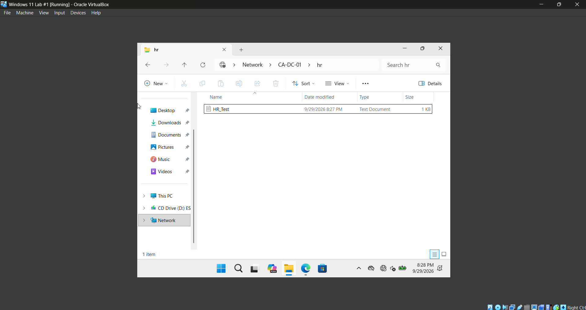

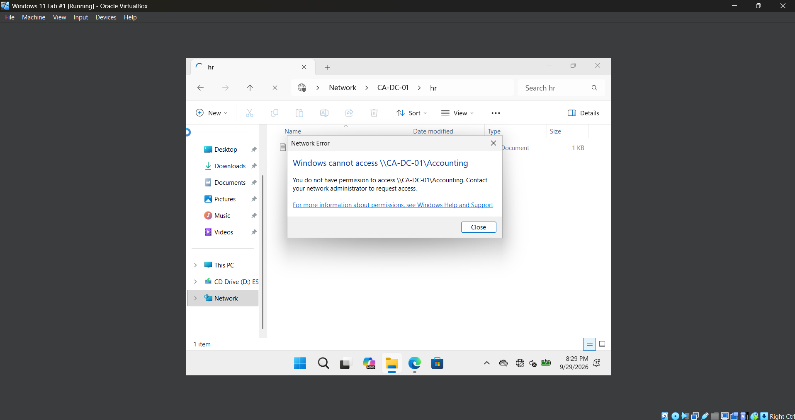

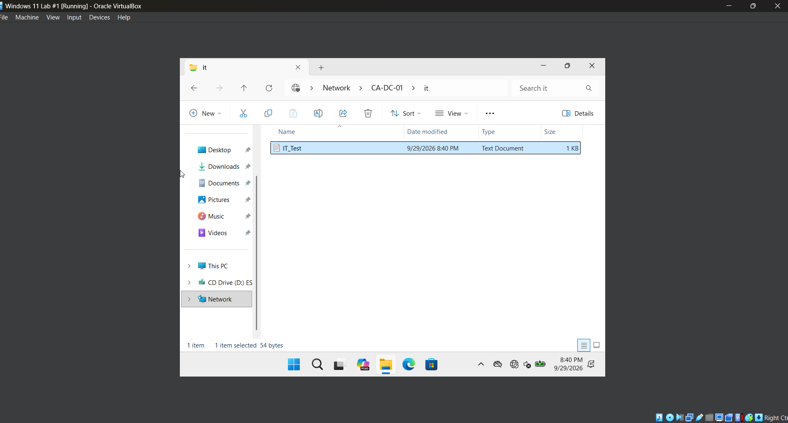

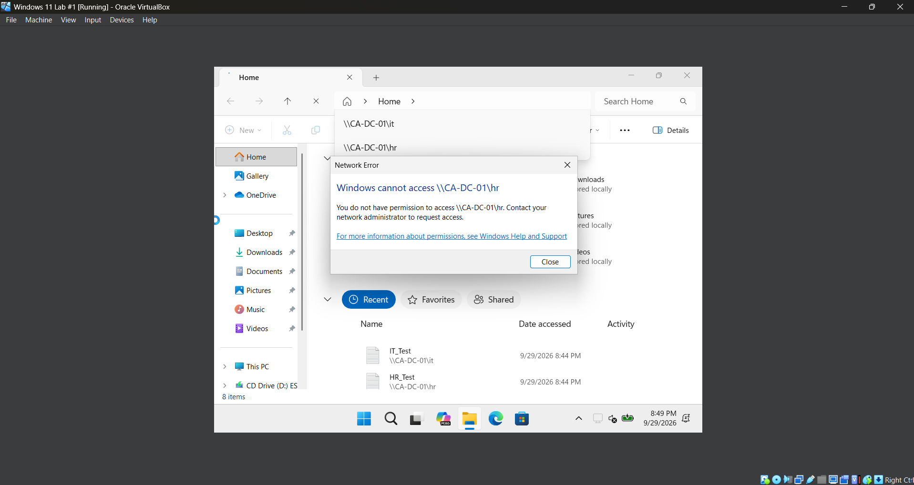

Using the same group-based permission model configured in an earlier lab, I create additional network shares for the HR and IT departments. Each department share is configured so that access is controlled through its corresponding Active Directory security group.

The department resources are organized so that `Accounting Users` control access to the Accounting share, `HR Users` control access to the HR share, and `IT Users` control access to the IT share. This allows permissions to be assigned based on an employee's department rather than directly to individual user accounts.

After configuring the shares and permissions, I use the Windows 11 domain client to test access with employees from different departments.

While signed in as an HR employee, I successfully access the HR network share and verify that I can create and access files within the folder. I then attempt to access the Accounting share and receive a permission error, confirming that the HR account does not have access to Accounting resources.

I also test the permissions using an IT employee. The IT account successfully accesses the IT network share and its files, while an attempt to access the HR share is denied.

These tests confirm that the department security groups assigned during the onboarding process are correctly controlling access to department resources. Instead of assigning permissions directly to individual employees, access is managed through their security group membership, providing a role-based approach to resource access.

### *Step 9 - Create the Employee Offboarding Script*

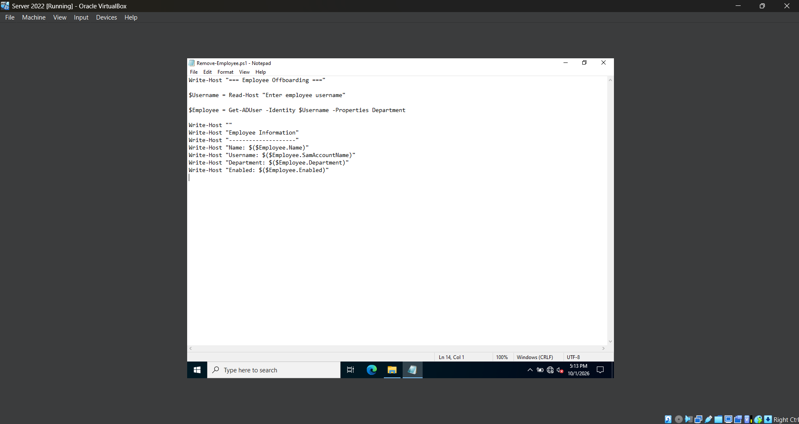

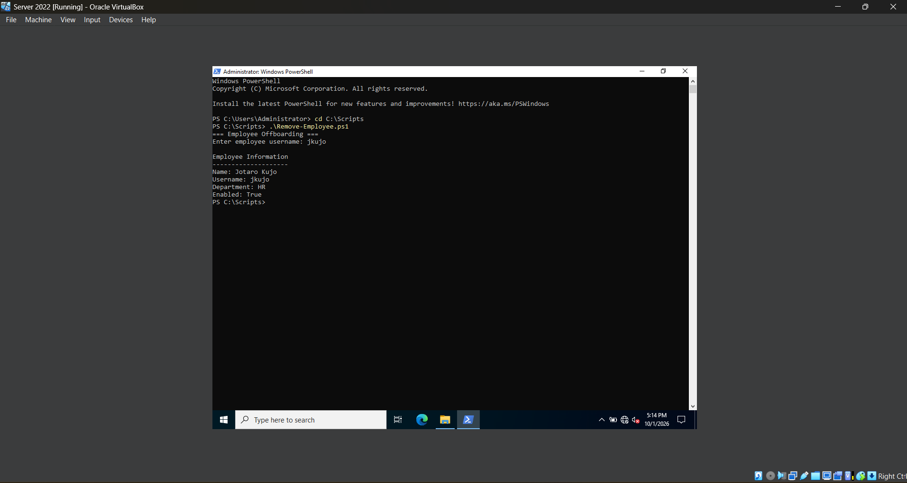

I create a new PowerShell script named `Remove-Employee.ps1` to begin automating the employee offboarding process. The script first asks the administrator to enter the username of the employee being offboarded.

I use `Get-ADUser` to locate the account in Active Directory and store the returned user object in the `$Employee` variable:

powershell ```
$Employee = Get-ADUser -Identity $Username -Properties Department
```
The `-Identity` parameter searches for the account using the username entered by the administrator. I also retrieve the `Department` property because it is not returned by default and will later be used to determine which department access should be removed.

After retrieving the account, the script displays the employee's name, username, department, and current account status. At this stage, the script only retrieves information and does not make any changes to the account.

To test the script, I enter the username `jkujo`. The script successfully retrieves Jotaro Kujo from Active Directory and displays that the account belongs to the HR department and is currently enabled.

Retrieving and verifying the employee's information before making changes provides a safer starting point for the offboarding process and helps ensure that the correct account is being modified.

### *Step 10 - Add Error Handling and Disable the Employee Account*

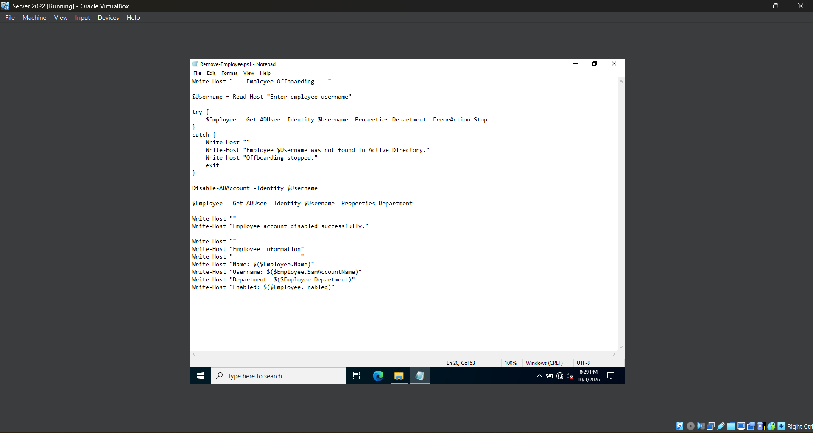

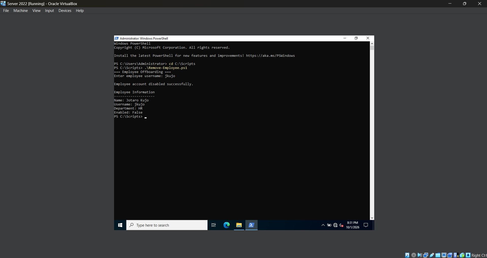

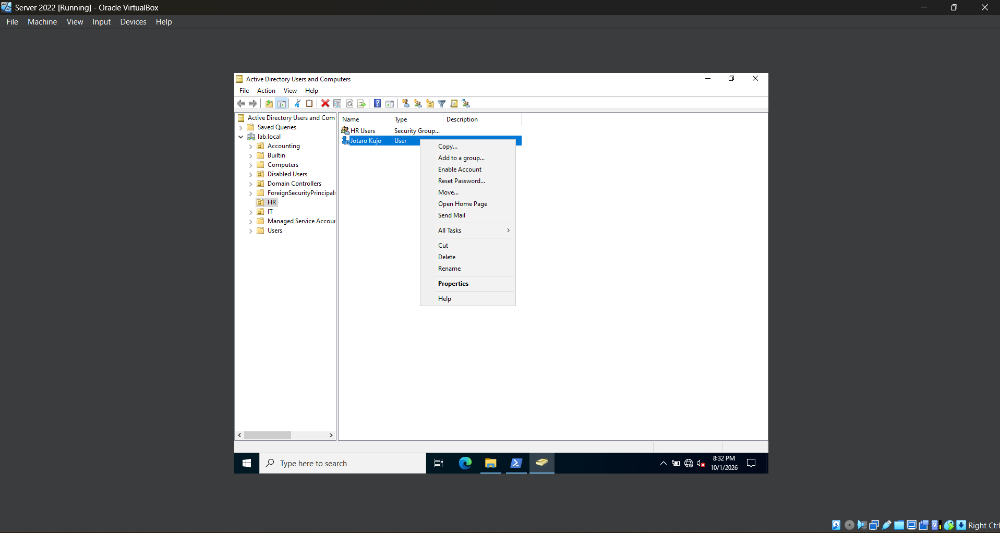

I update the employee offboarding script to safely retrieve the employee account and disable it in Active Directory.

I place the `Get-ADUser` command inside a `try` block and use `-ErrorAction Stop` so that an error retrieving the account is handled by the `catch` block instead of allowing the offboarding process to continue.

If the employee cannot be found, the `catch` block displays an error message and uses `exit` to stop the script before any account changes are made.

After successfully retrieving the employee, I disable the account using:

`Disable-ADAccount -Identity $Username`

I then use `Get-ADUser` again to refresh the information stored in the `$Employee` variable. This allows the script to display the employee's updated account status after the change.

To test the offboarding process, I enter the username `jkujo`. The script successfully disables Jotaro Kujo's account and displays the updated employee information with `Enabled: False`.

Finally, I verify the change in **Active Directory Users and Computers**. The account now shows the option **Enable Account**, confirming that Jotaro Kujo's account is currently disabled.

Adding error handling prevents the offboarding process from continuing when the employee account cannot be retrieved, while disabling the account prevents the former employee from authenticating with their domain credentials.

### *Step 11 - Remove Department Security Group Access*

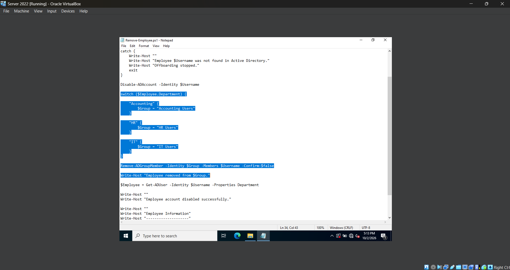

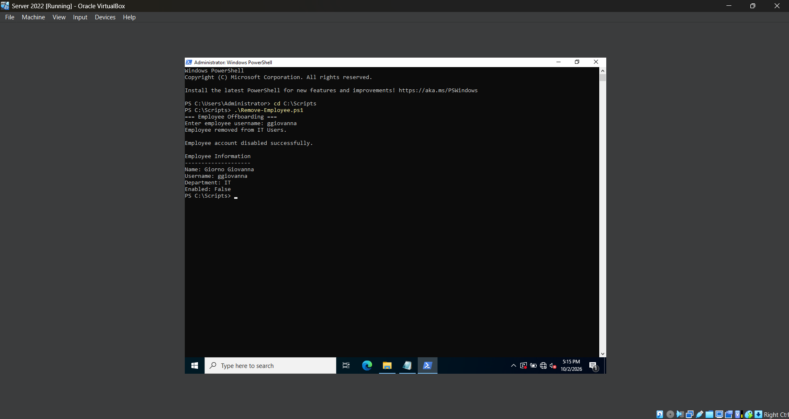

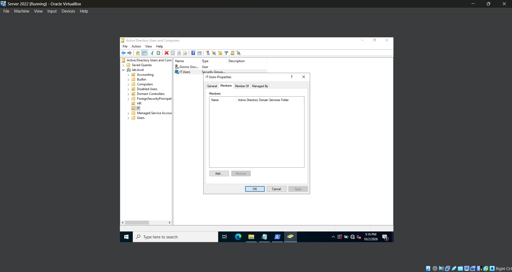

I update the employee offboarding script to automatically remove the employee from the security group associated with their department.

I use the employee's existing `Department` property with a `switch` statement to determine which department security group should be removed. Accounting employees are mapped to `Accounting Users`, HR employees are mapped to `HR Users`, and IT employees are mapped to `IT Users`.

After determining the correct group, I remove the employee using:

`Remove-ADGroupMember -Identity $Group -Members $Username -Confirm:$false`

The `$Group` variable identifies the department security group selected by the `switch` statement, while `$Username` identifies the employee being offboarded. I use `-Confirm:$false` so the command can complete without requiring an additional confirmation prompt.

To test the updated offboarding script, I use Giorno Giovanna, an employee assigned to the IT department. The script identifies the employee's department, disables the account, and automatically removes `ggiovanna` from the `IT Users` security group.

The PowerShell output confirms that the employee was removed from `IT Users` and that the account is now disabled with `Enabled: False`.

Finally, I open the `IT Users` security group in **Active Directory Users and Computers** and verify that Giorno Giovanna is no longer listed under the **Members** tab.

Removing the employee from their department security group revokes the role-based access that was assigned during onboarding, while disabling the account prevents the employee from authenticating with their domain credentials.

### *Step 12 - Move Disabled Employee to the Disabled Users OU*

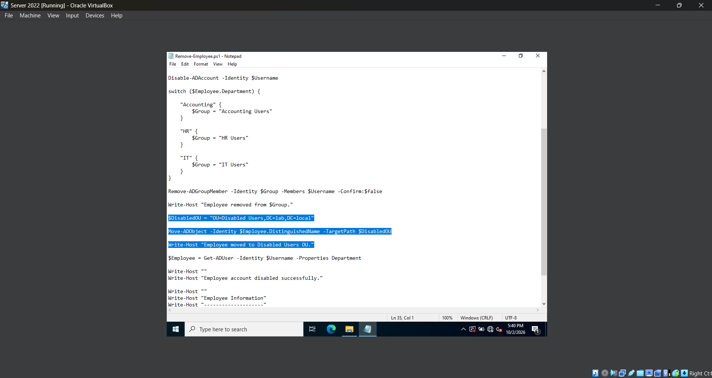

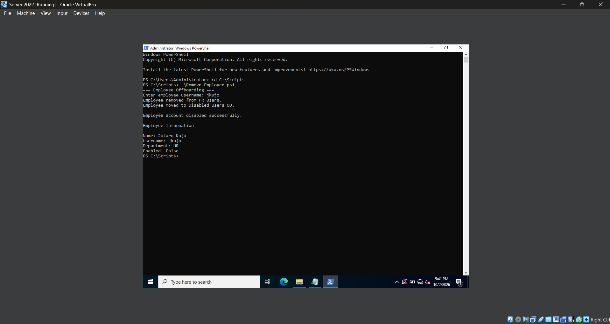

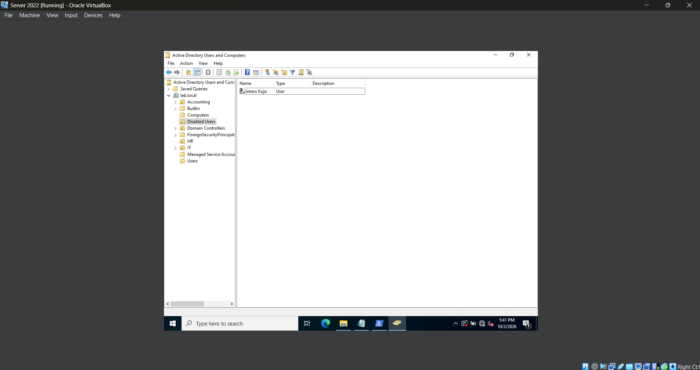

I update the employee offboarding script to automatically move the disabled employee account out of their department OU and into the `Disabled Users` OU.

First, I store the Distinguished Name of the destination OU in the `$DisabledOU` variable:

`$DisabledOU = "OU=Disabled Users,DC=lab,DC=local"`

I then use `Move-ADObject` to move the employee's Active Directory object:

`Move-ADObject -Identity $Employee.DistinguishedName -TargetPath $DisabledOU`

The `$Employee.DistinguishedName` property identifies the employee's current Active Directory object, while `$DisabledOU` specifies where the account should be moved.

To test the updated offboarding process, I use Jotaro Kujo (`jkujo`), an HR employee. The script disables the account, removes the employee from the `HR Users` security group, and moves the account into the `Disabled Users` OU.

The script then retrieves the employee information again and confirms that the account remains disabled with `Enabled: False`.

Finally, I open **Active Directory Users and Computers** and verify that Jotaro Kujo is now located inside the `Disabled Users` OU instead of the HR OU.

Moving disabled accounts into a separate OU keeps inactive accounts separated from active department users while allowing the accounts to be retained instead of immediately deleting them.

## **Challenges**

## **What I Learned**

## **Next Steps**
