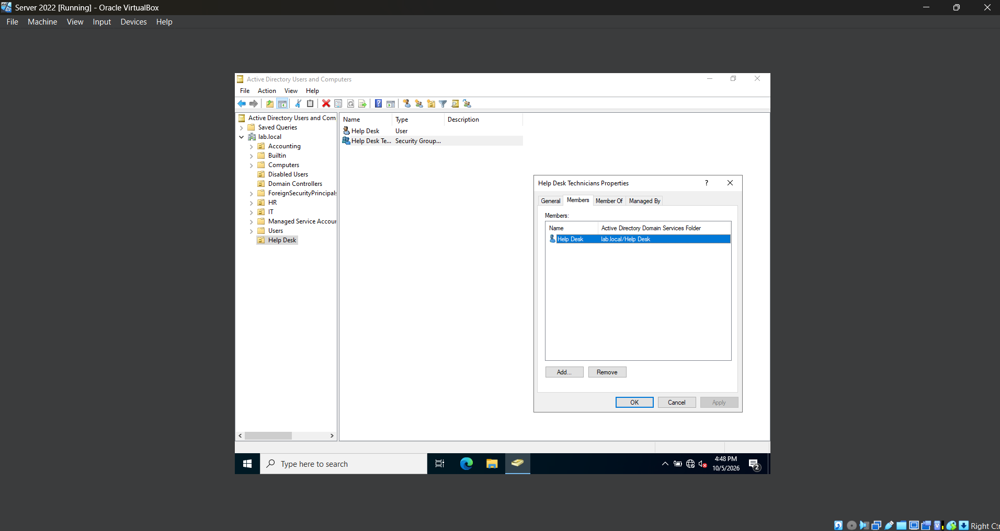

# **Lab 13 - Help Desk Administration with RSAT & Active Directory**

## **Objective**

## **Environment**

## **Skills Demonstrated**

## **Steps**

### *Step 1 - Create the Help Desk Group and Technician Account*

In the Windows Server 2022 VM, I open **Active Directory Users and Computers (ADUC)** and create a new Organizational Unit named **Help Desk** under the `lab.local` domain.

Inside the Help Desk OU, I create a new user account named **Help Desk** with the username `helpdesk01`. This account will represent a Tier 1 Help Desk technician and will later be used to remotely perform limited Active Directory administration from the Windows 11 workstation.

I also create a new Global Security group named **Help Desk Technicians** and add the Help Desk account as a member.

The Help Desk account remains a standard domain user and is not added to privileged groups such as **Domain Admins**. At this point, membership in the Help Desk Technicians group also does not provide any additional administrative permissions.

Instead of assigning permissions directly to the `helpdesk01` account, I will later delegate the required Active Directory permissions to the **Help Desk Technicians** security group. This allows additional Help Desk technicians to receive the same permissions simply by being added to the group.

This creates the initial structure for testing least-privilege Help Desk administration. The technician has a domain account and belongs to the appropriate role-based security group, but has not yet been granted permission to perform administrative tasks in Active Directory.

## **Challenges**

## **What I Learned**

## **Next Steps**
